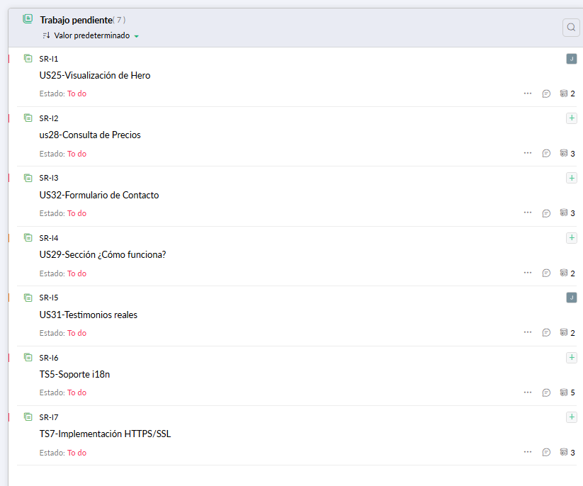
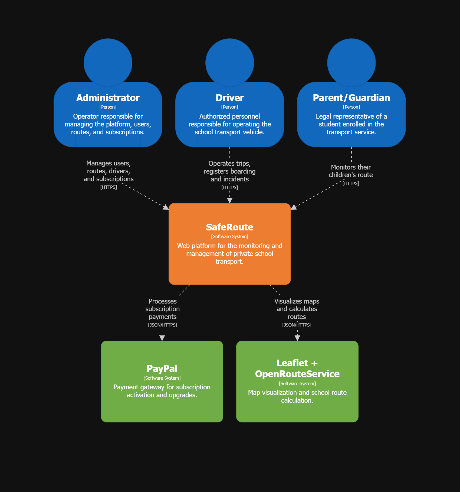
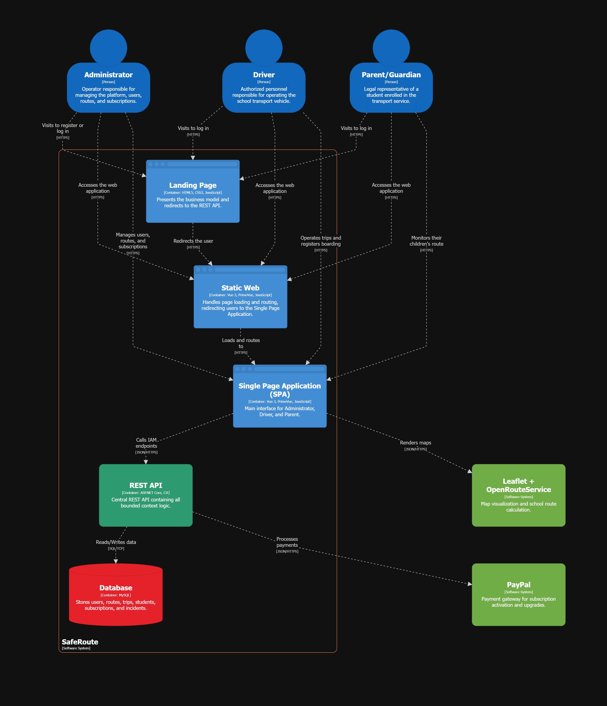
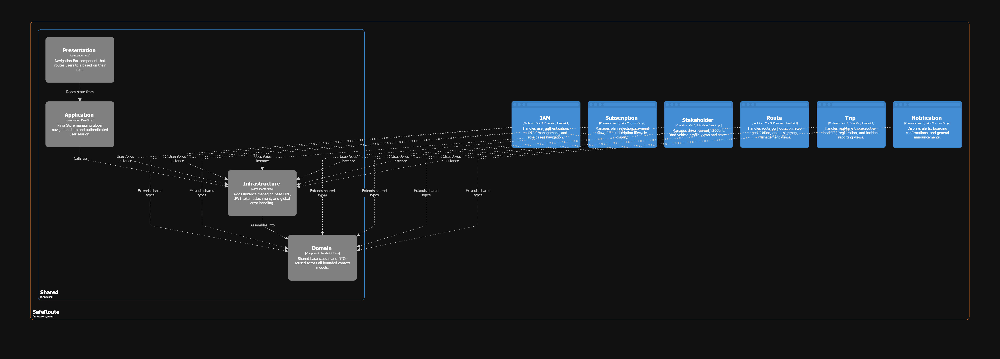
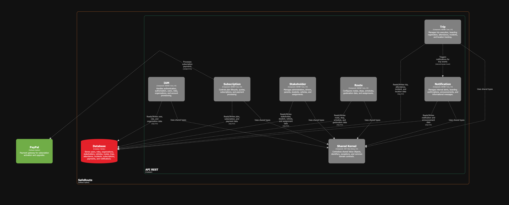
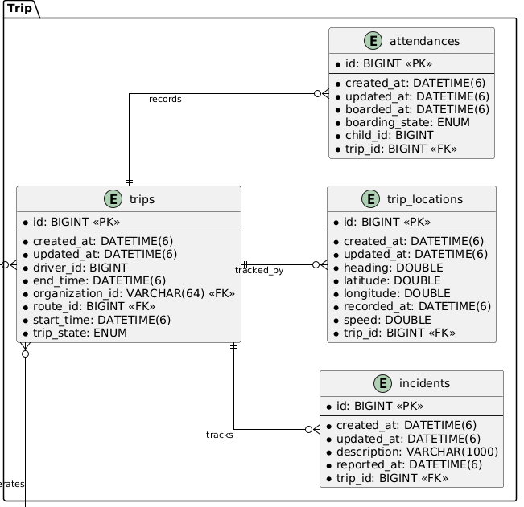
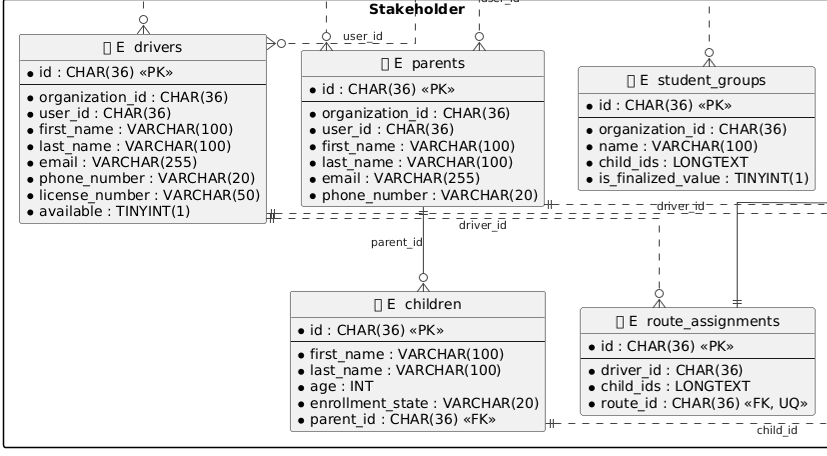
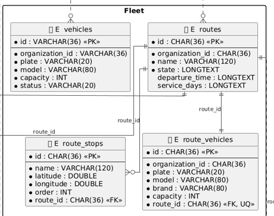
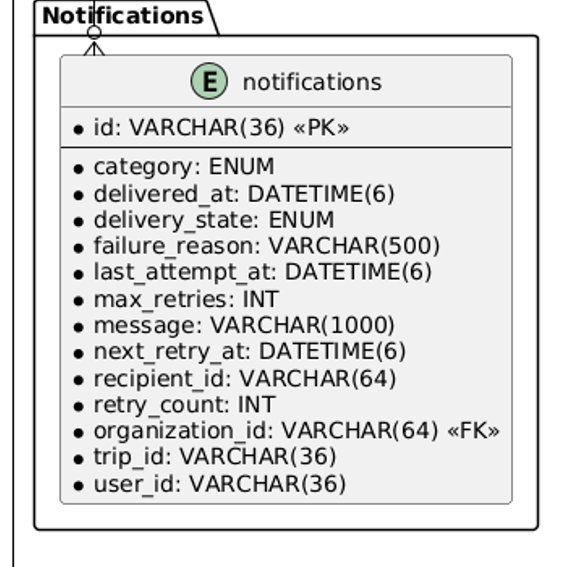
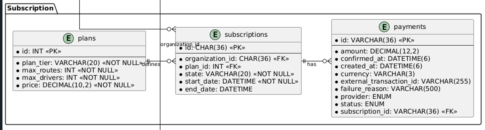

**Nombre de la Universidad:** Universidad Peruana de Ciencias Aplicadas  
**Facultad:** Ingeniería  
**Carrera:** Ingeniería de Software
**Ciclo:** 2026-10

**Código del curso:** 1ASI0730  
**Nombre del curso:** Aplicaciones Web
**NRC:** 12053  
**Nombre del profesor:** Efraín Ricardo Bautista Ubillús

**"Informe de Trabajo Final"**
**Nombre del startup:** PowerTech  
**Nombre del producto:** SafeRoute

**Relación de integrantes:**

- U202424059 - De La Cruz De Los Santos, Mathias Marcelo
- U202316852 - Ortega Quintana, Jose Zacarias
- U20241D922 - Quispe Serrano, Julio Frank
- U202415551 - Ramirez Ruiz, Nickolas
- U20211D989 - Vallejo Trujillo, Fabio Cesar

**Abril, 2026**

---

## Registro de Versiones del Informe

| Avance | Fecha      | Autor                                                                                                                                                                                                 | Descripción de Modificación |
| :----- | :--------- | :---------------------------------------------------------------------------------------------------------------------------------------------------------------------------------------------------- | :-------------------------- |
| AV1    | 25/04/2026 | De La Cruz De Los Santos, Mathias Marcelo; Ortega Quintana, Jose Zacarias; Quispe Serrano, Julio Frank; Ramirez Ruiz, Nickolas; Vallejo Trujillo, Fabio Cesar | Se desarrolló el Sprint Review correspondiente a la Semana 4, incluyendo la elaboración del Final Project Documentation Report, la presentación del Final Project Keynote y el reporte individual de desempeño de los integrantes. A nivel de implementación, se desarrolló y desplegó la primera versión del Landing Page. El informe incorpora la carátula, registro de versiones, insights de colaboración, student outcome, y los capítulos I al V, abarcando desde la introducción, levantamiento y especificación de requerimientos, diseño del producto, hasta la implementación, validación y despliegue. Además, se documenta la gestión de configuración del software, el entorno de desarrollo, control de código fuente, convenciones de estilo y configuración de despliegue. Finalmente, se incluye la evidencia completa del Sprint 1: planificación, backlog, desarrollo, ejecución, documentación de servicios, despliegue y análisis de la colaboración del equipo, junto con conclusiones, bibliografía y anexos. |

---

## Project Report Collaboration Insights
El equipo ha utilizado un flujo de trabajo en github: [https://github.com/upc-pre-202610-1asi0730-12053-powertech/saferoute-report](https://github.com/upc-pre-202610-1asi0730-12053-powertech/saferoute-report)

---

## Contenido
1. [Student Outcome](#student-outcome)
2. [Capítulo I: Introducción](#capítulo-i-introducción)
3. [Capítulo II: Requirements Elicitation & Analysis](#capítulo-ii-requirements-elicitation--analysis)
4. [Capítulo III: Requirements Specification](#capítulo-iii-requirements-specification)
5. [Capítulo IV: Product Design](#capítulo-iv-product-design)
6. [Capítulo V: Product Implementation, Validation & Deployment](#capítulo-v-product-implementation-validation--deployment)
7. [Conclusiones](#conclusiones)
8. [Bibliografía](#bibliografía)
---

## Student Outcome
**ABET - EAC - Student Outcome 5:** Capacidad de funcionar efectivamente en un equipo.

| Criterio | Acciones realizadas | Conclusiones |
|----------|--------------------|--------------|
| Criterio 1: Participa activamente en el trabajo en equipo, contribuyendo a un entorno colaborativo e inclusivo | **Julio Frank Quispe Serrano (AV1):** Participé en la elaboración del Startup Profile y promoví la comunicación clara entre los miembros del equipo.  **José Zacarías Ortega Quintana (AV1):** Colaboré con el equipo en la recolección y análisis de información mediante entrevistas y análisis competitivo.  **Mathias Marcelo De La Cruz De Los Santos (AV1):** Trabajé junto al equipo en el diseño del Landing Page, aportando ideas y manteniendo coherencia visual.  **Fabio Cesar Vallejo Trujillo (AV1):** Colaboré en la estructuración del diseño del producto y apoyé en decisiones técnicas iniciales.  **Nickolas Ramirez Ruiz (AV1):** Coordiné con el equipo la planificación del Sprint 1, fomentando la participación activa de todos los integrantes. | Durante el AV1, el equipo logró establecer un entorno colaborativo e inclusivo, donde todos los integrantes participaron activamente y aportaron desde sus roles, fortaleciendo la comunicación y el trabajo en conjunto. |
| Criterio 2: Planifica tareas, establece objetivos y cumple con los resultados propuestos | **Julio Frank Quispe Serrano (AV1):** Apoyé en la definición de objetivos iniciales y en la organización del trabajo del equipo.  **José Zacarías Ortega Quintana (AV1):** Estructuré los requerimientos del proyecto en artefactos claros que contribuyen al cumplimiento de objetivos.  **Mathias Marcelo De La Cruz De Los Santos (AV1):** Cumplí con los entregables de diseño UX/UI dentro del tiempo establecido.  **Fabio Cesar Vallejo Trujillo (AV1):** Participé en la planificación técnica y aseguré el avance en los componentes asignados.  **Nickolas Ramirez Ruiz (AV1):** Lideré la planificación del Sprint 1, gestioné el backlog y realicé seguimiento del progreso del equipo. | En el AV1, el equipo logró definir objetivos claros, organizar tareas de manera eficiente y cumplir con los entregables establecidos, evidenciando una adecuada planificación y ejecución del trabajo. |

## Capítulo I: Introducción
### 1.1. Startup Profile
#### 1.1.1. Descripción de la Startup

PowerTech es una startup de tecnología conformada por estudiantes de Ingeniería de Software de la Universidad Peruana de Ciencias Aplicadas (UPC), orientada al desarrollo de soluciones digitales que resuelven problemas reales en sectores con baja penetración tecnológica. Nació con la convicción de que la seguridad de los niños durante su traslado escolar no debería depender de llamadas telefónicas, mensajes de WhatsApp o registros manuales en papel.
Nuestra propuesta de valor se materializa en SafeRoute, una plataforma web de movilidad institucional inteligente diseñada para digitalizar y optimizar la gestión del transporte escolar. SafeRoute permite a cualquier organización de transporte escolar ya sea un grupo de padres que se organizaron para compartir una movilidad, un conductor independiente o una pequeña empresa del rubro que busquen centralizar la administración de sus rutas, conductores, alumnos y la comunicación en un solo lugar.

#### 1.1.2. Perfiles de integrantes del equipo

|                Foto                | Apellidos y Nombres         |    Código     | Carrera                | Resumen                                                                                                                                                                                                                                                                                                                                                                                                                                                |
| :--------------------------------: | :-------------------------- | :-----------: | :--------------------- | :----------------------------------------------------------------------------------------------------------------------------------------------------------------------------------------------------------------------------------------------------------------------------------------------------------------------------------------------------------------------------------------------------------------------------------------------------- |
|                             | De la Cruz De los Santos, Mathias Marcelo    | [U202424059] | Ingeniería de Software | [Soy estudiante de la carrera de Ingeniería de Software y actualmente me encuentro cursando el 5to ciclo de la carrera en la Universidad Peruana de Ciencias Aplicadas. Me considero un fanático de la programación, del futbol y los videojuegos. Considero que puedo aportar al equipo y al proyecto mis conocimientos técnicos, además de considerarme una persona disciplinada, responsable y que valora el trabajo en equipo.]                                                                                                                                                                                                                                                                                                                                                                             |
|                              | Ortega Quintana, Jose Zacarias  | [U202316852] | Ingeniería de Software | Soy Jose Ortega, estudiante de Ingenieria de Software en la Universidad Peruana de Ciencias Aplicadas. Actualmente con 21 años disfruto de los pequeños momentos de tranquilidad para aprovechra en meditar, dibujar o practicar. Deseo apoyar a mi equipo lo mejor posible para poder afrontar cualquier adversidad o contratiempo en este trabajo.                                                                                                                                                                                                                                                                                                                                                                     |
|  | Quispe Serrano, Julio Frank | [U20241D922]  | Ingeniería de Software | Mi nombre es Julio Frank Quispe Serrano, tengo 20 años,actualmente estoy cursando el 5to ciclo de la carrera de Ingeniería de Software en la Universidad Peruana de Ciencias Aplicadas. Soy un apasionado por la programación, el gym y explorador de música en distintos géneros. Mi aporte en este grupo será el de brindar soluciones prácticas y eficientes ante situaciones de adversidad que estanquen la fluidez de la elaboración del trabajo. |
 | Ramirez Ruiz, Nickolas      | [U202415551]  | Ingeniería de Software | Soy Nickolas Ramirez Ruiz, estudiante del quinto ciclo de la carrera de Ingeniería de Software. A lo largo de mi formación académica he adquirido conocimientos en programación, principalmente utilizando el lenguaje Java. Me considero una persona organizada, comprometida y con un enfoque proactivo, siempre buscando cumplir con mis responsabilidades antes del tiempo previsto.                                                               |
|  | Vallejo Trujillo, Fabio Cesar    | [U20211D989] | Ingeniería de Software | Soy Fabio, estudiante de ingenieria de software en quinto ciclo. Me gusta aprender nuevas tecnologías de programación y mantener buenas prácticas. Puedo aportar al proyecto con mis conocimientos técnicos en las multiples areas de programación y mejorando la organización de los entregables.       

### 1.2. Solution Profile
#### 1.2.1 Antecedentes y problemática

Who (¿Quiénes son los afectados?)
Los afectados son dos grupos claramente identificables. En primer lugar, los padres de familia con hijos en nivel inicial, kínder y primaria que utilizan servicios de transporte escolar privado, quienes no cuentan con información en tiempo real sobre el estado del traslado de sus hijos. En segundo lugar, los conductores de transporte escolar independientes o pertenecientes a pequeñas empresas que gestionan múltiples alumnos y rutas sin herramientas digitales de apoyo.

What (¿Cuál es el problema?)
El transporte escolar privado en el Perú opera en su gran mayoría de forma tradicional y sin soporte tecnológico. La comunicación entre padres y conductores depende de canales no estructurados como llamadas telefónicas y grupos de WhatsApp, lo que genera desorganización, pérdida de información y una sensación constante de incertidumbre en los padres respecto a la seguridad de sus hijos. Por su parte, los conductores y administradores del servicio carecen de herramientas para registrar asistencia, gestionar rutas, reportar incidencias y llevar un historial ordenado de cada trayecto.

Where (¿Dónde ocurre?)
El problema se presenta principalmente en zonas urbanas de Lima Metropolitana, donde la demanda de transporte escolar privado es alta y la oferta opera de manera fragmentada e incluso a veces informal. Sin embargo, la problemática es extensible a cualquier ciudad del Perú con alta densidad de centros educativos privados y colegios que no cuentan con flota propia.

When (¿Cuándo ocurre?)
El problema se manifiesta de forma recurrente durante los horarios de entrada y salida escolar, típicamente entre las 6:00 a.m. y 8:30 a.m., y entre las 12:30 p.m. y 5:00 p.m. Es en estos momentos cuando la falta de información en tiempo real genera mayor ansiedad en los padres y mayor presión operativa en los conductores.

Why (¿Por qué es un problema?)
La ausencia de digitalización en este sector genera consecuencias concretas, por ejemplo los padres no saben si su hijo abordó la movilidad, si llegó al colegio o si ocurrió algún incidente en el camino. Los conductores cometen errores en las paradas, olvidan recoger alumnos o no tienen cómo comunicar retrasos de forma ordenada. Los administradores del servicio pierden tiempo valioso coordinando manualmente lo que podría automatizarse, y no cuentan con registros históricos que les permitan mejorar la operación.

How (¿Cómo se manifiesta?)
Se manifiesta en llamadas y mensajes constantes de padres al conductor durante el trayecto, listas de alumnos escritas en papel o en hojas de cálculo no compartidas, ausencia de registros de incidencias, imposibilidad de verificar el cumplimiento de las paradas, y falta de trazabilidad sobre qué alumnos abordaron o no en cada viaje.

How much (¿Cuál es la magnitud?)
Si bien no existen datos precisos y actualizados que cuantifiquen de forma específica el mercado del transporte escolar privado en el Perú, los indicadores educativos y de transporte disponibles permiten dimensionar la magnitud del problema.
Según el Censo Educativo 2022-2023 del Ministerio de Educación (MINEDU, 2023), en Lima Metropolitana existen aproximadamente 1.9 millones de estudiantes distribuidos en cerca de 7,602 instituciones educativas, de las cuales el 74% son de gestión privada. Esta alta concentración de colegios privados implica que muchas familias dependen de servicios externos de transporte escolar, dado que pocas instituciones cuentan con flotas propias.
Este panorama se ve agravado por una reducción en la oferta formal del servicio. Según la Autoridad de Transporte Urbano para Lima y Callao (ATU, 2024), la cantidad de movilidades escolares autorizadas disminuyó en un 25% en solo un año, lo que sugiere un incremento en la informalidad del sector y, con ello, una mayor ausencia de herramientas de control y monitoreo sobre el servicio que reciben los menores.
Respecto a la seguridad, la Superintendencia de Transporte Terrestre de Personas, Carga y Mercancías (SUTRAN, 2024) ejecutó campañas de sensibilización que alcanzaron a más de 47,000 escolares, evidenciando que la seguridad en el transporte escolar continúa siendo una preocupación activa para las autoridades. Sin embargo, no se dispone públicamente de cifras desagregadas de incidentes específicos en este sector entre 2022 y 2025.

**Figura 1** Distribución de estudiantes de Educación Inicial y Primaria en instituciones privadas y zonas urbanas en el Perú

_Nota._ Adaptado de Resultados del Censo Educativo 2022 (p. 12), por Ministerio de Educación, 2023.

#### 1.2.2 Lean UX Process
##### 1.2.2.1. Lean UX Problem Statements

El transporte escolar privado en el Perú opera mayoritariamente de forma informal, coordinándose mediante
llamadas telefónicas, mensajes de WhatsApp y registros manuales en hojas privadas. En este contexto, tanto
los padres de familia como los transportistas escolares enfrentan dificultades que comprometen la seguridad
y eficiencia del servicio. Hemos observado un factor crítico que afecta a este ecosistema, los padres de familia
no cuentan con visibilidad sobre el trayecto de sus hijos, mientras que los transportistas carecen de
herramientas digitales para gestionar rutas, alumnos e incidencias de forma estructurada. Estas dos
necesidades son interdependientes, mientras que por un lado los padres necesitan visibilidad, y por el otro los
transportistas no tienen los medios para proporcionársela. ¿Cómo podemos desarrollar una plataforma que
permita a los transportistas escolares gestionar su operación de forma digital, mientras ofrece
simultáneamente a los padres de familia la visibilidad y tranquilidad que necesitan sobre el traslado de sus
hijos?

##### 1.2.2.2. Lean UX Assumptions

**Business Assumptions**

- Creemos que existe demanda suficiente para digitalizar el transporte escolar privado en Lima Metropolitana, dado que opera mayoritariamente de forma tradicional y sin soporte tecnológico.
- Creemos que los padres de familia adoptarán la plataforma si el proceso de incorporación es simple y la información que reciben sobre el trayecto de sus hijos es clara y confiable.
- Creemos que los transportistas adoptarán la plataforma si la interfaz operativa durante el trayecto es simple, rápida y no distrae la conducción.
- Creemos que el modelo de suscripción por planes escalonados Básico, Intermedio y Completo permite capturar tanto a grupos pequeños de padres organizados como a empresas de transporte escolar con flotas más grandes.
- Creemos que SafeRoute transmite ahorro de tiempo, reduccion de errores y confianza al transporte de los escolares frente a los padres de familia, lo que justifica el costo de la suscripción.
- Sabremos que estamos equivocados si los administradores abandonan la plataforma en los primeros 60 días por considerar que la curva de aprendizaje es demasiado alta o que el valor percibido no justifica el costo.

**User Assumptions**

- ¿Quién es el usuario?
  Los padres de familia con hijos en nivel inicial, kínder y primaria que utilizan un servicio de transporte escolar ya contratado, y los transportistas escolares como por ejemplo los conductores independientes o responsables de pequeñas empresas que operan ese servicio. Dentro de la plataforma, cualquiera de estos segmentos puede asumir además el rol de Administrador.
- ¿Dónde encaja nuestro producto en su vida?
  Para el transportista, en su jornada laboral operativa diaria. Para el padre, en los momentos de entrada y salida escolar de sus hijos.
- ¿Qué problemas resuelve?
  Elimina la gestión manual y la comunicación no estructurada del transporte escolar, proporcionando al transportista herramientas operativas digitales y al padre visibilidad del trayecto de sus hijos.
- ¿Cuándo y cómo es usado?
  El transportista lo usa durante cada trayecto para gestionar abordajes, paradas e incidencias. El padre lo consulta en los horarios de traslado escolar para monitorear el estado del viaje de sus hijos.
- ¿Qué características son importantes?
  Registro de abordaje por alumno, visualización de ruta y paradas, reporte de incidencias, historial de trayectos y gestión centralizada de usuarios y rutas.
- ¿Cómo debe verse y comportarse?
  Interfaz limpia, responsiva, rápida y accesible (a11y), disponible en español e inglés (i18n), e intuitiva para usuarios con distintos niveles de familiaridad tecnológica.

##### 1.2.2.3. Lean UX Hypothesis Statements

- Hipótesis 1: "Creemos que los padres de familia reducirán su incertidumbre durante el traslado escolar mediante el uso de una vista del estado del trayecto con marcación de abordaje por alumno y visualización de paradas.
Sabremos que esto es verdad cuando al menos el 70% de los padres activos consulten el estado del trayecto al menos una vez por día durante las primeras 4 semanas de uso."

- Hipótesis 2: "Creemos que los transportistas gestionarán el trayecto con menos errores y menor carga operativa mediante el uso de una interfaz operativa simple para marcar abordajes, seguir paradas y reportar incidencias durante el viaje.
Sabremos que esto es verdad cuando el 80% de los trayectos registrados incluyan el check-list de abordaje completado durante las primeras 4 semanas de operación."

- Hipótesis 3: "Creemos que los administradores centralizarán la gestión de su servicio mediante el uso de un panel único para registrar usuarios, conductores, hijos, asignaciones y rutas.
Sabremos que esto es verdad cuando al menos el 75% de los administradores registren la totalidad de sus usuarios y rutas dentro de los primeros 15 días tras el onboarding."

- Hipótesis 4: "Creemos que los administradores incrementarán su nivel de suscripción al percibir que las funcionalidades de los planes superiores reducen significativamente el tiempo de coordinación del servicio.
Sabremos que esto es verdad cuando al menos el 20% de los administradores de los planes Básico o Intermedio actualicen a un plan superior dentro de los primeros 3 meses de uso."

##### 1.2.2.4. Lean UX Canvas

| Sección                                                                                  | Contenido                                                                                                                                                                                                                                                                                                                                                                                                                                                                                                                                       |
| :--------------------------------------------------------------------------------------- | :---------------------------------------------------------------------------------------------------------------------------------------------------------------------------------------------------------------------------------------------------------------------------------------------------------------------------------------------------------------------------------------------------------------------------------------------------------------------------------------------------------------------------------------------- |
| 1. Business Problem                                                                      | El transporte escolar privado en el Perú opera de forma tradicional y sin soporte tecnológico. Los padres no tienen visibilidad sobre el trayecto de sus hijos y los transportistas gestionan su operación con llamadas, WhatsApp y hojas privadas, lo que genera errores, ineficiencia y una experiencia de servicio poco confiable.                                                                                                                                                                                                           |
| 2. Business Outcomes                                                                     | Lograr que el 75% de administradores completen el registro de su operación en los primeros 15 días. Retener al 80% de suscriptores activos durante los primeros 3 meses. Alcanzar una tasa de upgrade del plan Básico al Intermedio del 20% en los primeros 3 meses de uso.                                                                                                                                                                                                                                                                     |
| 3. Users                                                                                 | Los segmentos que interactúan con SafeRoute son los padres de familia con hijos en nivel inicial, kínder y primaria que utilizan un servicio de transporte escolar ya contratado, y los transportistas escolares conductores independientes o responsables de pequeñas empresas que operan ese servicio. Cualquiera de estos puede asumir además el rol de Administrador dentro de la plataforma.                                                                                                                                               |
| 4. User Outcomes & Benefits                                                              | Los padres buscan reducir su incertidumbre sobre el trayecto de sus hijos, pudiendo monitorear el estado del viaje sin necesidad de interrumpir al conductor. Los transportistas buscan gestionar rutas, alumnos e incidencias de forma digital, reduciendo errores operativos y proyectando mayor profesionalismo frente a las familias. Quienes asumen el rol de administrador buscan centralizar toda la operación del servicio en un solo panel, eliminando la coordinación manual y el uso de herramientas desconectadas.                  |
| 5. Solution Ideas                                                                        | Ofrecemos un panel de administración de usuarios, conductores, hijos y rutas. Tambien, Check-list de abordaje digital por conductor. Vista de paradas y estado del trayecto para padres. Registro de incidencias por ruta. Historial de trayectos por comunidad de ruta. Seguimiento GPS en tiempo real (plan Completo). Apertura a integración IoT futura.                                                                                                                                                                                     |
| 6. Hypotheses                                                                            | Los padres consultan la vista del estado del trayecto al menos una vez al día en un 70% durante las primeras 4 semanas. Los conductores completan el check-list de abordaje en el 80% de los trayectos durante las primeras 4 semanas mediante el uso de una interfaz operativa simple. Los administradores completan el registro de su operación en un 75% dentro de los primeros 15 días mediante el uso de un panel único de gestión. Los administradores de planes Básico o Intermedio realizan upgrade en un 20% dentro de los primeros 3 meses al percibir el valor de las funcionalidades superiores. |
| 7. What's the most important thing we need to learn first?                               | ¿El administrador del servicio percibe suficiente valor en SafeRoute como para abandonar los métodos informales actuales y pagar una suscripción mensual?                                                                                                                                                                                                                                                                                                                                                                                       |
| 8. What's the least amount of work we need to do to learn the next most important thing? | Realizar entrevistas con 3 a 5 administradores de servicios de transporte escolar (padres representantes o transportistas independientes) para validar su disposición al cambio y las funcionalidades que consideran imprescindibles antes de desarrollar el MVP.                                                                                                                                                                                                                                                                               |

### 1.3. Segmentos objetivo

SafeRoute está dirigido a dos segmentos que forman parte del ecosistema del transporte escolar privado en Lima Metropolitana.

- **Segmento 1: Padres de Familia**
  El primer segmento está conformado por padres de familia o apoderados con hijos en nivel inicial, kínder y primaria que utilizan un servicio de transporte escolar privado ya contratado. Se trata de personas que han delegado el traslado de sus hijos a un tercero y que, durante el trayecto, no cuentan con información estructurada sobre el estado del viaje. Este segmento no está delimitado por un nivel socioeconómico específico, sino por la condición de tener hijos en edad escolar que usan transporte privado y de contar con acceso a internet desde un dispositivo con navegador web. Su principal motivación al usar SafeRoute es, precisamente, reducir la incertidumbre que genera no saber si sus hijos abordaron con seguridad, en qué parte del recorrido se encuentran o si ocurrió alguna novedad durante el viaje. Para dimensionar este segmento, según el Censo Educativo 2022-2023, en Lima Metropolitana existen aproximadamente 1.9 millones de estudiantes distribuidos en cerca de 7,602 instituciones educativas, de las cuales el 74% son de gestión privada (Ministerio de Educación, 2023). Esta alta proporción de colegios privados implica que una parte significativa de las familias limeñas depende de servicios externos de transporte escolar, dado que pocas instituciones cuentan con flotas propias.

- **Segmento 1: Transportistas Escolares**
  El segundo segmento está conformado por las personas o entidades que operan el servicio de transporte escolar privado. Dentro de este segmento conviven tres perfiles distintos. El primero corresponde a personas independientes que ofrecen el servicio de forma autónoma. El segundo agrupa a conductores que han sido asignados para operar una movilidad organizada por un conjunto de familias. El tercero engloba a los responsables de pequeñas empresas de transporte escolar que cuentan con una flota de vehículos y conductores a su cargo. A pesar de sus diferencias, todos comparten un factor común, pues operan sin herramientas digitales especializadas, apoyándose en métodos manuales e informales para gestionar una actividad que involucra directamente la seguridad de menores. La relevancia de este segmento se ve reflejada en que la cantidad de movilidades escolares autorizadas en Lima disminuyó en un 25% en solo un año, lo que evidencia un incremento en la informalidad del sector y, con ello, una mayor ausencia de mecanismos de control y monitoreo sobre el servicio que reciben los menores (Autoridad de Transporte Urbano para Lima y Callao, 2024). Adicionalmente, la Superintendencia de Transporte Terrestre de Personas, Carga y Mercancías ejecutó en 2024 campañas de sensibilización que alcanzaron a más de 47,000 escolares, lo que confirma que la seguridad en este sector continúa siendo una preocupación activa para las autoridades (SUTRAN, 2024). Por ello, la principal motivación de este segmento al usar SafeRoute es digitalizar y profesionalizar su operación, reducir los errores en la gestión de rutas y alumnos, y ofrecer a las familias que atienden una experiencia de servicio más confiable y transparente.

---

## Capítulo II: Requirements Elicitation & Analysis
### 2.1. Competidores
### Identificación de Competidores

En esta sección se describen los principales competidores (directos e indirectos) con modelos de negocio basados en productos digitales similares o servicios complementarios de monitoreo.

#### Life360
**Descripción:** Aplicación de rastreo familiar líder a nivel global que permite compartir la ubicación en tiempo real entre miembros de un grupo, así como recibir alertas de llegada y salida de lugares definidos. Está orientada a mejorar la seguridad y comunicación entre familias mediante funciones de geolocalización avanzada.

* **Enfoque:** Seguridad familiar general.
* **URL:** [https://www.life360.com/](https://www.life360.com/)

#### Find My Kids
**Descripción:** Aplicación de monitoreo parental diseñada para que los padres conozcan la ubicación en tiempo real de sus hijos mediante GPS. Permite revisar el historial de movimientos, escuchar el entorno en caso de emergencia y recibir alertas. Se destaca por su integración con relojes inteligentes (smartwatches) para niños.

* **Enfoque:** Monitoreo infantil y seguridad parental.
* **URL:** [https://findmykids.org/](https://findmykids.org/)

#### OnTrack School
**Descripción:** Sistema digital integral enfocado específicamente en la gestión y monitoreo del transporte escolar. Permite el seguimiento de vehículos en tiempo real, envío de notificaciones automáticas a los padres y control administrativo de rutas y conductores. Está orientado principalmente a instituciones educativas y flotas de transporte escolar.

* **Enfoque:** Gestión logística y transporte escolar corporativo.
* **URL:** [https://ontrack.global/school/](https://ontrack.global/school/)

---
#### 2.1.1. Análisis competitivo

**¿Por qué llevar a cabo este análisis?**
El objetivo es contrastar SafeRoute con soluciones líderes de geolocalización familiar y gestión escolar, identificando oportunidades para posicionarnos como la herramienta preferida de los transportistas independientes en Lima que buscan profesionalizar su servicio.
| Categoría | Detalle | **SafeRoute** | **Life360** | **Find My Kids** | **OnTrack School** |
| :--- | :--- | :--- | :--- | :--- | :--- |
| **Perfil** | **Overview** | Gestión y monitoreo especializado en transporte escolar. | App de seguridad familiar y rastreo GPS general. | App de monitoreo infantil enfocada en smartwatches. | Plataforma integral de logística para transporte escolar. |
| **Perfil** | **Ventaja competitiva** | Roles específicos (Conductor/Padre) y flujo de abordaje manual. | Círculos familiares privados y detección de choques. | Escucha ambiental y compatibilidad con relojes GPS. | Optimización de rutas avanzada para flotas de colegios. |
| **Marketing** | **Mercado objetivo** | Padres y conductores independientes en Lima. | Familias con adolescentes y adultos mayores. | Padres con niños pequeños (5-12 años). | Colegios privados y empresas de transporte masivo. |
| **Marketing** | **Estrategias** | Seguridad digital y profesionalización del sector. | Marketing masivo de "Tranquilidad familiar". | Enfoque en seguridad infantil y prevención de extravíos. | Ventas corporativas (B2B) y eventos educativos. |
| **Producto** | **Productos & Servicios** | App, Dashboard Web, Alertas IoT y API para devs. | App móvil, asistencia en carretera y alertas de velocidad. | App móvil, rastreadores físicos y notificaciones SOS. | Software de logística, portal para padres y conductores. |
| **Producto** | **Precios & Costos** | Suscripción mensual ($9.99 - $49.99). | Freemium (Suscripciones Gold/Platinum desde $14.99). | Suscripción mensual o pago único de por vida. | Cotización personalizada por número de rutas/colegios. |
| **Producto** | **Canales de distribución**| Web (Landing Page) y tiendas de apps. | App Store, Play Store y web global. | App Store, Play Store y fabricantes de smartwatches. | Web corporativa y equipo de ventas directas. |
| **SWOT** | **Fortalezas** | Sistema especializado con control de abordaje y registro de incidencias para estructurar el servicio informal. | Alta precisión en rastreo en tiempo real . | Especialización en el segmento de niños pequeños. | Robustez técnica y algoritmos de optimización. |
| **SWOT** | **Debilidades** | Marca nueva en un mercado con desconfianza. | No está diseñada para el flujo de transporte escolar. | Funcionalidades limitadas si el niño no tiene reloj. | Costo elevado y difícil implementación para independientes. |
| **SWOT** | **Oportunidades** | Nicho desatendido de transportistas independientes en Perú que buscan organización y confianza. | Creciente preocupación por la seguridad familiar | Crecimiento del mercado de wearables infantiles. | Digitalización de colegios en mercados emergentes. |
| **SWOT** | **Amenazas** | Informalidad que prefiere usar solo WhatsApp. | Mejoras en los sistemas nativos de Google/Apple. | Regulaciones estrictas de privacidad infantil (COPPA). | Nuevas startups locales con precios de introducción bajos. |

---

### 2.1.2 Estrategias y tácticas frente a competidores

En base al análisis competitivo y SWOT realizado, SafeRoute plantea las siguientes estrategias y tácticas para diferenciarse aprovechando las debilidades de la competencia y el contexto local:

#### Enfoque en especialización del problema
- SafeRoute se posicionará como una solución especializada en transporte escolar, integrando funcionalidades específicas como control de abordaje, gestión de rutas y registro de incidencias.
- Esto permitirá cubrir necesidades logísticas que las soluciones genéricas de GPS ignoran.

#### Estrategia de digitalización del sector no estructurado
- Enfoque en transportistas independientes que actualmente dependen de WhatsApp y procesos manuales.
- Oferta de una plataforma simple e intuitiva para una transición digital sin fricciones técnicas.

#### Diferenciación por simplicidad y accesibilidad
- Priorización de facilidad de uso y costos accesibles frente a soluciones corporativas complejas como OnTrack School.
- Experiencia de usuario optimizada para minimizar la carga operativa del conductor durante el trayecto.

#### Estrategia de confianza y seguridad para padres
- Reducción de la incertidumbre mediante notificaciones automáticas de abordaje y alertas en tiempo real.
- Reemplazo de la comunicación informal por una estructura de datos confiable y profesional.

#### Estrategia de crecimiento progresivo (escalabilidad)
- Modelo de planes escalables (Básico, Intermedio, Completo) que acompaña el crecimiento de la flota del cliente.
- Facilita la adopción inicial con un ticket de entrada bajo.

#### Estrategia de posicionamiento local
- Adaptación a las dinámicas operativas y geográficas de Lima Metropolitana antes de escalar a otras ciudades del Perú.

#### Estrategia de preparación tecnológica futura
- Arquitectura preparada para la integración de sensores y cámaras IoT en etapas posteriores, garantizando competitividad a largo plazo.

### 2.2. Entrevistas
#### 2.2.1. Diseño de entrevistas
##### Guion de Entrevistas - Proyecto SafeRoute

###### **Segmento Objetivo 1: Conductor**

1. ¿Cuál es tu nombre?
2. ¿Cuál es tu edad?
3. ¿Podrías contarme un poco sobre tu entorno familiar? Por ejemplo, si vives con una familia o tienes hijos.
4. ¿En qué distrito o zona sueles trabajar?
5. ¿Podrías contarme un poco sobre tu trabajo como conductor de transporte escolar?
6. ¿Trabajas de manera independiente o en coordinación con otro grupo de personas o empresa?
7. En tu día a día, ¿qué herramientas o medios utilizas para organizar tu trabajo?
8. Cuéntame cómo realizas normalmente el proceso de recoger y dejar a los alumnos.
9. Durante el recorrido, ¿cómo llevas el control de los alumnos?
10. ¿Qué suele pasar cuando ocurre algún cambio o imprevisto en la ruta?
11. ¿Cómo te comunicas con los padres durante el servicio?
12. ¿Qué partes de tu trabajo sientes que requieren más atención o te generan mayor carga?
13. ¿Qué tan organizado sientes que es tu proceso actual de trabajo?
14. Si pudieras mejorar algún aspecto de tu trabajo diario, ¿cuál sería y por qué?
15. ¿Qué tipo de información te ayudaría a sentir mayor control durante el recorrido?
16. ¿Qué preocupaciones tendrías al usar algún tipo de sistema durante el trayecto?
17. ¿Cómo te gustaría que fuera la comunicación con los padres para que no interfiera con tu conducción?
18. ¿Qué tendría que tener una herramienta así para que realmente la uses?
19. ¿Qué tan dispuesto estarías a usar una herramienta que te ayude a organizar y monitorear tu trabajo? ¿Por qué?

---

###### **Segmento Objetivo 2: Padre de Familia**

1. Para comenzar, ¿podrías indicarme tu nombre?
2. ¿Cuál es tu edad?
3. ¿En qué distrito o zona resides?
4. ¿Podrías contarme un poco sobre tu entorno familiar?
5. ¿Qué edades tienen tus hijos que utilizan transporte escolar?
6. ¿Qué rol cumple el transporte escolar dentro de tu día a día?
7. ¿Qué tan cómodo(a) te sientes utilizando tecnología en tu vida diaria?
8. Cuéntame cómo haces actualmente para saber que tu hijo llegó bien a su destino.
9. ¿Qué es lo que más te preocupa cuando tu hijo está en el transporte escolar?
10. ¿Cómo te comunicas normalmente con el conductor o responsable del transporte?
11. ¿Recuerdas alguna situación en la que hayas sentido preocupación o falta de información? ¿Qué ocurrió?
12. ¿Qué tipo de información sientes que hoy no tienes y te gustaría tener?
13. ¿Qué aspectos del servicio de transporte actual te generan más desconfianza o incomodidad?
14. Si pudieras mejorar alguna parte del servicio de transporte escolar, ¿cuál sería y por qué?
15. ¿Qué opinas de una herramienta que te permita tener mayor visibilidad del transporte escolar de tu hijo?
16. ¿En qué aspectos crees que una solución así podría ayudarte en tu día a día?
17. ¿Qué preocupaciones tendrías al usar una herramienta digital para monitorear este servicio?
18. Para finalizar, ¿qué consideras indispensable para sentirte tranquilo(a) con el transporte de tu hijo?
    
#### 2.2.2. Registro de entrevistas
### Entrevista 1: Arturo Núñez

| Campo | Detalle |
| :--- | :--- |
| Nombre y Apellidos | Arturo Núñez |
| Edad | 28 años |
| Distrito / Zona de trabajo | San Miguel y Miraflores, Lima |
| Segmento | Conductor de Transporte Escolar |
| Inicio en video | 00:15 |
| Duración | 07:19 |
| URL del video | [https://1drv.ms/v/c/f647ccc757f760c7/IQBpmAWWCOusSLuP0uLD_z7NAe5clO5HVvyL8gi5oJuddj8?e=9qIP9h](https://1drv.ms/v/c/f647ccc757f760c7/IQBpmAWWCOusSLuP0uLD_z7NAe5clO5HVvyL8gi5oJuddj8?e=9qIP9h)] |

#### Screenshot

---

## Resumen Descriptivo de la Entrevista

### Características Objetivas y Entorno

Arturo Núñez es un conductor de transporte escolar independiente de 28 años, con aproximadamente seis años de experiencia en el rubro. Opera principalmente en los distritos de San Miguel y Miraflores, zonas urbanas con alto flujo vehicular. Gestiona su propia unidad móvil y administra directamente la captación de clientes, organización de rutas y comunicación con padres de familia.

Su rutina diaria consiste en recoger estudiantes en sus domicilios, trasladarlos al colegio y retornarlos posteriormente según el turno escolar.

### Herramientas, Tecnología y Canales de Interacción

Actualmente utiliza herramientas informales para operar:

- WhatsApp como canal principal de comunicación con padres
- Libreta física para horarios y direcciones
- Google Maps para navegación y rutas alternas
- Smartphone como dispositivo principal de trabajo

El uso del teléfono móvil es constante durante la jornada. Se evidencia familiaridad con aplicaciones digitales de uso cotidiano.

### Características Subjetivas y Personalidad

Arturo presenta un perfil pragmático, independiente y orientado a resultados. Busca mantener el orden operativo, aunque reconoce limitaciones de su sistema actual. Muestra preocupación por la seguridad vial y estrés cuando debe responder mensajes mientras conduce.

También demuestra apertura al cambio tecnológico siempre que la solución sea sencilla, rápida y útil.

### Pain Points Detectados

- Exceso de mensajes durante la conducción
- Distracción al responder consultas de padres
- Dependencia de memoria personal
- Falta de sistema formal de asistencia
- Cambios de ruta difíciles de comunicar
- Estrés operativo en horas punta

### Oportunidades Identificadas

El entrevistado valora altamente una plataforma que permita:

- Ubicación en tiempo real para padres
- Notificaciones automáticas
- Lista diaria de alumnos asistentes
- Registro rápido de abordaje
- Operación con pocos pasos
- Uso estable con señal limitada

### Validación del Arquetipo
La entrevista confirma que el segmento conductor necesita reducir carga operativa, profesionalizar su servicio y automatizar comunicaciones sin comprometer la seguridad al volante. Esto respalda directamente el User Persona definido para SafeRoute.

---
### Entrevista 2: Carla Peláez

| Campo | Detalle |
| :--- | :--- |
| **Nombre y Apellidos** | Carla Peláez |
| **Edad** | 38 años |
| **Distrito / Zona de residencia** | Santiago de Surco, Lima |
| **Segmento** | Padre de Familia |
| **Inicio en video** | 07:42 |
| **Duración** | 04:80 |
| **URL del video** | [https://1drv.ms/v/c/f647ccc757f760c7/IQBpmAWWCOusSLuP0uLD_z7NAe5clO5HVvyL8gi5oJuddj8?e=9qIP9h](https://1drv.ms/v/c/f647ccc757f760c7/IQBpmAWWCOusSLuP0uLD_z7NAe5clO5HVvyL8gi5oJuddj8?e=9qIP9h)] |

#### **Screenshot**

> *Captura de pantalla de la entrevista realizada al segmento Padre de Familia.*

---

#### **Resumen Descriptivo de la Entrevista**

### **Características Objetivas y Entorno**

Carla Peláez es una madre de familia de 38 años residente en el distrito de Santiago de Surco. Vive con su esposo y sus cuatro hijos, de los cuales dos utilizan actualmente servicio de transporte escolar. Representa a familias urbanas con alta responsabilidad logística diaria, donde el traslado escolar cumple un rol clave para compatibilizar horarios familiares, laborales y educativos.

El transporte escolar forma parte importante de su rutina diaria, ya que permite asegurar la asistencia puntual de sus hijos al centro educativo.

### **Perfil Tecnológico y Hábitos Digitales**

La entrevistada demuestra una actitud positiva frente al uso de tecnología y asocia las herramientas digitales con mayor seguridad y tranquilidad. Está acostumbrada a recibir información mediante canales digitales institucionales y mensajería móvil.

Actualmente utiliza:

* Teléfono móvil como principal dispositivo de comunicación  
* WhatsApp para contacto con responsables del transporte  
* Sistema digital del colegio para validar asistencia diaria  

Esto evidencia un perfil digital intermedio, con apertura a nuevas soluciones tecnológicas siempre que sean simples y confiables.

### **Proceso Actual y Canales de Interacción**

Para confirmar que sus hijos llegaron correctamente a destino, Carla depende de dos mecanismos externos:

* Confirmación verbal de la responsable de movilidad escolar  
* Confirmación de asistencia enviada por el colegio mediante su sistema interno  

Cuando existe demora o falta de confirmación, se comunica directamente con el colegio para validar la llegada de sus hijos.

Actualmente la comunicación con el conductor o responsable se realiza principalmente por:

* Llamadas telefónicas  
* WhatsApp  

### **Pain Points (Problemas Detectados)**

Durante la entrevista se identificaron preocupaciones relevantes:

* Angustia cuando la movilidad se retrasa  
* Ansiedad cuando no llega la confirmación del colegio  
* Falta de visibilidad en tiempo real durante el trayecto  
* Dependencia de terceros para validar información  
* Percepción de inseguridad en el contexto actual de transporte urbano  
* Menor confianza cuando la movilidad no pertenece directamente al colegio  

Estos puntos reflejan una necesidad clara de trazabilidad, confianza y comunicación inmediata.

### **Necesidades y Oportunidades Detectadas**

Carla mostró alta aceptación hacia una plataforma digital que le permita:

* Ver la ruta del vehículo en tiempo real  
* Conocer si ocurrió algún inconveniente durante el trayecto  
* Recibir confirmación automática de llegada  
* Saber la ubicación permanente de sus hijos  
* Reducir ansiedad e incertidumbre diaria  
* Incrementar confianza en el servicio contratado  

Para Carla, el atributo más importante para sentirse tranquila es:

“Saber en dónde está en todo momento”.

### **Características Subjetivas y Personalidad**

A partir de sus respuestas, se identifica un perfil:

* Protector y orientado al bienestar familiar  
* Preventivo frente a riesgos externos  
* Receptivo a herramientas digitales útiles  
* Sensible a la falta de información  
* Altamente motivado por la seguridad de sus hijos  

### **Validación del Arquetipo**
Los datos recolectados en esta entrevista validan los supuestos definidos para el segmento Padre de Familia dentro del proyecto SafeRoute. Se confirma que este segmento prioriza:

* Seguridad del estudiante  
* Monitoreo en tiempo real  
* Alertas automáticas  
* Comunicación confiable  
* Reducción de ansiedad durante el traslado escolar  

Asimismo, respalda los objetivos del Impact Mapping relacionados con generar tranquilidad, confianza y visibilidad operacional para las familias usuarias.

---

### Entrevista 3: Marío Villarreyes

| Campo | Detalle |
| :--- | :--- |
| **Nombre y Apellidos** | Marío Villarreyes |
| **Edad** | 49 años |
| **Distrito / Zona de residencia** | Pueblo Libre, Lima |
| **Segmento** | Padre de Familia |
| **Inicio en video** | 12:31 |
| **Duración** | 07:33 |
| **URL del video** | [https://1drv.ms/v/c/f647ccc757f760c7/IQBpmAWWCOusSLuP0uLD_z7NAe5clO5HVvyL8gi5oJuddj8?e=9qIP9h](https://1drv.ms/v/c/f647ccc757f760c7/IQBpmAWWCOusSLuP0uLD_z7NAe5clO5HVvyL8gi5oJuddj8?e=9qIP9h)] |

#### **Screenshot**

## **Resumen Descriptivo de la Entrevista**

### **Características Objetivas y Entorno**

Mario Humberto Villarreyes Quinoza es un padre de familia de 49 años residente en Pueblo Libre, Lima. Vive con su esposa actual y dos de sus hijos: Ciara de 12 años y León de 7 años. Representa a familias urbanas que requieren apoyo logístico complementario para equilibrar responsabilidades familiares, laborales y escolares.

En su caso, el transporte escolar no se utiliza diariamente como servicio institucional fijo, sino principalmente para el recojo de su hija cuando tiene horarios extendidos o actividades adicionales en el colegio.

### **Perfil Tecnológico y Hábitos Digitales**

El entrevistado demuestra familiaridad funcional con herramientas digitales orientadas a resolver necesidades cotidianas. Utiliza tecnología principalmente para coordinar servicios y validar información relevante antes de contratar.

Actualmente utiliza:

* WhatsApp como principal canal de coordinación  
* Teléfono móvil para contacto inmediato  
* Búsqueda digital de antecedentes e información vehicular  

Esto evidencia un perfil digital práctico, orientado a la utilidad, seguridad y rapidez de respuesta.

### **Proceso Actual y Canales de Interacción**

Actualmente contrata un servicio particular tipo taxi privado para recoger a su hija cuando lo necesita. La coordinación se realiza mediante una persona de confianza (señora Ana), quien contacta al conductor encargado del traslado.

La comunicación con el conductor o responsable del servicio se realiza principalmente por:

* WhatsApp  
* Coordinación indirecta mediante tercero de confianza  

Esto refleja un modelo operativo informal, altamente dependiente de referencias personales.

### **Pain Points (Problemas Detectados)**

Durante la entrevista se identificaron preocupaciones importantes:

* Falta de visibilidad previa sobre antecedentes del conductor  
* Dificultad para validar papeletas, sanciones o historial de manejo  
* Incertidumbre sobre propiedad y condiciones del vehículo  
* Conducción imprudente o exceso de velocidad en movilidades escolares  
* Uso inadecuado del claxon y presión por llegar a tiempo  
* Sobrecarga de pasajeros por encima del aforo permitido  
* Escasa capacitación percibida en algunos conductores  

Estos hallazgos muestran que la principal preocupación no es solo la ubicación, sino la seguridad integral y calidad del operador.

### **Necesidades y Oportunidades Detectadas**

Mario mostró interés en una plataforma digital que permita:

* Ver antecedentes del conductor antes de contratar  
* Consultar papeletas o faltas registradas  
* Validar experiencia del conductor  
* Revisar comentarios y reputación del servicio  
* Conocer información completa del vehículo  
* Confirmar cumplimiento de aforo permitido  
* Elegir opciones confiables antes de contratar  

Valora especialmente la transparencia previa a la contratación.

### **Características Subjetivas y Personalidad**

A partir de sus respuestas, se identifica un perfil:

* Preventivo y orientado a la seguridad familiar  
* Analítico al momento de contratar servicios  
* Exigente con estándares de conducción  
* Crítico frente a informalidad del sector  
* Receptivo a soluciones digitales con información verificable  

### **Validación del Arquetipo**

Los datos recolectados validan los supuestos del segmento Padre de Familia dentro del proyecto SafeRoute. Se confirma que este segmento prioriza:

* Seguridad física de sus hijos  
* Transparencia del conductor y vehículo  
* Información verificable antes de contratar  
* Buenas prácticas de conducción  
* Confianza operativa del servicio  

---
## Entrevista 4: Máximo Quevedo

| Campo | Detalle |
| :--- | :--- |
| **Nombre y Apellidos** | Máximo Quevedo |
| **Edad** | 25 años |
| **Distrito / Zona de residencia** | Callería, Pucallpa |
| **Segmento** | Padre de Familia |
| **Inicio en video** | 20:03 |
| **Duración** | 08:04 |
| **URL del video** | [[[https://1drv.ms/v/c/f647ccc757f760c7/IQBpmAWWCOusSLuP0uLD_z7NAe5clO5HVvyL8gi5oJuddj8?e=9qIP9h](https://1drv.ms/v/c/f647ccc757f760c7/IQBpmAWWCOusSLuP0uLD_z7NAe5clO5HVvyL8gi5oJuddj8?e=9qIP9h)] |

#### **Screenshot**

---

## Resumen Descriptivo de la Entrevista

### Características Objetivas y Entorno

Máximo Quevedo es un padre de familia de 25 años residente en el distrito de Callería, ciudad de Pucallpa. Tiene hijos de 6 y 7 años que utilizan transporte escolar institucional brindado por el colegio mediante rutas establecidas.

Para él, el transporte escolar cumple principalmente una función de **seguridad, organización y ahorro de tiempo**, ya que permite asegurar el traslado diario de sus hijos mientras la familia mantiene sus actividades cotidianas.

Actualmente el servicio es administrado por la institución educativa, y la comunicación relacionada con el transporte se realiza principalmente mediante directivos o responsables del colegio.

---

### Herramientas y Proceso Actual

En la actualidad, el entrevistado no cuenta con herramientas digitales específicas para monitorear el trayecto del transporte escolar. El seguimiento se basa en mecanismos tradicionales:

- Llamadas telefónicas al director o encargado del colegio  
- Espera pasiva de confirmación de llegada  
- Confianza en la institución educativa  
- Comunicación indirecta con el conductor  

No existe visibilidad en tiempo real del recorrido, ni acceso directo a información del vehículo o conductor.

---

### Problemas Detectados (Pain Points)

Máximo identifica varios problemas relevantes en el servicio actual:

- Falta de seguimiento en tiempo real del bus escolar  
- Incertidumbre sobre la llegada segura de sus hijos  
- Demora o ausencia de respuesta por parte de directivos  
- Escasa información sobre conductor y unidad vehicular  
- Ansiedad cuando no recibe confirmaciones oportunas  
- Dependencia total del colegio como intermediario de comunicación  

Además, expresa preocupación por riesgos potenciales como accidentes o emergencias durante el trayecto.

---

### Necesidades y Oportunidades

El entrevistado muestra una percepción altamente positiva hacia una solución digital especializada para transporte escolar. Considera valioso que la plataforma incluya:

- Seguimiento GPS en tiempo real  
- Identificación del bus asignado  
- Datos visibles del conductor responsable  
- Confirmaciones automáticas de llegada  
- Canal rápido ante emergencias  
- Comunicación directa y ordenada con responsables  

También menciona que una herramienta así podría reducir ansiedad familiar y aumentar la confianza en el servicio.

---

### Aspectos Subjetivos y Comportamiento

Máximo presenta un perfil orientado a la protección familiar. Sus decisiones están fuertemente influenciadas por la seguridad de sus hijos y la tranquilidad emocional del hogar.

Valora:

- Seguridad por encima del precio o comodidad  
- Transparencia en la información  
- Rapidez de respuesta ante incidentes  
- Control preventivo del trayecto  
- Bienestar emocional de sus hijos durante el viaje  

Su reacción ante nuevas tecnologías es positiva, siempre que sean confiables y precisas.

---

### Tecnología y Riesgos Percibidos

Aunque muestra aceptación hacia herramientas digitales, también expresa una preocupación clara: que el sistema falle o entregue información errónea.

Esto evidencia que para este segmento no basta con innovar, sino que la solución debe transmitir:

- Precisión de datos  
- Estabilidad técnica  
- Buena conectividad  
- Información actualizada en tiempo real  
- Confianza operacional  

---

### Validación del Arquetipo

Los hallazgos obtenidos validan el arquetipo del segmento **Padre de Familia Protector y Ansioso por la Seguridad**, definido previamente en la investigación.

Se confirma que este segmento necesita una solución digital enfocada en:

- Seguridad infantil  
- Monitoreo en tiempo real  
- Reducción de incertidumbre  
- Comunicación confiable  
- Transparencia del servicio escolar  

Esto respalda directamente las User Stories relacionadas con rastreo GPS, alertas automáticas, confirmación de llegada y acceso a información del trayecto dentro de SafeRoute.

#### 2.2.3. Análisis de entrevistas
## Segmento Objetivo 1: Conductores de Transporte Escolar

El presente análisis corresponde a una muestra inicial de 1 entrevista válida del segmento conductor, por lo que los porcentajes reflejan únicamente los hallazgos preliminares del entrevistado y serán refinados con futuras entrevistas.
### Características Objetivas del Segmento

| Característica | Resultado | Sustento |
|---|---|---|
| Edad joven-adulta (25 a 35 años) | 100% | Arturo tiene 28 años |
| Trabajo independiente | 100% | Indica operar con unidad propia y captar clientes directamente |
| Experiencia en el rubro mayor a 5 años | 100% | Señala 6 años trabajando en transporte escolar |
| Opera en zonas urbanas congestionadas | 100% | Trabaja en San Miguel y Miraflores |
| Manejo de ruta diaria fija | 100% | Realiza recojo, traslado al colegio y retorno |

### Hallazgo

El segmento conductor evaluado corresponde a microoperadores independientes que administran su propio servicio y requieren herramientas de gestión simples, móviles y rápidas.

### Uso de Tecnología y Herramientas Actuales

| Herramienta / Canal | Porcentaje |
|---|---|
| WhatsApp como canal principal con padres | 100% |
| Libreta física para horarios/direcciones | 100% |
| Google Maps para navegación | 100% |
| Uso combinado de herramientas manuales + digitales | 100% |

### Principales Problemas Detectados (Pain Points)

| Problema identificado | Porcentaje |
|---|---|
| Exceso de mensajes durante la conducción | 100% |
| Distracción por responder padres en ruta | 100% |
| Dependencia de memoria personal | 100% |
| Estrés ante tráfico o cambios imprevistos | 100% |
| Falta de visibilidad para padres genera presión | 100% |

### Necesidades Funcionales Prioritarias

| Necesidad mencionada | Porcentaje |
|---|---|
| Ubicación visible para padres sin escribir al conductor | 100% |
| Notificaciones automáticas de abordaje/llegada | 100% |
| Lista digital de alumnos del día | 100% |
| Confirmación previa de asistencia | 100% |
| App sencilla e intuitiva | 100% |
| Funcionamiento con señal limitada | 100% |

### Características Subjetivas del Segmento

| Rasgo detectado | Porcentaje |
|---|---|
| Alta disposición a adoptar tecnología útil | 100% |
| Mentalidad pragmática | 100% |
| Valora eficiencia y orden | 100% |
| Sensible a distracciones durante manejo | 100% |
| Busca profesionalizar su servicio | 100% |

----
## Segmento Objetivo 2: Padres de Familia
El presente análisis corresponde a una muestra de 3 entrevistas válidas del segmento padres de familia. Los porcentajes representan hallazgos identificados en Carla Peláez, Máximo Quevedo y Mario Villarreyes, permitiendo construir un perfil más sólido del segmento objetivo.

### Características Objetivas del Segmento

| Característica | Resultado | Sustento |
|---|---|---|
| Adultos responsables entre 25 y 49 años | 100% | Entrevistados de 38, 25 y 49 años |
| Residen en zonas urbanas | 100% | Surco, Pucallpa urbana y Pueblo Libre |
| Hogares con hijos en etapa escolar | 100% | Todos cuentan con hijos usuarios del servicio |
| Uso actual de transporte escolar o particular escolar | 100% | Todos utilizan alguna modalidad de traslado |
| Alta responsabilidad logística familiar | 100% | Coordinan horarios, recojo y seguimiento diario |

Este hallazgo está compuesto por padres y madres responsables de la organización familiar que delegan el traslado escolar, pero desean mantener control, seguridad y visibilidad constante del proceso.

### Uso de Tecnología y Herramientas Actuales

| Herramienta / Canal | Porcentaje |
|---|---|
| WhatsApp como canal principal de comunicación | 100% |
| Teléfono móvil como dispositivo principal | 100% |
| Llamadas telefónicas como respaldo | 67% |
| Dependencia de terceros para confirmar llegada | 100% |
| Uso de sistemas del colegio o encargado institucional | 67% |

Actualmente el segmento resuelve el seguimiento mediante canales informales y fragmentados, principalmente WhatsApp, llamadas y confirmaciones externas.

### Principales Problemas Detectados (Pain Points)

| Problema identificado | Porcentaje |
|---|---|
| Temor a accidentes o incidentes de seguridad | 100% |
| Falta de información en tiempo real | 100% |
| Ansiedad cuando no responde el encargado o conductor | 67% |
| Desconfianza hacia conductores no validados | 67% |
| Falta de datos del vehículo o conductor | 67% |
| Demoras sin explicación clara | 67% |
| Percepción de informalidad del servicio | 67% |

La principal fricción no es solo logística, sino emocional: incertidumbre, riesgo percibido y falta de transparencia del operador.

### Necesidades Funcionales Prioritarias

| Necesidad mencionada | Porcentaje |
|---|---|
| Ubicación en tiempo real del transporte | 100% |
| Confirmación automática de llegada | 100% |
| Alertas ante retrasos o emergencias | 100% |
| Información validada del conductor | 67% |
| Información del vehículo | 67% |
| Historial / reputación del servicio | 33% |
| Herramienta simple desde celular | 100% |

El segmento espera una solución móvil sencilla que combine monitoreo en vivo con confianza previa a la contratación.

### Características Subjetivas del Segmento

| Rasgo detectado | Porcentaje |
|---|---|
| Alta preocupación por seguridad infantil | 100% |
| Alta receptividad hacia soluciones digitales útiles | 100% |
| Busca reducir ansiedad diaria | 100% |
| Valora confianza institucional | 67% |
| Perfil práctico orientado a familia | 100% |
| Conducta preventiva antes de contratar | 67% |

La conclusión del segmento es que los padres de familia no buscan únicamente tecnología, sino tranquilidad y confianza. Valoran una plataforma que les permita saber dónde están sus hijos, recibir alertas automáticas y verificar que el conductor y vehículo sean seguros.

### 2.3. Needfinding
#### 2.3.1. User Personas
En esta sección se presentan los arquetipos de usuario diseñados para representar los segmentos objetivo de SafeRoute: el conductor de transporte escolar independiente y el padre de familia. 

La elaboración de estas fichas es el resultado de una síntesis detallada entre el análisis de la competencia y el proceso de Needfinding. Se han identificado características críticas como la alta dependencia de herramientas informales (WhatsApp/Llamadas), la ansiedad generada por la incertidumbre del tráfico en Lima y la necesidad de profesionalizar un sector mayoritariamente no estructurado.

###### **Segmento Objetivo 1: Conductor **

---
###### **Segmento Objetivo 2: Padre de Familia**

#### 2.3.2. User Task Matrix
En esta sección se presenta la matriz de tareas de usuario , la cual consolida las actividades fundamentales que tanto el conductor (Carlos Ramírez) como el padre de familia (Rosita Nery) ejecutan para asegurar un traslado escolar exitoso. 

Es importante destacar que estas tareas representan necesidades y procesos intrínsecos del servicio que existen independientemente de la existencia de una solución de software; el objetivo de SafeRoute es optimizar y digitalizar estas interacciones para reducir la carga operativa y la incertidumbre.

#### Cuadro: User Task Matrix

| Tarea (User Task) | Conductor - Frecuencia | Conductor - Importancia | Padre - Frecuencia | Padre - Importancia |
|:---|:---:|:---:|:---:|:---:|
| Verificar lista de asistencia de alumnos | Alta | Alta | N/A | N/A |
| Identificar alumnos en el punto de recojo | Alta | Alta | N/A | N/A |
| Confirmar el abordaje seguro del alumno | Alta | Crítica | Alta | Crítica |
| Gestionar comunicación entre conductores y padres | Alta | Alta | Alta | Alta |
| Notificar retrasos o imprevistos en la ruta | Media | Alta | Alta | Crítica |
| Monitorear el progreso del trayecto | Media | Media | Alta | Alta |
| Confirmar llegada al destino final | Alta | Crítica | Alta | Crítica |
| Registrar la entrega del alumno al responsable | Alta | Crítica | Alta | Crítica |
| Coordinar cambios de último momento en el servicio | Baja | Media | Baja | Alta |
| Reportar incidencias de seguridad o salud | Baja | Crítica | Baja | Crítica |
| Consultar el estado actual del servicio | Media | Media | Alta | Alta |
| Revisar historial de trayectos realizados | Baja | Media | Media | Media |
| Organizar y optimizar rutas y paradas | Alta | Alta | N/A | N/A |

---

#### Análisis y Explicación de la Matriz

Tras el análisis de la matriz, se desprenden las siguientes conclusiones clave sobre el comportamiento y necesidades de los segmentos:

* **Coincidencias en Tareas Críticas:** Existe una convergencia total en las tareas de "Confirmar abordaje", "Confirmar llegada" y "Registrar entrega". Para ambos segmentos, estas acciones representan la columna vertebral de la confianza en el servicio, manteniendo una importancia **Crítica** debido a que involucran la seguridad directa del menor.
* **Diferencias de Rol:** La carga operativa de planificación y ejecución (verificación de listas y organización de rutas) recae exclusivamente en el conductor. Por el contrario, el padre de familia se enfoca en tareas de supervisión pasiva como "Monitorear el progreso", que tiene una frecuencia alta debido a la ansiedad constante que genera el tráfico de la ciudad.
* **Gestión de Incidencias:** Se observa que tareas como "Reportar incidencias" tienen una frecuencia baja, pero su importancia es crítica. Esto valida la necesidad de que SafeRoute ofrezca canales de comunicación prioritarios que garanticen que, ante un imprevisto, la información fluya sin errores.
* **Fricción en la Comunicación:** La tarea de "Notificar retrasos" es de frecuencia media para el conductor pero de importancia crítica para el padre, lo que resalta el mayor punto de fricción actual: la necesidad de información en tiempo real para reducir el estrés parental.

#### 2.3.3. User Journey Mapping

En esta sección se presentan los User Journey Maps en versión As-Is correspondientes a los dos segmentos objetivo definidos previamente: conductor escolar y padre de familia. El propósito es comprender la experiencia actual del servicio de transporte escolar, identificando emociones, fricciones operativas, puntos críticos de comunicación y oportunidades de mejora antes de la implementación de SafeRoute.
A continuación, se presentan los diagramas detallados para cada User Persona, vinculando sus objetivos y puntos de dolor con las etapas del proceso actual.

User Journey Map: Carlos Ramírez (Conductor-Segmento Objetivo 1)

----
User Journey Map: Rosita Nery (Padre de Familia-Segmento Objetivo 2)

#### 2.3.4. Empathy Mapping
En esta sección se presenta el análisis de empatía realizado para nuestros segmentos objetivo buscando responder las preguntas ¿Con quién estamos empatizando? ¿Qué necesita hacer? ¿Qué está
diciendo? ¿Qué está viendo? ¿Qué está haciendo? ¿Qué está escuchando? ¿Cómo sesiente y qué piensa? E identificando sus Pains y Gains.

Segmento Objetivo 1: Conductor 

---
Segmento Objetivo 2: Padre de familia 

### 2.4. Big Picture Event Storming
En esta sección, se presenta el desarrollo y los resultados de la sesión de Big Picture Event Storming realizada por el equipo para el proyecto SafeRoute. Este proceso consistió en una sesión colaborativa de modelado dirigida al dominio, donde el equipo se enfocó en comprender el ecosistema del negocio de movilidad escolar de manera integral.

A través de esta dinámica, se logró plasmar los eventos significativos y sus interrelaciones, construyendo una primera aproximación visual de alto nivel que explora el landscape completo del negocio.

* **URL:** [[https://miro.com/app/board/uXjVGhc-MhA=/](https://miro.com/app/board/uXjVGhc-MhA=/)]

### 2.5. Ubiquitous Language

En esta sección se presenta el glosario de términos de negocio utilizados dentro del dominio de SafeRoute. 
| Term (English) | Equivalente en Español | Definición |
|---|---|---|
| Administrator | Administrador | Persona o entidad responsable de la gestión operativa del servicio de movilidad escolar. Administra usuarios, rutas, vehículos, estudiantes y suscripciones. |
| Driver | Conductor | Responsable de operar la unidad de transporte escolar y ejecutar el viaje diario. Registra eventos como inicio de trayecto, abordaje, incidencias y cierre de ruta. |
| Parent | Padre de familia / Tutor | Usuario final que monitorea el recorrido del estudiante, recibe notificaciones y valida la seguridad del servicio. |
| Student | Estudiante / Alumno | Beneficiario del servicio de transporte escolar. Su estado de abordaje, traslado y entrega representa el núcleo operativo del sistema. |
| Visitor | Visitante | Usuario no registrado que accede a la Landing Page para conocer el servicio, consultar precios o solicitar una demostración. |
| Subscription | Suscripción | Acuerdo comercial que habilita el acceso a la plataforma SafeRoute según un plan contratado y vigente. |
| Plan | Plan | Oferta comercial (Basic, Intermediate, Premium) que determina funcionalidades, límites operativos y capacidad de uso del sistema. |
| Billing Cycle | Ciclo de facturación | Periodo de tiempo en el que se cobra y renueva la suscripción del cliente (mensual o anual). |
| Payment | Pago | Transacción económica realizada por el Administrador para activar o renovar una suscripción. |
| Invoice | Factura / Comprobante | Documento emitido luego de un pago exitoso como constancia de la transacción realizada. |
| Route | Ruta | Definición logística que incluye origen, destino, paradas y secuencia del recorrido escolar. |
| Stop | Parada | Punto físico autorizado donde el vehículo recoge o entrega estudiantes. |
| Checkpoint | Punto de control | Referencia geográfica dentro de la ruta utilizada para validar avance y calcular tiempos estimados. |
| Trip | Viaje / Trayecto | Ejecución en tiempo real de una ruta programada en una fecha y horario determinados. |
| Scheduled Trip | Viaje programado | Viaje previamente configurado para una fecha, conductor, vehículo y ruta específica. |
| Boarding | Abordaje | Acción física y registro digital del momento en que el estudiante sube al vehículo. |
| Boarding Status | Estado de abordaje | Estado operativo del estudiante durante el viaje (Boarded, Absent, Delivered, Pending). |
| Absence | Ausencia | Evento registrado cuando el estudiante no aborda la unidad en la parada correspondiente. |
| Delivery | Entrega | Confirmación de que el estudiante fue dejado de forma segura en destino autorizado. |
| Vehicle | Vehículo / Unidad | Medio de transporte asignado a rutas específicas dentro de la operación escolar. |
| Fleet | Flota | Conjunto de vehículos administrados por una misma organización o administrador. |
| Driver Assignment | Asignación de conductor | Acción mediante la cual un conductor queda vinculado a una ruta o viaje programado. |
| Vehicle Assignment | Asignación de vehículo | Acción mediante la cual una unidad queda vinculada a una ruta o viaje programado. |
| Manifest | Manifiesto | Lista oficial de estudiantes asignados a una ruta o grupo para control operativo y asistencia. |
| Group | Grupo | Conjunto de estudiantes relacionados a una ruta, zona o servicio común. |
| Live Tracking | Monitoreo en tiempo real | Visualización dinámica de la ubicación actual del vehículo durante el viaje. |
| ETA (Estimated Time of Arrival) | Tiempo estimado de llegada | Predicción del tiempo restante para llegar a una parada o destino. |
| Incident | Incidente | Evento no planificado reportado durante el trayecto, como retrasos, tráfico, avería o emergencia. |
| Delay | Retraso | Desviación del horario esperado del viaje respecto a la planificación original. |
| Emergency Alert | Alerta de emergencia | Notificación prioritaria generada ante una situación crítica que requiere atención inmediata. |
| Notification | Notificación | Comunicación automática enviada al usuario sobre eventos relevantes del servicio. |
| Push Notification | Notificación push | Mensaje inmediato enviado al dispositivo móvil del usuario. |
| Announcement | Comunicado | Mensaje masivo emitido por la administración hacia padres o usuarios registrados. |
| Dashboard | Panel de control | Vista de gestión donde el Administrador monitorea operaciones, métricas y configuraciones. |
| Attendance | Asistencia | Registro histórico de abordajes y ausencias del estudiante. |
| Attendance Report | Reporte de asistencia | Resumen periódico del historial de presencia de estudiantes en el servicio. |
| Trip History | Historial de viajes | Registro consolidado de trayectos ejecutados anteriormente. |
| Security Validation | Validación de seguridad | Confirmación de identidad o permisos para acceder a funciones sensibles del servicio. |
| Account Provisioning | Habilitación de cuenta | Proceso de creación y activación de acceso para un usuario del sistema. |
| Role | Rol | Perfil funcional del usuario dentro del negocio (Administrator, Driver, Parent). |
| Capacity Limit | Límite de capacidad | Restricción operativa determinada por el plan contratado, como número de rutas o conductores permitidos. |
| Renewal | Renovación | Extensión de una suscripción al completar un nuevo pago. |
| Suspension | Suspensión | Estado en el que se restringe el acceso al sistema por falta de pago o incumplimiento. |
| Landing Page | Página informativa principal | Sitio web orientado a captación comercial donde se presenta la propuesta de valor del servicio. |
| Demo Request | Solicitud de demostración | Petición comercial realizada por un visitante interesado en conocer el producto. |
| Pricing | Precios / Tarifario | Información pública de costos y beneficios asociados a cada plan disponible. |
| Trust Signal | Señal de confianza | Elemento comercial que incrementa credibilidad, como testimonios, alianzas o certificaciones. |

---

## Capítulo III: Requirements Specification
### 3.1. User Stories
Las siguientes User Stories representan los requisitos detallados del sistema SafeRoute, cubriendo la operación completa, la Landing Page y la API técnica.

| Epic / ID | Título | Descripción | Escenarios de Aceptación (Gherkin) | Relacionado con |
|:---|:---|:---|:---|:---|
| **E5** | **Technical Foundation** | Infraestructura técnica y capacidades base del sistema | N/A | N/A |
| **TS1** | Implementación JWT Authentication | Como sistema, deseo emitir tokens JWT para asegurar sesiones autenticadas. | **S1:** Given credenciales válidas, When usuario inicia sesión, Then retorna JWT válido.   **S2:** Given token activo, When consume endpoint protegido, Then retorna 200 OK.   **S3:** Given token expirado, When consume endpoint, Then retorna 401 Unauthorized. | E5 |
| **TS2** | Integración Leaflet Maps | Como sistema, deseo integrar Leaflet para visualizar rutas dinámicas en tiempo real. | **S1:** Given coordenadas válidas, When carga mapa, Then renderiza ruta correctamente.   **S2:** Given tracking activo, When recibe GPS, Then actualiza posición del vehículo.   **S3:** Given API de mapas caída, When carga mapa, Then muestra mensaje de error. | E5 |
| **TS3** | Persistencia de Tracking GPS | Como sistema, deseo almacenar coordenadas GPS para mantener historial de viajes. | **S1:** Given viaje activo, When recibe coordenadas, Then almacena latitud y longitud.   **S2:** Given historial solicitado, When consulta viaje, Then retorna recorrido completo.   **S3:** Given coordenadas inválidas, When procesa request, Then rechaza registro. | E5 |
| **TS4** | Configuración Swagger/OpenAPI | Como developer, deseo acceder a documentación interactiva para probar endpoints REST. | **S1:** Given acceso a `/swagger`, When carga interfaz, Then muestra endpoints documentados.   **S2:** Given endpoint válido, When ejecuta prueba, Then retorna respuesta esperada.   **S3:** Given API offline, When abre Swagger, Then muestra error de conexión. | E5 |
| **TS5** | Soporte i18n Angular | Como sistema, deseo soportar múltiples idiomas para internacionalizar la Landing Page. | **S1:** Given idioma inglés, When usuario cambia lenguaje, Then traduce componentes.   **S2:** Given idioma español, When recarga página, Then mantiene preferencia.   **S3:** Given traducción inexistente, When carga clave, Then usa fallback en español. | E5 |
| **TS6** | Sistema de Push Notifications | Como sistema, deseo enviar notificaciones push automáticas para eventos críticos. | **S1:** Given alumno abordado, When se registra boarding, Then envía push al padre.   **S2:** Given incidente crítico, When conductor reporta emergencia, Then dispara alerta prioritaria.   **S3:** Given dispositivo desconectado, When intenta enviar push, Then almacena reintento. | E5 |
| **TS7** | Implementación HTTPS/SSL | Como sistema, deseo cifrar comunicaciones para proteger datos sensibles. | **S1:** Given acceso web, When usuario navega, Then conexión usa HTTPS.   **S2:** Given envío de credenciales, When procesa request, Then información viaja cifrada.   **S3:** Given certificado expirado, When abre sitio, Then navegador alerta inseguridad. | E5 |
| **TS8** | Soporte Offline para Conductores | Como sistema, deseo almacenar eventos temporalmente cuando no exista conexión. | **S1:** Given sin internet, When conductor registra boarding, Then guarda localmente.   **S2:** Given conexión restaurada, When sincroniza, Then envía eventos pendientes.   **S3:** Given conflicto de sincronización, When procesa datos, Then muestra advertencia. | E5 |
| **TS9** | API: Obtener Alumnos | Como developer, quiero listar alumnos por ruta, para integraciones externas. | **S1:** Given GET `/students`, When token Admin, Then retorna JSON lista.   **S2:** Given filtro por ID, When consulta, Then retorna datos de 1 alumno.   **S3:** Given token expirado, When consulta, Then retorna 401 Unauthorized. | E5 |
| **TS10** | API: Registro GPS | Como developer, quiero enviar coordenadas, para actualizar la posición del bus. | **S1:** Given alta frecuencia, When envía 10 req/seg, Then el sistema procesa sin delay.   **S2:** Given coordenadas inválidas, When envía null, Then retorna 400 Bad Request. | E5 |

| Epic / ID | Título | Descripción | Escenarios de Aceptación (Gherkin: 2 Positivos / 1 Negativo) | Relacionado con |
|:---|:---|:---|:---|:---|
| **E1** | **Gestión Administrativa** | Control de planes, usuarios y flota | | |
| US1 | Contratar Plan | Como administrador, quiero elegir un plan, para escalar mi operación. | **S1:** Given el admin elige "Plan Completo", When confirma pago, Then los límites de rutas se actualizan.   **S2:** Given un plan activo, When elige "Upgrade", Then se prorratea el pago.   **S3:** Given tarjeta sin fondos, When intenta contratar, Then se muestra "Error de transacción". | E1 |
| US2 | Registro de Conductores | Como administrador, quiero crear cuentas de conductores, para asignar responsabilidades. | **S1:** Given datos válidos, When guarda, Then perfil se crea.   **S2:** Given licencia subida, When sistema valida, Then estado cambia a "Verificado".   **S3:** Given DNI duplicado, When intenta guardar, Then muestra "Usuario ya existe". | E1 |
| US3 | Registro de Padres | Como administrador, quiero registrar a los padres, para habilitar el monitoreo. | **S1:** Given correo válido, When registra, Then envía invitación.   **S2:** Given vínculo con alumno, When confirma, Then habilita vista de mapa.   **S3:** Given correo inválido, When intenta enviar, Then muestra "Formato no soportado". | E1 |
| US4 | Alta de Alumnos | Como administrador, quiero registrar alumnos, para incluirlos en los recorridos. | **S1:** Given datos del menor, When guarda, Then aparece en lista de espera.   **S2:** Given foto subida, When guarda, Then se muestra en carné digital.   **S3:** Given campos vacíos, When intenta guardar, Then resalta campos obligatorios. | E1 |
| US5 | Creación de Rutas | Como administrador, quiero trazar rutas y paradas, para optimizar el tiempo. | **S1:** Given puntos A y B, When traza en mapa, Then calcula tiempo estimado.   **S2:** Given paradas nuevas, When agrega a ruta, Then recalcula orden óptimo.   **S3:** Given puntos inaccesibles, When intenta trazar, Then muestra "Ruta no transitable". | E1 |
| US6 | Asignación de Roles | Como administrador, quiero asignar conductores a rutas, para organizar la operación. | **S1:** Given conductor libre, When asigna a ruta X, Then conductor recibe alerta.   **S2:** Given cambio de unidad, When reasigna, Then se actualiza en tiempo real.   **S3:** Given conductor ya ocupado, When intenta asignar, Then muestra "No disponible". | E1 |
| US7 | Analítica de Flota | Como administrador, quiero ver reportes de rendimiento, para evaluar eficiencia. | **S1:** Given Plan Completo, When abre dashboard, Then muestra consumo de combustible.   **S2:** Given periodo mensual, When filtra, Then genera PDF de rendimiento.   **S3:** Given Plan Básico, When intenta abrir analítica, Then pide "Upgrade". | E1 |
| US8 | Gestión de Notificaciones | Como administrador, quiero enviar avisos globales, para informar eventos del colegio. | **S1:** Given evento imprevisto, When escribe mensaje global, Then todos los padres reciben push.   **S2:** Given aviso programado, When elige fecha, Then se envía automáticamente.   **S3:** Given mensaje vacío, When intenta enviar, Then el botón se bloquea. | E1 |
| US9 | Auditoría de Logs | Como administrador, quiero ver logs de sistema, para rastrear errores técnicos. | **S1:** Given fallo reportado, When busca en logs, Then identifica hora y usuario.   **S2:** Given exportar datos, When elige formato CSV, Then descarga el historial.   **S3:** Given usuario sin permisos, When intenta acceder, Then muestra "Acceso Denegado". | E1 |
| **E2** | **Operación del Conductor** | Herramientas para la ejecución del servicio | | |
| US10 | Inicio de Trayecto | Como conductor, quiero activar la ruta, para notificar a los padres. | **S1:** Given ruta lista, When pulsa "Iniciar", Then cambia estado a "En camino".   **S2:** Given GPS activo, When inicia, Then comienza transmisión de coordenadas.   **S3:** Given sin conexión, When intenta iniciar, Then muestra "Modo Offline: reconectando". | E2 |
| US11 | Marcación de Abordaje | Como conductor, quiero registrar el abordaje, para confirmar asistencia. | **S1:** Given parada alcanzada, When marca check, Then notifica al padre.   **S2:** Given código QR, When escanea al alumno, Then registra abordaje automático.   **S3:** Given alumno equivocado, When intenta marcar, Then alerta "Alumno no pertenece a esta parada". | E2 |
| US12 | Reporte de Incidencias | Como conductor, quiero informar problemas, para que el admin tome medidas. | **S1:** Given tráfico denso, When reporta retraso, Then actualiza ETA de todos los padres.   **S2:** Given falla mecánica, When selecciona tipo, Then avisa a central de auxilio.   **S3:** Given falta de GPS, When intenta reportar, Then pide ingreso manual de ubicación. | E2 |
| US13 | Botón de Pánico | Como conductor, quiero usar el SOS, para emergencias críticas. | **S1:** Given peligro, When presiona 3 seg, Then envía alerta con ubicación GPS.   **S2:** Given alerta activa, When admin responde, Then abre canal de audio.   **S3:** Given presión accidental, When cancela en 2 seg, Then no envía la alerta. | E2 |
| US14 | Finalización de Ruta | Como conductor, quiero cerrar la sesión, para concluir el turno. | **S1:** Given fin de recorrido, When pulsa "Cerrar", Then detiene GPS.   **S2:** Given alumnos pendientes, When intenta cerrar, Then advierte "Hay alumnos a bordo".   **S3:** Given error de servidor, When cierra, Then guarda datos localmente. | E2 |
| US15 | Bitácora de Viajes | Como conductor, quiero ver mi historial, para revisar recorridos pasados. | **S1:** Given menú historial, When selecciona día, Then muestra mapa del recorrido.   **S2:** Given resumen semanal, When consulta, Then indica horas totales manejadas.   **S3:** Given sin historial previo, When abre pestaña, Then muestra "Sin viajes registrados". | E2 |
| US16 | Navegación Integrada | Como conductor, quiero usar mapas externos, para ver la mejor ruta. | **S1:** Given viaje iniciado, When pulsa "Navegar", Then abre app externa.   **S2:** Given cambio de tráfico, When mapas sugiere desvío, Then el sistema actualiza el ETA.   **S3:** Given app de mapas no instalada, When intenta abrir, Then sugiere descarga. | E2 |
| US17 | Check de Seguridad | Como conductor, quiero una lista de chequeo, para revisar la movilidad antes de salir. | **S1:** Given inicio de día, When marca luces y frenos, Then habilita el inicio de ruta.   **S2:** Given falla detectada, When reporta en check, Then bloquea unidad por seguridad.   **S3:** Given check incompleto, When intenta iniciar viaje, Then recuerda "Revisión obligatoria". | E2 |
| **E3** | **Monitoreo y Seguridad (Padres)** | Visibilidad y tranquilidad para la familia | | |
| US18 | Rastreo en Tiempo Real | Como padre, quiero el vehículo en el mapa, para calcular la hora de llegada. | **S1:** Given viaje activo, When abre mapa, Then ve el icono moverse.   **S2:** Given parada propia, When toca icono, Then muestra distancia en KM.   **S3:** Given viaje finalizado, When abre mapa, Then muestra "Servicio concluido". | E3 |
| US19 | Alerta de Proximidad | Como padre, quiero recibir un aviso previo, para bajar a la parada a tiempo(como acompañante). | **S1:** Given vehículo a 500m, When entra a geovalla, Then recibe notificación push.   **S2:** Given vehículo a 2min, When tiempo se cumple, Then vibra el teléfono.   **S3:** Given notificaciones desactivadas, When vehículo llega, Then solo registra el evento en log. | E3 |
| US20 | Confirmación de Llegada | Como padre, quiero saber si mi hijo llegó al colegio, para estar tranquilo. | **S1:** Given vehículo en colegio, When conductor cierra viaje, Then recibe notificación de éxito.   **S2:** Given viaje de retorno, When llega a casa, Then recibe "Hijo entregado".   **S3:** Given retraso mayor a 20min, When tiempo pasa, Then recibe alerta de demora. | E3 |
| US21 | Acceso a Cámara | Como padre, quiero ver el interior del vehículo, para verificar la seguridad. | **S1:** Given Plan Intermedio, When solicita video, Then carga cámara en vivo.   **S2:** Given modo nocturno, When poca luz, Then activa visión infrarroja.   **S3:** Given fallo de internet, When carga video, Then muestra "Señal débil". | E3 |
| US22 | Historial de Asistencia | Como padre, quiero ver los días que mi hijo abordó, para control mensual. | **S1:** Given pestaña asistencia, When elige mes, Then muestra calendario con checks.   **S2:** Given falta justificada, When marca día, Then el sistema cambia icono a "Justificado".   **S3:** Given mes futuro, When intenta ver, Then la opción aparece bloqueada. | E3 |
| US23 | Perfil del Estudiante | Como padre, quiero gestionar datos médicos, para informar alergias al conductor. | **S1:** Given editar perfil, When escribe "Alergia a maní", Then el conductor ve alerta en su panel.   **S2:** Given foto actualizada, When sube imagen, Then se actualiza en el panel del bus.   **S3:** Given campo vacío, When intenta guardar, Then mantiene datos anteriores. | E3 |
| US24 | Chat con Soporte | Como padre, quiero un chat interno, para reportar ausencias. | **S1:** Given ausencia programada, When escribe al chat, Then el admin recibe el aviso.   **S2:** Given respuesta de soporte, When llega mensaje, Then se muestra notificación.   **S3:** Given mensaje fuera de hora, When envía, Then recibe respuesta automática. | E3 |
| **E4** | **Landing Page (Visitantes)** | Captación de clientes e Internacionalización (i18n) | | |
| US25 | Visualización de Hero | Como visitante, quiero ver la propuesta de valor, para entender SafeRoute. | **S1:** Given carga de URL, When ve sección principal, Then lee "Seguridad en cada ruta".   **S2:** Given botón CTA, When hace clic, Then lo lleva a Registro.   **S3:** Given fallo de carga, When URL es errónea, Then muestra página 404 personalizada. | E4 |
| US26 | Navegación de Funciones | Como visitante, quiero ver las funcionalidades, para conocer el alcance técnico. | **S1:** Given sección funciones, When hace scroll, Then ve iconos de monitoreo.   **S2:** Given tarjetas de info, When pasa el mouse, Then se expande la descripción.   **S3:** Given pantalla pequeña, When usa móvil, Then las funciones se apilan verticalmente. | E4 |
| US27 | Detalle de Roles | Como visitante, quiero conocer las vistas por perfil, para ver los beneficios. | **S1:** Given sección roles, When elige "Padre", Then muestra capturas de la App de padres.   **S2:** Given rol "Conductor", When elige, Then muestra gestión de rutas.   **S3:** Given opción no seleccionada, When ve la sección, Then muestra el rol "Admin" por defecto. | E4 |
| US28 | Consulta de Precios | Como visitante, quiero ver los costos, para evaluar mi presupuesto. | **S1:** Given tabla de precios, When elige "Anual", Then aplica 20% de descuento.   **S2:** Given moneda local, When cambia región, Then muestra precios en Soles (PEN).   **S3:** Given plan no disponible, When intenta ver, Then aparece etiqueta "Próximamente". | E4 |
| US29 | Sección "¿Cómo funciona?" | Como visitante, quiero ver los pasos iniciales, para saber cómo empezar. | **S1:** Given infografía, When sigue los pasos 1-5, Then entiende el flujo de contrato.   **S2:** Given video demo, When pulsa play, Then visualiza el funcionamiento real.   **S3:** Given navegador antiguo, When carga video, Then muestra imagen estática. | E4 |
| US30 | Implementación i18n | Como visitante, quiero cambiar el idioma (ES/EN), para navegar cómodamente. | **S1:** Given selector de idioma, When marca "English", Then todo el texto cambia a inglés.   **S2:** Given navegador en inglés, When carga sitio, Then se muestra en inglés por defecto.   **S3:** Given idioma no soportado, When detecta región, Then carga español por defecto. | E4 |
| US31 | Testimonios Reales | Como visitante, quiero leer reseñas, para confiar en la marca. | **S1:** Given sección testimonios, When desliza, Then ve fotos y opiniones de colegios.   **S2:** Given estrellas de calificación, When ve promedio, Then nota 4.8/5 de satisfacción.   **S3:** Given sin internet, When carga sección, Then muestra testimonios cacheados. | E4 |
| US32 | Formulario de Contacto | Como visitante, quiero enviar dudas, para recibir una cotización. | **S1:** Given formulario completo, When envía, Then recibe mensaje "Enviado con éxito".   **S2:** Given campos obligatorios, When intenta enviar vacío, Then marca errores en rojo.   **S3:** Given bot detectado, When envía spam, Then el Captcha bloquea el envío. | E4 |
| US33 | Suscripción al Newsletter | Como visitante, quiero dejar mi correo, para recibir tips de seguridad. | **S1:** Given campo de email, When ingresa dato, Then recibe correo de bienvenida.   **S2:** Given checkbox de privacidad, When marca "Acepto", Then habilita botón Suscribir.   **S3:** Given correo duplicado, When intenta registrar, Then dice "Ya estás suscrito". | E4 |
| US34 | Visualización de Partners | Como visitante, quiero ver marcas aliadas o agentes externos, para validar la seriedad del servicio. | **S1:** Given sección agentes, When carga logos, Then se ven marcas de seguros y seguridad.   **S2:** Given enlace en logo, When hace clic, Then abre web del partner.   **S3:** Given logo roto, When no carga imagen, Then muestra el nombre en texto. | E4 |
| US35 | Preguntas Frecuentes (FAQ) | Como visitante, quiero ver dudas comunes, para evitar llamadas de soporte. | **S1:** Given lista de FAQs, When toca una pregunta, Then se despliega la respuesta.   **S2:** Given buscador de FAQs, When escribe "precio", Then filtra preguntas relacionadas.   **S3:** Given duda no resuelta, When baja al final, Then ve botón de contacto directo. | E4 |
| US36 | Responsive Design i18n | Como visitante, quiero que el texto se ajuste en móvil, para evitar cortes por traducción. | **S1:** Given idioma Ingles (texto largo), When ve en móvil, Then el contenedor se expande.   **S2:** Given modo horizontal, When gira teléfono, Then el menú se ajusta al idioma.   **S3:** Given fuente muy grande, When el texto desborda, Then aplica elipsis automáticamente. | E4 |
| US37 | Blog de Seguridad | Como visitante, quiero leer artículos, para aprender sobre movilidad escolar. | **S1:** Given lista de posts, When elige uno, Then abre lectura completa.   **S2:** Given botones sociales, When comparte post, Then abre ventana de RRSS.   **S3:** Given post sin imagen, When carga, Then usa una imagen corporativa por defecto. | E4 |
| US38 | Demo Interactiva | Como visitante, quiero probar un simulador de mapa, para ver la experiencia real. | **S1:** Given mapa demo, When pulsa "Play", Then ve un bus moviéndose ficticiamente.   **S2:** Given alertas demo, When bus llega a punto, Then suena un aviso de prueba.   **S3:** Given navegador sin JS, When intenta ver demo, Then pide activar JavaScript. | E4 |
| US39 | SEO & Meta Tags i18n | Como visitante, quiero encontrar la web en buscadores, según mi idioma local. | **S1:** Given búsqueda en Google (ES), When escribe "Transporte Seguro", Then aparece SafeRoute.   **S2:** Given búsqueda en Google (EN), When escribe "Safe School Bus", Then aparece SafeRoute.   **S3:** Given link compartido, When pega URL, Then muestra preview con título traducido. | E4 |
| US40 | Verificación de SSL | Como visitante, quiero ver el candado de seguridad, para confiar mis datos. | **S1:** Given acceso a la web, When ve la barra de direcciones, Then aparece el prefijo HTTPS.   **S2:** Given envío de datos, When procesa formulario, Then viajan cifrados.   **S3:** Given certificado vencido, When entra, Then el navegador muestra aviso de "Sitio no seguro". | E4 |
| US41 | Política de Cookies i18n | Como visitante, quiero aceptar cookies, para cumplir con normativas legales. | **S1:** Given primera visita, When aparece el banner, Then puede elegir "Aceptar todas".   **S2:** Given idioma inglés, When ve el banner, Then los términos están en inglés.   **S3:** Given rechazo de cookies, When navega, Then solo carga las técnicas esenciales. | E4 |
| US42 | Soporte Multimoneda | Como visitante, quiero ver precios en mi moneda, para facilitar la comparación. | **S1:** Given geolocalización Perú, When ve precios, Then muestra en Soles (PEN).   **S2:** Given cambio manual a USA, When selecciona, Then muestra precios en Dólares (USD).   **S3:** Given moneda desconocida, When carga sitio, Then muestra precios en USD por defecto. | E4 |

### 3.2. Impact Mapping
Segmento Objetivo 1: Carlos Ramirez, conductor

---
Segmento Objetivo 2: Rosita Nery, padre de familia

### 3.3. Product Backlog
# Product Backlog - SafeRoute

El equipo gestionó el Product Backlog mediante una herramienta Scrum digital, organizando User Stories y Technical Stories

| Orden | Tipo | ID | Título | Descripción | Story Points |
|------:|------|------|--------|-------------|-------------|
| 1 | US | US25 | Visualización de Hero | Como visitante, deseo ver la propuesta de valor de SafeRoute para entender rápidamente el servicio. | 2 |
| 2 | US | US28 | Consulta de Precios | Como visitante, deseo ver los planes y precios para evaluar mi presupuesto. | 3 |
| 3 | US | US32 | Formulario de Contacto | Como visitante, deseo enviar mis datos para solicitar información o una demo comercial. | 3 |
| 4 | US | US29 | Sección ¿Cómo funciona? | Como visitante, deseo entender el proceso del servicio antes de contratar. | 2 |
| 5 | US | US31 | Testimonios Reales | Como visitante, deseo leer reseñas para confiar en la marca. | 2 |
| 6 | TS | TS5 | Soporte i18n  | Como sistema, deseo soportar múltiples idiomas para internacionalizar la Landing Page. | 5 |
| 7 | TS | TS7 | Implementación HTTPS/SSL | Como sistema, deseo cifrar comunicaciones para proteger datos sensibles. | 3 |
| 8 | TS | TS2 | Integración Leaflet Maps | Como sistema, deseo integrar Leaflet para visualizar rutas dinámicas en tiempo real. | 5 |
| 9 | US | US1 | Contratar Plan | Como administrador, deseo elegir un plan para digitalizar y escalar mi operación. | 5 |
| 10 | US | US2 | Registro de Conductores | Como administrador, deseo crear cuentas de conductores para asignar responsabilidades. | 3 |
| 11 | US | US4 | Alta de Alumnos | Como administrador, deseo registrar alumnos para incluirlos en rutas. | 5 |
| 12 | US | US3 | Registro de Padres | Como administrador, deseo registrar padres para habilitar monitoreo. | 3 |
| 13 | TS | TS1 | JWT Authentication | Como sistema, deseo emitir tokens JWT para asegurar sesiones autenticadas. | 5 |
| 14 | US | US5 | Creación de Rutas | Como administrador, deseo crear rutas y paradas para optimizar tiempos. | 8 |
| 15 | US | US6 | Asignación de Roles | Como administrador, deseo asignar conductores a rutas para organizar operaciones. | 3 |
| 16 | TS | TS3 | Persistencia de Tracking GPS | Como sistema, deseo almacenar coordenadas GPS para mantener historial de viajes. | 5 |
| 17 | US | US10 | Inicio de Trayecto | Como conductor, deseo iniciar la ruta para notificar que estoy en camino. | 3 |
| 18 | US | US11 | Marcación de Abordaje | Como conductor, deseo registrar el abordaje para confirmar asistencia. | 5 |
| 19 | US | US18 | Rastreo en Tiempo Real | Como padre, deseo ver la movilidad en el mapa para calcular hora de llegada. | 8 |
| 20 | US | US19 | Alerta de Proximidad | Como padre, deseo recibir aviso cuando el vehículo esté cerca. | 5 |
| 21 | TS | TS6 | Sistema de Push Notifications | Como sistema, deseo enviar notificaciones push automáticas para eventos críticos. | 5 |
| 22 | US | US20 | Confirmación de Llegada | Como padre, deseo saber si mi hijo llegó al colegio para estar tranquilo. | 3 |
| 23 | US | US14 | Finalización de Ruta | Como conductor, deseo cerrar la ruta para concluir el servicio. | 2 |
| 24 | US | US12 | Reporte de Incidencias | Como conductor, deseo informar retrasos o problemas durante la ruta. | 5 |
| 25 | US | US16 | Navegación Integrada | Como conductor, deseo abrir mapas externos para usar la mejor ruta disponible. | 3 |
| 26 | TS | TS8 | Soporte Offline para Conductores | Como sistema, deseo almacenar eventos temporalmente cuando no exista conexión. | 5 |
| 27 | US | US7 | Analítica de Flota | Como administrador, deseo revisar métricas de rendimiento operativo. | 8 |
| 28 | US | US22 | Historial de Asistencia | Como padre, deseo revisar asistencia mensual de mi hijo. | 5 |
| 29 | US | US15 | Bitácora de Viajes | Como conductor, deseo consultar historial de viajes realizados. | 3 |
| 30 | US | US23 | Perfil del Estudiante | Como padre, deseo registrar alergias o datos médicos relevantes. | 5 |
| 31 | US | US24 | Chat con Soporte | Como padre, deseo reportar ausencias o dudas desde la app. | 5 |
| 32 | US | US13 | Botón de Pánico | Como conductor, deseo activar SOS en emergencias críticas. | 8 |
| 33 | TS | TS4 | Configuración Swagger/OpenAPI | Como developer, deseo acceder a documentación interactiva para probar endpoints REST. | 3 |

---

## Capítulo IV: Product Design

## 4.1. Style Guidelines

### 4.1.1. General Style Guidelines

El diseño de SafeRoute se fundamenta en decisiones visuales estratégicas destinadas a proyectar seguridad, fiabilidad y modernidad. El objetivo principal es construir una experiencia de usuario que genere confianza inmediata, tanto en los padres de familia que buscan tranquilidad como en los transportistas que necesitan eficiencia.

#### Colores
La selección cromática de SafeRoute no es meramente estética; responde a una psicología del color aplicada a la seguridad y el entorno escolar, garantizando accesibilidad y jerarquía visual. Cada tono desempeña una función específica en la interfaz:

- Azul Noche Profundo - #1A1A2E: Este color transmite autoridad, seriedad máxima y seguridad corporativa. En SafeRoute, se utiliza estratégicamente en el texto principal del logotipo y como fondo en secciones críticas de cierre, como el CTA final y el footer, para anclar la percepción de una plataforma robusta y confiable.

- Azul Marino - #1D3F6E y #16305a:Esta gama de azules medios y oscuros refuerza la percepción de una herramienta tecnológica, profesional y estable. Se emplean principalmente en títulos secundarios y elementos estructurales clave, estableciendo la jerarquía visual y la formalidad que el servicio requiere.

- Naranja Ámbar - #FFB74D: Este color funciona como el punto focal de acento y acción principal en SafeRoute, aportando vitalidad, energía y una conexión visual amigable con el entorno escolar. Se reserva exclusivamente para incentivar la acción en los botones de llamado a la acción principales y elementos destacados.

- Verde Éxito - #22C55E: Este color se asocia directamente con estados positivos, confirmación y seguridad. Se emplea de forma sutil en indicadores de estado (como el check en el mockup del teléfono) para validar acciones exitosas y reforzar la tranquilidad del usuario.

- Gris Neutro - #6B7280: Se ha seleccionado para el texto de cuerpo y párrafos largos. Ofrece una legibilidad excelente sobre fondos claros, reduciendo la fatiga visual y aportando un acabado limpio y moderno.

- Gris Claro y Neutral - #F8F9FB y #F4F7FA: Estos tonos muy claros se utilizan como fondos alternos para delimitar secciones (como el Hero, Planes o ¿Cómo funciona?). Su función es estructurar la página, proporcionando descansos visuales y una sensación de limpieza tecnológica y amplitud.

#### Tipografía

Se seleccionó la tipografía “Plus Jakarta Sans” como fuente principal para los títulos de la plataforma de SafeRoute por su estilo geométrico moderno y su capacidad para captar la atención del usuario con un toque tecnológico pero amigable. Se utiliza en pesos altos para asegurar que los encabezados sean visualmente impactantes, sólidos y de fácil lectura.

Asimismo, optamos por la tipografía “DM Sans” como fuente secundaria para los textos de cuerpo y navegación por su diseño extremadamente legible, limpio y neutro. Su apariencia estética y claridad garantizan una experiencia de uso accesible y agradable, reduciendo la fatiga visual del usuario al leer información detallada sobre funciones o planes.

En cuanto al tamaño, se utiliza jerárquicamente en toda la página para resaltar títulos principales, botones de acción y texto de soporte. Los tamaños más grandes en los encabezados guían al usuario rápidamente por los puntos clave del mensaje, mientras que los más pequeños en los párrafos aseguran la comprensión y la eficiencia en la lectura de detalles secundarios.

#### Branding

El branding de SafeRoute está diseñado para reflejar simplicidad, confianza y profesionalismo. El logo y los íconos adoptan un enfoque minimalista, con líneas claras y formas simples que comunican el propósito de seguridad de la plataforma. El diseño incluye un símbolo que combina un escudo y un marcador de posición, representado de tal manera que simboliza protección y monitoreo con una apariencia limpia que es fácilmente reconocible, tanto en entornos web como móviles.

#### Espaciado

El diseño de SafeRoute utiliza una estrategia de espacios en blanco diseñada para transmitir orden y claridad, factores críticos en una herramienta de seguridad escolar. En lugar de saturar la vista, aprovechamos márgenes amplios en los laterales de cada sección para que el usuario pueda diferenciar rápidamente entre los beneficios para padres, conductores y colegios. El contenido se mantiene estructurado mediante el uso de Flexbox y CSS Grid, lo que evita que la información se disperse y mantiene una jerarquía visual equilibrada que facilita la lectura de las características del servicio. Además, los rellenos (padding) en elementos como las tarjetas de planes y funciones garantizan una distribución adecuada del contenido.

#### Dimensiones para el tono de comunicación y lenguaje aplicado

En SafeRoute, definimos cuidadosamente el tono de nuestra comunicación para alinearlo con la misión de la plataforma: garantizar la seguridad y la tranquilidad en el transporte escolar para padres, conductores e instituciones educativas. Nuestro tono de voz busca proyectar confianza y control, combinando una comunicación clara, directa y altamente profesional.

Optamos por un tono formal pero empático, que permita a los padres de familia sentirse seguros al interactuar con funciones críticas como el monitoreo en vivo o las notificaciones de abordaje. Queremos que cada interacción refleje eficiencia para fomentar la puntualidad y el orden, pero también serenidad, asegurando que los usuarios sientan que el bienestar de los estudiantes es nuestra prioridad absoluta. Este equilibrio nos permite inspirar autoridad en la gestión logística, al tiempo que proyectamos cercanía y compromiso con la comunidad escolar.

Además, se han considerado los siguientes aspectos clave en el diseño de SafeRoute:

- Consistencia: La coherencia visual y textual es fundamental para brindar una experiencia confiable. Todos los elementos, desde los mensajes de estado hasta las etiquetas de los botones, mantienen una línea comunicativa uniforme. Esto facilita que los usuarios se familiaricen rápido con el sistema, algo vital en una operación diaria que requiere precisión.
- Navegación: La estructura ha sido pensada para ser lógica y sin fricciones. Los usuarios pueden acceder rápidamente a la información relevante según su rol, ya sea para verificar una ruta o reportar una incidencia. Los menús son minimalistas para evitar confusiones y optimizar el tiempo de respuesta en entornos dinámicos.
- Accesibilidad: La plataforma está optimizada para ser inclusiva y funcional en diversos contextos. Mediante el uso de etiquetas claras y un diseño responsivo, aseguramos que la información sea legible tanto para un administrador en una oficina como para un padre que revisa el celular en movimiento, garantizando una experiencia de uso fluida para todos.

#### Elementos de diseño

Además de los lineamientos generales sobre colores, tipografía y branding, en el diseño visual de SafeRoute se han aplicado de manera consciente diversos elementos fundamentales del diseño gráfico que enriquecen la experiencia del usuario y refuerzan la identidad de seguridad de la plataforma.

Uno de los elementos clave es la **línea**, utilizada sutilmente para separar secciones y delimitar las tarjetas de planes y roles, lo que organiza visualmente la interfaz y guía la lectura sin saturar al usuario. El **color** cumple un rol fundamental no solo en la identidad, sino en la comunicación funcional; la paleta incluye el azul noche para la autoridad, el naranja ámbar para la acción y el verde para confirmaciones, seleccionados por su capacidad para transmitir estados de seguridad y éxito.

En cuanto al **tamaño**, se utiliza jerárquicamente para resaltar títulos, botones y texto de soporte. Los tamaños más grandes en los encabezados captan la atención en puntos clave como el Hero, mientras que los más pequeños se emplean para detalles secundarios en las tarjetas de características, mejorando la comprensión y la eficiencia. Por su parte, la **textura** es limpia y moderna, gracias al uso de fondos suaves y superficies blancas que aportan una sensación de amplitud tecnológica sin distraer de las funciones de monitoreo.

El **espacio** es uno de los elementos más destacados del diseño de SafeRoute. Se han implementado márgenes amplios y rellenos generosos entre secciones, lo que permite una interfaz despejada y cómoda para padres y conductores. A nivel de **brillo** (value), se aplican contrastes claros que diferencian los botones de acción del fondo, guiando al usuario de forma intuitiva hacia la conversión.

Respecto a las **formas**, se ha optado por geometrías amigables con bordes redondeados en botones y tarjetas. Estos acabados suavizados no solo mejoran la estética profesional, sino que también transmiten una imagen de accesibilidad y cercanía, alineándose con una herramienta diseñada para el cuidado y protección escolar.

#### Principios de diseño

En cuanto a los principios de diseño, el **contraste** se emplea para asegurar que los elementos críticos, como los llamados a la acción (CTA) de "Ver planes" o las etiquetas de "Sistema en vivo", sean claramente visibles y resalten sobre los fondos neutros. Este principio es fundamental para la accesibilidad visual, permitiendo que tanto padres como conductores identifiquen los puntos de interacción más importantes de la plataforma de manera inmediata.

La **repetición** de colores como el azul noche y el naranja ámbar, junto con una iconografía coherente de escudos y mapas, refuerza la familiaridad y la consistencia del sistema visual. Al utilizar componentes visuales recurrentes en toda la landing, los usuarios comprenden rápidamente la función de cada sección, lo que reduce la curva de aprendizaje al interactuar con las herramientas de monitoreo.

La **alineación** contribuye a la profesionalidad y solidez del diseño: la estructura de la página, los listados de roles y las tarjetas de precios mantienen una disposición coherente lograda mediante el uso de Flexbox y CSS Grid. Esta organización clara y alineada facilita una navegación intuitiva, transmitiendo el orden necesario para una plataforma de gestión logística.

Por último, el principio de **proximidad** agrupa de manera lógica los elementos relacionados, como los iconos de las funciones con sus respectivas descripciones o los beneficios específicos para cada rol. Al mantener los elementos vinculados cerca entre sí, se mejora significativamente la lectura y la comprensión de cada bloque de información, permitiendo que el usuario asocie rápidamente las soluciones de SafeRoute con sus necesidades específicas.

Estos elementos y principios no se aplican de forma aislada, sino como parte integral de un sistema visual que busca ser funcional, estético y coherente con la misión de SafeRoute: digitalizar y dar seguridad al transporte escolar a través de una experiencia clara, confiable y eficiente.

### 4.1.2. Web Style Guidelines

El diseño web de SafeRoute está optimizado para proporcionar una experiencia de usuario fluida y profesional, centrada en la legibilidad y la facilidad de navegación. Se emplean estructuras de contenedores flexibles que permiten que el contenido se organice de manera clara, utilizando amplios espacios en blanco para evitar la saturación visual y garantizar la accesibilidad de la información crítica sobre seguridad. Los elementos visuales, como tarjetas de planes y secciones de roles, mantienen proporciones equilibradas para guiar la vista del usuario de forma jerárquica.

En cuanto a la interactividad, la plataforma utiliza una lógica de componentes claramente identificables. Los botones de acción (CTAs) emplean colores contrastantes y estados visuales (como hover y active) que ofrecen una retroalimentación inmediata, reforzando la confianza del usuario al interactuar con el sistema. La navegación se apoya en transiciones suaves y menús persistentes que aseguran que las herramientas principales, como el sistema de internacionalización (i18n), estén siempre al alcance del usuario, facilitando un flujo de trabajo intuitivo y eficiente dentro de la landing page.

_Nota_: Elaboración propia.

## 4.2. Information Architecture

### 4.2.1. Organization Systems

En el sistema SafeRoute, se emplea la organización jerárquica (visual hierarchy) para destacar información crítica, como el mapa de monitoreo en tiempo real, las alertas de emergencia y las notificaciones de abordaje de los alumnos en los dashboards principales. Esta jerarquía visual permite que tanto padres como conductores identifiquen de forma inmediata los datos más relevantes según el contexto operativo, relegando datos secundarios del perfil a niveles inferiores.

Asimismo, se aplica una organización secuencial (step-by-step) en procesos que requieren una guía estructurada. En la landing page, este sistema se evidencia en la sección "¿Cómo funciona?", donde se orienta al visitante a través de 5 pasos para la adopción del servicio. En la Web Application, este esquema se utilizará para el flujo de registro de paradas y asistencia que el conductor debe seguir durante su ruta, asegurando una progresión lógica que minimice errores de registro.

Respecto a los esquemas de categorización, no se utilizan organizaciones alfabéticas o matriciales complejas. En su lugar, se emplea una organización cronológica para la visualización de datos históricos, permitiendo que los padres de familia revisen los registros pasados de asistencias y llegadas de sus hijos de manera ordenada por fecha y hora. Además, el contenido se clasifica según audiencia, segmentando las interfaces y funcionalidades de acuerdo con los dos User Personas identificados: Conductores, enfocados en la gestión de ruta y paradas, y Padres de Familia, orientados al monitoreo y recepción de avisos de seguridad.

### 4.2.2. Labeling Systems

El sistema de etiquetado de SafeRoute ha sido desarrollado bajo un criterio de funcionalidad operativa, buscando que cada término actúe como una señal clara que reduzca el esfuerzo cognitivo de los usuarios. Se han seleccionado etiquetas descriptivas que permiten una navegación intuitiva tanto en el proceso de descubrimiento (Landing Page) como en el uso crítico de la aplicación (Web Application).

**Landing Page**

  - **Funciones**: Agrupa las capacidades técnicas y herramientas de gestión de la plataforma.
  - **Roles**: Define los accesos y beneficios específicos para los dos perfiles del sistema.
  - **Planes**: Estructura la oferta comercial basándose en la escala de la flota de transporte.
  - **¿Cómo funciona?**: Etiqueta de apoyo que resuelve dudas sobre la implementación del servicio.
  - **Comenzar**: Botón de acción principal diseñado para motivar la conversión inmediata.

**Aplicación Web – Conductores**

  - **Mis Rutas**: Vista principal donde se gestionan los trayectos diarios asignados.
  - **Lista de Alumnos**: Relación detallada de estudiantes por paradas, optimizando el tiempo de recogida.
  - **Estado de Abordaje**: Sistema de etiquetas rápidas ("Abordado", "Ausente", "En espera") que permite al conductor registrar la asistencia con un solo toque.
  - **Iniciar Ruta**: Etiqueta de alta visibilidad que dispara el envío de alertas GPS a los padres.
  - **Botón de Incidencia**: Acceso directo para reportar eventos imprevistos (tráfico, accidentes) de forma estandarizada.

**Aplicación Web – Padres de Familia**

  - **Monitoreo**: Sección central que integra el mapa en tiempo real y la ubicación de la unidad.
  - **Historial de Viajes**: Registro cronológico de las horas de recogida y entrega de sus hijos.
  - **Alertas**: Centro de notificaciones sobre la proximidad del bus o confirmaciones de llegada.
  - **Datos del Bus**: Información transparente sobre el vehículo y el conductor asignado para generar confianza.

### 4.2.3. SEO Tags and Meta Tags

1. **Landing Page**

**Charset**

  `<meta charset="UTF-8" />`

Esta línea establece la codificación universal de caracteres. Su función es garantizar que el navegador interprete correctamente los textos del sistema i18n, asegurando que tildes, la letra "ñ" y símbolos especiales se visualicen sin errores en español e inglés, evitando una mala experiencia de lectura.

**Viewport (Responsive)**

  `<meta name="viewport" content="width=device-width, initial-scale=1.0"/>`

Controla el escalado de la página en diferentes dispositivos. Su función es hacer que la landing sea responsiva, ajustando el ancho del contenido al tamaño de la pantalla. Esto es vital para que los padres de familia visualicen la información de manera legible desde sus smartphones.

**Title (SEO)**
  
  `<title>SafeRoute — Transporte Escolar Seguro</title>`

Define el título que aparece en la pestaña del navegador y en los resultados de búsqueda. Su función es proporcionar una identificación inmediata de la marca y su propósito principal, siendo un factor crítico para el posicionamiento orgánico.

**Meta Description (SEO)**

  `<meta name="description" content="Plataforma integral para el monitoreo en tiempo real, control de asistencia y comunicación segura entre conductores y padres de familia.">`

Provee un resumen conciso del contenido del sitio. Su función es aparecer como el fragmento de texto (snippet) en Google, atrayendo a los usuarios al explicar claramente cómo SafeRoute resuelve la inseguridad en el transporte escolar.

**Meta Keywords (SEO)**

  `<meta name="keywords" content="transporte escolar, monitoreo GPS, seguridad, SafeRoute, logística escolar, app bilingüe">`

Especifica palabras clave relevantes para la temática de la página. Su función es ayudar a los algoritmos de indexación a clasificar el sitio dentro del nicho de tecnología de transporte y seguridad educativa.

**Meta Author**

  `<meta name="author" content="PowerTech Team">`
  
Identifica formalmente a los creadores de la plataforma. Su función es atribuir la autoría del proyecto al equipo de PowerTech, vinculando el desarrollo técnico con el startup responsable.

**Meta Copyright**

  `<meta name="copyright" content="PowerTech 2026">`

Esta línea establece legalmente la propiedad intelectual de la página. Su función es indicar la titularidad de los derechos de autor y el año de vigencia, protegiendo el contenido y diseño del sitio.

**Meta Robots**

  `<meta name="robots" content="index, follow">`

Instruye a los motores de búsqueda sobre cómo tratar el sitio. Su función es permitir que los "robots" incluyan la página en sus índices y sigan los enlaces internos, lo cual es fundamental para el crecimiento del tráfico hacia la plataforma.

**Meta Language**

  `<html lang="en">`

Declara el idioma principal de la estructura del sitio. Su función es informar a los navegadores y buscadores que el texto base está en ingles, mejorando la segmentación del público objetivo internacionalmente.

### 4.2.4. Searching Systems

En esta sección se describen los mecanismos de asistencia y recuperación de información diseñados para SafeRoute. El objetivo primordial es evitar la desorientación del usuario ante el flujo constante de datos logísticos, garantizando que la información sobre rutas y alumnos sea accesible de manera inmediata.

**Vista del Conductor / Dueño de Unidad**

**1. Medios de ayuda para la búsqueda de datos**

  - Barra de búsqueda operativa: Ubicada en los módulos de "Rutas" y "Lista de Alumnos" para acceso rápido.
  - Autocompletado inteligente: Sugiere nombres de alumnos o puntos de parada conforme el conductor escribe, facilitando la operación en dispositivos móviles.
  - Mensajes contextuales: En caso de no hallar un registro, el sistema ofrece opciones como "¿Desea registrar un nuevo alumno en esta parada?".
  - Búsqueda por proximidad: Sugerencia automática de la siguiente parada basada en la ubicación GPS actual.

**2. Filtros y opciones**

  - Por Nombre del Alumno: Localización directa de la ficha de contacto y datos de emergencia.
  - Por Estado de Asistencia: Filtrado rápido de alumnos "Abordados", "Pendientes" o "Ausentes".
  - Por Punto de Parada: Visualización de todos los estudiantes vinculados a un hito específico de la ruta.
  - Por Turno: Filtrado entre rutas de "Recojo" (mañana) y "Retorno" (tarde).

**3. Visualización de resultados**

  - Tarjetas de Alumno (Cards): Incluyen foto, nombre, grado y una etiqueta de estado de alta visibilidad.
  - Indicadores de Color:
      - Amarillo: Alumno en espera.
      - Verde: Alumno ya abordó la unidad.
      - Rojo: Alumno reportado como ausente.
  - Acciones rápidas: Botones directos para "Marcar Asistencia", "Llamar a Apoderado" o "Reportar Incidencia".

**Vista del Padre de Familia**

**1. Medios de ayuda para la búsqueda de datos**

  - Buscador de historial: Permite localizar eventos específicos dentro de la bitácora de viajes del alumno.
  - Sugerencias por fecha: Calendario interactivo para seleccionar días específicos de consulta.
  - Acceso directo a Unidad: Buscador para identificar los datos del bus asignado mediante la placa o nombre del conductor.

**2. Filtros y opciones**

  - Por Fecha: Consulta de registros de asistencia de días o meses anteriores.
  - Por Tipo de Evento: Filtrado entre "Notificaciones de Proximidad", "Confirmación de Abordaje" y "Llegada al Destino".
  - Por Estado del Viaje: Filtrado entre rutas "Completadas", "En curso" o "Canceladas".

**3. Visualización de resultados**

  - Timeline de Eventos: Lista cronológica detallada con la hora exacta de cada suceso.
  - Mapa de Resultados: Al buscar un historial, se muestra el trazado que siguió la unidad en esa fecha específica.
  - Colores de Estado:

      - Check Verde: Evento completado con éxito.
      - Reloj Naranja: Retraso reportado en el punto de entrega.
      - Círculo Rojo: Registro de inasistencia justificada.

### 4.2.5. Navigation Systems

La navegación en SafeRoute ha sido diseñada para ser intuitiva y guiada mediante componentes de interfaz que permiten a los usuarios gestionar la seguridad del transporte de forma fluida y sin fricciones. En la landing page, se utiliza un sistema de desplazamiento vertical (smooth scroll) que permite explorar de forma narrativa los beneficios, los roles de usuario y los planes de suscripción, guiando al visitante estratégicamente hacia los llamados a la acción (CTAs) para el contacto. Esta navegación se apoya en una barra superior persistente (Sticky Nav) que incluye un selector de idioma (i18n), permitiendo cambiar el contexto lingüístico en cualquier punto del recorrido.

Dentro de la aplicación web, la navegación principal se organiza mediante una barra lateral fija (Sidebar) que otorga acceso inmediato a las secciones críticas: Monitoreo en Tiempo Real, Lista de Alumnos, Historial de Rutas, Alertas de Seguridad y Configuración de Perfil. Este diseño permite que, por ejemplo, un conductor pueda alternar entre su hoja de ruta y el reporte de incidencias con un solo toque, manteniendo siempre la visibilidad del estado del viaje.

La experiencia de navegación también se adapta dinámicamente según el tipo de usuario. Los Padres de Familia acceden a una vista simplificada centrada en el mapa y las notificaciones de sus hijos, mientras que los Conductores disponen de controles operativos más robustos. El uso de pestañas (tabs) y botones de acción rápida dentro de cada módulo asegura que el usuario pueda ejecutar tareas específicas, como marcar la asistencia o llamar a un apoderado, sin perder el contexto de la ruta activa, garantizando un flujo de trabajo coherente con la naturaleza crítica del servicio.

## 4.3. Landing Page UI Design

### 4.3.1. Landing Page Wireframe

A continuación, se presentan los wireframes de las principales secciones de la landing page. Cada imagen ilustra el diseño propuesto para las diferentes funcionalidades, flujos de navegación y elementos de interacción de la plataforma.

**Principios Aplicados**

- **Jerarquía visual clara:** Los contenidos se ordenan priorizando la información de confianza en el Hero Section (Seguridad y Gestión). Se guía al usuario progresivamente a través de las estadísticas de impacto, los beneficios específicos para padres y conductores, la tabla comparativa de planes y, finalmente, el tutorial operativo.

- **Consistencia visual:** Se mantuvieron patrones uniformes utilizando la tipografía Plus Jakarta Sans para títulos impactantes y DM Sans para la legibilidad del cuerpo. Se aplicó la paleta institucional (azul marino para seguridad y ámbar para alertas) de manera coherente en todos los componentes.

- **Contraste y accesibilidad:** Se garantizó un contraste elevado entre el texto y los fondos para facilitar la lectura en condiciones de luz exterior (común para conductores y padres en ruta). Los botones de acción cuentan con estados visuales claros para confirmar la interacción del usuario.

- **Optimización para dispositivos móviles:** Los wireframes y el diseño final contemplan una navegación móvil dedicada. Se implementó un menú lateral (sidebar) activado por un botón hamburguesa para ahorrar espacio, se ajustaron las cuadrículas (grids) a una sola columna para evitar el desplazamiento horizontal y se optimizaron las áreas de contacto en botones para una interacción táctil precisa.

- **Diseño inclusivo:** La estructura es totalmente compatible con el sistema i18n, permitiendo que el diseño se adapte dinámicamente al largo de las palabras en español e inglés. Además, se aseguró que la navegación sea lógica y accesible mediante teclado y lectores de pantalla, facilitando el uso para cualquier tipo de usuario.

##### Versión Desktop Web Browser:

En esta primera sección se presenta la pantalla Home de la landing page, donde se observa el encabezado principal con la propuesta de valor y el acceso al sistema de internacionalización (i18n). Se aprecia un botón call-to-action principal diseñado para captar el interés de los padres de familia y conductores independientes.

A continuación, se muestra la Sección de Características, donde se detallan los pilares y eficiencia que sustentan la plataforma SafeRoute, utilizando iconos y textos breves para una lectura rápida.

Se presenta la sección de Funcionalidades, la cual profundiza en las capacidades tecnológicas del sistema, como el monitoreo en tiempo real y las notificaciones automáticas.

El siguiente frame corresponde a los Roles del Sistema, donde se segmentan los beneficios específicos para cada usuario objetivo: los padres de familia, enfocados en la tranquilidad y el seguimiento, y los conductores, enfocados en la gestión operativa de la ruta.

Se presenta la sección de Planes, donde se muestra la estructura de precios y niveles de servicio, diseñada de forma escaneable para facilitar la toma de decisiones.

A continuación, se detalla el flujo de uso del sistema en la sección "¿Cómo funciona?". Este tutorial visual guía al nuevo usuario a través de los pasos necesarios para implementar la plataforma con éxito.

Finalmente, se presenta la sección de Footer, la cual incluye el cierre de la página con los créditos correspondientes al equipo de desarrollo de PowerTech.

#### Versión Mobile Web Browser

A continuación, se presenta la adaptación responsiva de SafeRoute para dispositivos móviles. En estas vistas se observa la reorganización de los elementos en una estructura vertical y el uso de componentes optimizados para la interacción táctil.

Pantalla Home y Menú Lateral (Sidebar):
Se muestra la adaptación del Hero Section y el funcionamiento del menú hamburguesa, el cual despliega una barra lateral para facilitar la navegación en pantallas pequeñas sin obstruir el contenido.

Secciones de Características y Funcionalidades en Móvil:
Los pilares de seguridad y las capacidades tecnológicas del sistema se reorganizan en una sola columna. Esto permite que los iconos y textos descriptivos mantengan un tamaño adecuado para la lectura táctil, evitando que el usuario deba realizar zoom para comprender las funciones de monitoreo y alertas.

Sección de Roles del Sistema en Móvil:
Se adapta la segmentación de beneficios para padres y conductores mediante un flujo vertical. Cada rol se presenta de forma independiente para asegurar que el impacto visual de los beneficios específicos no se pierda en pantallas de dimensiones reducidas.
 

Planes, Tutorial y Footer Móvil:
La tabla de precios se transforma en tarjetas individuales desplazables de arriba hacia abajo, seguida del flujo paso a paso del tutorial. El cierre de página se optimiza para mostrar los créditos de PowerTech de manera compacta al final del recorrido del usuario.

### 4.3.2. Landing Page Mock-up

A continuación, se presentan los mock-ups de las principales secciones de la landing page. Cada imagen ilustra el diseño propuesto para las diferentes funcionalidades, flujos de navegación y elementos de interacción de la plataforma.

En esta primera sección se presenta la pantalla Home de la landing page, donde se observa el encabezado principal con la propuesta de valor y el acceso al sistema de internacionalización (i18n). Se aprecia un botón call-to-action principal diseñado para captar el interés de los padres de familia y conductores independientes.

A continuación, se muestra la Sección de Características, donde se detallan los pilares y eficiencia que sustentan la plataforma SafeRoute, utilizando iconos y textos breves para una lectura rápida.

Se presenta la sección de Funcionalidades, la cual profundiza en las capacidades tecnológicas del sistema, como el monitoreo en tiempo real y las notificaciones automáticas.

El siguiente frame corresponde a los Roles del Sistema, donde se segmentan los beneficios específicos para cada usuario objetivo: los padres de familia, enfocados en la tranquilidad y el seguimiento, y los conductores, enfocados en la gestión operativa de la ruta.

Se presenta la sección de Planes, donde se muestra la estructura de precios y niveles de servicio, diseñada de forma escaneable para facilitar la toma de decisiones comerciales.

A continuación, se detalla el flujo de uso del sistema en la sección "¿Cómo funciona?". Este tutorial visual guía al nuevo usuario a través de los pasos necesarios para implementar la plataforma con éxito.

Finalmente, se presenta la sección de Footer, la cual incluye el cierre de la página con los créditos correspondientes al equipo de desarrollo de PowerTech.

#### Versión Mobile Web Browser

A continuación, se presentan los mock-ups de la versión móvil de la aplicación. Cada imagen muestra la adaptación responsiva de las principales funcionalidades y secciones diseñadas para ofrecer una experiencia de usuario optimizada en dispositivos móviles.

Pantalla Home y Menú Lateral (Sidebar):
Se muestra la adaptación del Hero Section y el funcionamiento del menú hamburguesa, el cual despliega una barra lateral para facilitar la navegación en pantallas pequeñas sin obstruir el contenido.

Secciones de Características y Funcionalidades en Móvil:
Los pilares de seguridad y las capacidades tecnológicas del sistema se reorganizan en una sola columna. Esto permite que los iconos y textos descriptivos mantengan un tamaño adecuado para la lectura táctil, evitando que el usuario deba realizar zoom para comprender las funciones de monitoreo y alertas.

Sección de Roles del Sistema en Móvil:
Se adapta la segmentación de beneficios para padres y conductores mediante un flujo vertical. Cada rol se presenta de forma independiente para asegurar que el impacto visual de los beneficios específicos no se pierda en pantallas de dimensiones reducidas.
 

Planes, Tutorial y Footer Móvil:
La tabla de precios se transforma en tarjetas individuales desplazables de arriba hacia abajo, seguida del flujo paso a paso del tutorial. El cierre de página se optimiza para mostrar los botones de contacto y los créditos de PowerTech de manera compacta y accesible al final del recorrido del usuario.

## 4.4. Web Applications UX/UI Design

### 4.4.1. Web Applications Wireframes

Los siguientes wireframes representan la arquitectura visual de la aplicación web de SafeRoute, diseñada para centralizar la gestión de seguridad y logística del transporte escolar.

#### Principios aplicados

- Jerarquía funcional clara: El flujo de navegación prioriza las acciones críticas para la seguridad, como el acceso al mapa de rastreo en vivo y la gestión de alertas de pánico.

- Consistencia y patrones de diseño: Se mantiene la uniformidad visual en componentes de formularios y tablas de datos, asegurando una curva de aprendizaje mínima para todos los usuarios.

- Accesibilidad en interfaces: Se implementaron contrastes elevados y fuentes legibles (Plus Jakarta Sans), facilitando el uso en dispositivos móviles y de escritorio.

- Diseño adaptativo: El diseño es responsivo, permitiendo que la plataforma sea funcional tanto en estaciones de monitoreo (Desktop) como en tablets de conductores.

#### Versión Desktop Wireframes - Acceso y Configuración (Universal)

##### Autenticación y Acceso

Registro de Cuenta
Pantalla unificada de registro donde el usuario selecciona su rol (Padre, Conductor o Administrador) y completa sus datos básicos. Es el punto de partida para que cualquier actor del sistema pueda interactuar con la plataforma.

Inicio de Sesión (Login) Interfaz de acceso donde los usuarios ingresan sus credenciales. El sistema valida el rol del usuario y lo redirige automáticamente a su panel de control correspondiente.

Cambio de Contraseña Formulario de seguridad que permite restablecer el acceso mediante la verificación de identidad tras un código, garantizando que solo el propietario de la cuenta pueda modificar sus credenciales.

#### Versión Desktop Wireframes - Administradores 

##### Configuración y Gestión Administrativa

Panel de Inicio y Navegación (US20)

Dashboard central que organiza todos los módulos del sistema a través de un sidebar lateral, facilitando el salto entre la gestión de rutas, alumnos y reportes.

Asignación de Roles (US6)

Módulo exclusivo para el administrador donde se definen los permisos específicos de cada usuario registrado, garantizando la integridad de los datos.

##### Gestión Comercial y Planes

Contratación de Planes (US1)

Vista comercial que permite al dueño de la unidad o institución seleccionar y contratar el nivel de servicio adecuado según la cantidad de buses y alumnos.

Consulta de Precios y Tarifas (US22)

Sección informativa donde se detallan los costos operativos y las tarifas vigentes para la gestión del transporte escolar.

##### Gestión de Logística y Alumnos
Alta y Gestión de Alumnos (US4, US24)

Interfaz conectada a la API que permite visualizar la lista completa de estudiantes, agregar nuevos registros o actualizar la información de los existentes.

Registro de Conductores (US2)

Formulario dedicado a la creación del perfil del conductor, donde se almacenan sus datos personales, licencias y contacto de emergencia.

Registro de Padres (US3)

Formulario dedicado a la creación del perfil del padre de familia, donde se almacenan sus datos personales y estudiante del cual es apoderado.

Creación y Edición de Rutas (US5)

Herramienta de diseño logístico donde el administrador traza los recorridos, define paradas clave y asigna los tiempos estimados de viaje.

#### Versión Desktop Wireframes - Conductores

##### Operación de Viaje

Inicio de Trayecto (US8)

Pantalla de activación donde el conductor confirma que está listo para empezar el recorrido. Al hacer clic en "Iniciar Viaje", se dispara el rastreo GPS para los padres.

Marcación de Abordaje (US9)

Lista interactiva de alumnos por parada. El conductor marca con un solo toque quién ha subido al bus, actualizando el estado de asistencia en tiempo real.

Finalización de Ruta (US12)

Vista de cierre donde el conductor reporta el término del trayecto, asegurando que todos los alumnos hayan descendido en sus destinos correspondientes.

Bitácora de Viajes Histórica (US13)

Resumen diario de los trayectos realizados, permitiendo al conductor revisar las horas de inicio, fin e incidencias ocurridas durante sus turnos.

##### Seguridad y Alertas

Reporte de Incidencias en Ruta (US10)

Módulo para notificar eventos imprevistos como tráfico pesado, accidentes o fallas mecánicas, enviando una alerta automática a la central y a los padres.

Botón de Pánico (US11)

Funcionalidad de emergencia de un solo clic que envía una señal de auxilio inmediata a los administradores con la ubicación exacta del vehículo.

#### Versión Desktop Wireframes - Padres de Familia

##### Monitoreo y Supervisión

Rastreo en Tiempo Real (US14)

Vista de mapa interactivo que permite al padre seguir el movimiento del bus y ver el tiempo estimado para que llegue a su parada.

Acceso a Cámara Interna (US17)

Funcionalidad que permite visualizar el interior de la unidad mediante streaming de video, proporcionando una capa adicional de tranquilidad sobre la seguridad del niño.

Alerta de Proximidad (US15)

Interfaz de notificación que avisa visualmente cuando el bus entra en un radio cercano al hogar (ej. 500 metros), indicando que es momento de salir a la parada.

Confirmación de Llegada (US16)

Aviso automático que recibe el padre cuando la unidad llega satisfactoriamente al colegio o al punto de destino final.

Historial de Asistencia (US18)

Calendario detallado donde el padre puede revisar los días asistidos, las horas de abordaje y cualquier incidencia registrada en viajes pasados.

#### Versión Mobile Wireframes - Acceso y Configuración (Universal)

##### Autenticación y Acceso

Registro de Cuenta
Pantalla unificada de registro donde el usuario selecciona su rol (Padre, Conductor o Administrador) y completa sus datos básicos. Es el punto de partida para que cualquier actor del sistema pueda interactuar con la plataforma.

Inicio de Sesión (Login) Interfaz de acceso donde los usuarios ingresan sus credenciales. El sistema valida el rol del usuario y lo redirige automáticamente a su panel de control correspondiente.

Cambio de Contraseña Formulario de seguridad que permite restablecer el acceso mediante la verificación de identidad tras un código, garantizando que solo el propietario de la cuenta pueda modificar sus credenciales.

#### Versión Mobile Wireframes - Administradores 

##### Configuración y Gestión Administrativa

Panel de Inicio y Navegación (US20)

Dashboard central que organiza todos los módulos del sistema a través de un sidebar lateral, facilitando el salto entre la gestión de rutas, alumnos y reportes.

 

Asignación de Roles (US6)

Módulo exclusivo para el administrador donde se definen los permisos específicos de cada usuario registrado, garantizando la integridad de los datos.

##### Gestión Comercial y Planes

Contratación de Planes (US1)

Vista comercial que permite al dueño de la unidad o institución seleccionar y contratar el nivel de servicio adecuado según la cantidad de buses y alumnos.

Consulta de Precios y Tarifas (US22)

Sección informativa donde se detallan los costos operativos y las tarifas vigentes para la gestión del transporte escolar.

##### Gestión de Logística y Alumnos
Alta y Gestión de Alumnos (US4, US24)

Interfaz conectada a la API que permite visualizar la lista completa de estudiantes, agregar nuevos registros o actualizar la información de los existentes.

Registro de Conductores (US2)

Formulario dedicado a la creación del perfil del conductor, donde se almacenan sus datos personales, licencias y contacto de emergencia.

Registro de Padres (US3)

Formulario dedicado a la creación del perfil del padre de familia, donde se almacenan sus datos personales y estudiante del cual es apoderado.

Creación y Edición de Rutas (US5)

Herramienta de diseño logístico donde el administrador traza los recorridos, define paradas clave y asigna los tiempos estimados de viaje.

#### Versión Mobile Wireframes - Conductores

##### Operación de Viaje

Inicio de Trayecto (US8)

Pantalla de activación donde el conductor confirma que está listo para empezar el recorrido. Al hacer clic en "Iniciar Viaje", se dispara el rastreo GPS para los padres.

Marcación de Abordaje (US9)

Lista interactiva de alumnos por parada. El conductor marca con un solo toque quién ha subido al bus, actualizando el estado de asistencia en tiempo real.

Finalización de Ruta (US12)

Vista de cierre donde el conductor reporta el término del trayecto, asegurando que todos los alumnos hayan descendido en sus destinos correspondientes.

Bitácora de Viajes Histórica (US13)

Resumen diario de los trayectos realizados, permitiendo al conductor revisar las horas de inicio, fin e incidencias ocurridas durante sus turnos.

##### Seguridad y Alertas

Reporte de Incidencias en Ruta (US10)

Módulo para notificar eventos imprevistos como tráfico pesado, accidentes o fallas mecánicas, enviando una alerta automática a la central y a los padres.

Botón de Pánico (US11)

Funcionalidad de emergencia de un solo clic que envía una señal de auxilio inmediata a los administradores con la ubicación exacta del vehículo.

#### Versión Mobile Wireframes - Padres de Familia

##### Monitoreo y Supervisión

Rastreo en Tiempo Real (US14)

Vista de mapa interactivo que permite al padre seguir el movimiento del bus y ver el tiempo estimado para que llegue a su parada.

Acceso a Cámara Interna (US17)

Funcionalidad que permite visualizar el interior de la unidad mediante streaming de video, proporcionando una capa adicional de tranquilidad sobre la seguridad del niño.

Alerta de Proximidad (US15)

Interfaz de notificación que avisa visualmente cuando el bus entra en un radio cercano al hogar (ej. 500 metros), indicando que es momento de salir a la parada.

Confirmación de Llegada (US16)

Aviso automático que recibe el padre cuando la unidad llega satisfactoriamente al colegio o al punto de destino final.

Historial de Asistencia (US18)

Calendario detallado donde el padre puede revisar los días asistidos, las horas de abordaje y cualquier incidencia registrada en viajes pasados.

### 4.4.2. Web Applications Wireflow Diagrams

#### Task Flow 1: Administrar cuenta

Objetivo del usuario: Gestionar la información de su cuenta y suscripción para mantener el acceso y los beneficios de la plataforma.

#### Pasos del Task Flow:

1. Crear una nueva cuenta en la sección de "Registrar usuario"

2. Guardar los campos registrados para el nuevo usuario

3. Ingresar a la aplicación con la cuenta creada en la sección "Ingresar con usuario"

4. Cambiar a la sección de "Cambio de Contraseña", en caso no se pueda acceder

5. Registrar la nueva contraseña

6. Ingresar a la aplicación con su cuenta y contraseña

7. Se muestra la sección de "Inicio" y el menú lateral

##### User Goal 1: Como suscriptor, quiero poder acceder a mi cuenta de la aplicación

##### User Goal 2: Como suscriptor, quiero poder cambiar mi contraseña para mantener mi cuenta asegurada.

#### Task Flow 2: Setup Logístico y Financiero del Servicio

Objetivo: Configurar la infraestructura operativa y los niveles de acceso para la gestión de la unidad.

#### Pasos del Task Flow:

1. Seleccionar y confirmar la "Contratación del Plan" (US1) según su flota.

2. Acceder a la "Asignación de Roles" (US6) para dar permisos de edición del equipo.

3. Registrar los datos del personal operativo en "Registro de Conductor" (US2).

4. Trazar los puntos de parada y tiempos en "Creación de Rutas" (US5).

5. El sistema genera el balance de costos visibles en "Consulta de Precios" (US28).

##### User Goal 3: Como administrador, quiero ingresar nuevos conductores y crear sus nuevas rutas.

##### User Goal 4: Como administrador, quiero organizar los roles y rutas de manera centralizada.

##### User Goal 5: Como administrador, quiero mejorar las características de la aplicación con un nuevo plan.

#### A. Segmento: Conductores

#### Task Flow 3: Gestión de Abordaje y Control de Alumnos

Objetivo: Registrar el inicio de la ruta y validar la subida de los estudiantes a la unidad mediante sincronización en la nube.

#### Pasos del Task Flow:

1. El conductor ingresa al sistema y selecciona la ruta asignada en su panel principal.

2. Acciona el control "Iniciar Trayecto" (US10), habilitando la transmisión de coordenadas GPS.

3. El sistema realiza una petición GET a la API (US43) para listar a los alumnos de esa ruta específica.

4. En cada parada, el conductor localiza al estudiante en la lista y pulsa "Marcación de Abordaje" (US11).

5. El sistema genera un registro de tiempo (timestamp) y actualiza el estado del pasajero a "En ruta".

6. Al llegar al destino institucional, el conductor pulsa "Finalización de Ruta" (US14).

##### User Goal 6: Como Conductor, quiero tener un control claro de los alumnos durante la ruta.

##### User Goal 7: Cómo conductor, quiero brindar un servicio más profesional y confiable.

### Task Flow 4: Seguridad Crítica e Incidencias en Ruta

Objetivo: Notificar imprevistos logísticos y activar protocolos de auxilio inmediato ante situaciones de riesgo.

### Pasos del Task Flow:

1. Durante la navegación activa, el conductor identifica un obstáculo o emergencia.

2. Ingresa al módulo de seguridad del Dashboard.

3. Selecciona una categoría predefinida en "Reporte de Incidencias" (US12) para informar retrasos.

4. En caso de peligro inminente, presiona el "Botón de Pánico" (US13) durante 2 segundos.

5. El sistema dispara una alerta roja a emergencias y notificaciones a los padres y administrador.

6. Tras la resolución, el conductor revisa el registro en su "Bitácora de Viajes" (US15).

##### User Goal 8: Como conductor, quiero comunicar alguna incidencia u avance de la ruta durante el viaje.

##### User Goal 9: Como conductor, quiero una manera inmediata de informar una emergencia.

### B. Segmento: Padres de Familia

### Task Flow 5: Monitoreo Parental y Supervisión Visual

Objetivo: Supervisar la ubicación geográfica y el estado interno de la unidad escolar durante el trayecto.

### Pasos del Task Flow:

1. El padre inicia sesión y accede al seguimiento del bus asignado a su hijo.

2. El sistema renderiza el mapa con la "Ubicación en Tiempo Real" (US18) del vehículo.

3.El usuario activa el switch de "Acceso a la Cámara" (US21) para abrir la transmisión de video.

4. El sistema valida los permisos y muestra el video en vivo.

5. Al entrar en el radio de 500m, el sistema proyecta la "Alerta de Proximidad" (US19).

##### User Goal 10: Cómo padre de familia, quiero estar informado de ubicación y situación en tiempo real del vehiculo.

##### User Goal 11: Cómo padre de familia, quiero recibir notificaciones sin tener que preguntar.

### Task Flow 6: Auditoría de Asistencia y Verificación de Entrega

Objetivo: Validar el cumplimiento del servicio y consultar el historial de seguridad del estudiante.

### Pasos del Task Flow:

1. El padre recibe en pantalla la "Confirmación de Llegada" (US20) del bus al destino.

2. El sistema registra el cierre del viaje en el perfil del alumno.

3. El usuario se dirige al módulo de "Historial de Asistencia" (US22).

4. Selecciona el rango de fechas para auditar los horarios de recogida y entrega.

5. El sistema genera un reporte visual de la puntualidad del servicio.

##### User Goal 12: Cómo padre de familia, quiero saber si mi hijo abordó el transporte y quedo registrado.

### 4.4.2. Web Applications Mock-ups

#### Versión Desktop Mockups - Acceso y Configuración (Universal)

##### Autenticación y Acceso

Registro de Cuenta
Pantalla unificada de registro donde el usuario selecciona su rol (Padre, Conductor o Administrador) y completa sus datos básicos. Es el punto de partida para que cualquier actor del sistema pueda interactuar con la plataforma.

Inicio de Sesión (Login) Interfaz de acceso donde los usuarios ingresan sus credenciales. El sistema valida el rol del usuario y lo redirige automáticamente a su panel de control correspondiente.

Cambio de Contraseña Formulario de seguridad que permite restablecer el acceso mediante la verificación de identidad tras un código, garantizando que solo el propietario de la cuenta pueda modificar sus credenciales.

#### Versión Desktop Mockups - Administradores 

##### Configuración y Gestión Administrativa

Panel de Inicio y Navegación (US20)

Dashboard central que organiza todos los módulos del sistema a través de un sidebar lateral, facilitando el salto entre la gestión de rutas, alumnos y reportes.

Asignación de Roles (US6)

Módulo exclusivo para el administrador donde se definen los permisos específicos de cada usuario registrado, garantizando la integridad de los datos.

##### Gestión Comercial y Planes

Contratación de Planes (US1)

Vista comercial que permite al dueño de la unidad o institución seleccionar y contratar el nivel de servicio adecuado según la cantidad de buses y alumnos.

Consulta de Precios y Tarifas (US22)

Sección informativa donde se detallan los costos operativos y las tarifas vigentes para la gestión del transporte escolar.

##### Gestión de Logística y Alumnos
Alta y Gestión de Alumnos (US4, US24)

Interfaz conectada a la API que permite visualizar la lista completa de estudiantes, agregar nuevos registros o actualizar la información de los existentes.

Registro de Conductores (US2)

Formulario dedicado a la creación del perfil del conductor, donde se almacenan sus datos personales, licencias y contacto de emergencia.

Registro de Padres (US3)

Formulario dedicado a la creación del perfil del padre de familia, donde se almacenan sus datos personales y estudiante del cual es apoderado.

Creación y Edición de Rutas (US5)

Herramienta de diseño logístico donde el administrador traza los recorridos, define paradas clave y asigna los tiempos estimados de viaje.

#### Versión Desktop Mockups - Conductores

##### Operación de Viaje

Inicio de Trayecto (US8)

Pantalla de activación donde el conductor confirma que está listo para empezar el recorrido. Al hacer clic en "Iniciar Viaje", se dispara el rastreo GPS para los padres.

Marcación de Abordaje (US9)

Lista interactiva de alumnos por parada. El conductor marca con un solo toque quién ha subido al bus, actualizando el estado de asistencia en tiempo real.

Finalización de Ruta (US12)

Vista de cierre donde el conductor reporta el término del trayecto, asegurando que todos los alumnos hayan descendido en sus destinos correspondientes.

Bitácora de Viajes Histórica (US13)

Resumen diario de los trayectos realizados, permitiendo al conductor revisar las horas de inicio, fin e incidencias ocurridas durante sus turnos.

##### Seguridad y Alertas

Reporte de Incidencias en Ruta (US10)

Módulo para notificar eventos imprevistos como tráfico pesado, accidentes o fallas mecánicas, enviando una alerta automática a la central y a los padres.

Botón de Pánico (US11)

Funcionalidad de emergencia de un solo clic que envía una señal de auxilio inmediata a los administradores con la ubicación exacta del vehículo.

#### Versión Desktop Wireframes - Padres de Familia

##### Monitoreo y Supervisión

Rastreo en Tiempo Real (US14)

Vista de mapa interactivo que permite al padre seguir el movimiento del bus y ver el tiempo estimado para que llegue a su parada.

Acceso a Cámara Interna (US17)

Funcionalidad que permite visualizar el interior de la unidad mediante streaming de video, proporcionando una capa adicional de tranquilidad sobre la seguridad del niño.

Alerta de Proximidad (US15)

Interfaz de notificación que avisa visualmente cuando el bus entra en un radio cercano al hogar (ej. 500 metros), indicando que es momento de salir a la parada.

Confirmación de Llegada (US16)

Aviso automático que recibe el padre cuando la unidad llega satisfactoriamente al colegio o al punto de destino final.

Historial de Asistencia (US18)

Calendario detallado donde el padre puede revisar los días asistidos, las horas de abordaje y cualquier incidencia registrada en viajes pasados.

#### Versión Mobile Mockups - Acceso y Configuración (Universal)

##### Autenticación y Acceso

Registro de Cuenta
Pantalla unificada de registro donde el usuario selecciona su rol (Padre, Conductor o Administrador) y completa sus datos básicos. Es el punto de partida para que cualquier actor del sistema pueda interactuar con la plataforma.

Inicio de Sesión (Login) Interfaz de acceso donde los usuarios ingresan sus credenciales. El sistema valida el rol del usuario y lo redirige automáticamente a su panel de control correspondiente.

Cambio de Contraseña Formulario de seguridad que permite restablecer el acceso mediante la verificación de identidad tras un código, garantizando que solo el propietario de la cuenta pueda modificar sus credenciales.

#### Versión Mobile Mockups - Administradores 

##### Configuración y Gestión Administrativa

Panel de Inicio y Navegación (US20)

Dashboard central que organiza todos los módulos del sistema a través de un sidebar lateral, facilitando el salto entre la gestión de rutas, alumnos y reportes.

 

Asignación de Roles (US6)

Módulo exclusivo para el administrador donde se definen los permisos específicos de cada usuario registrado, garantizando la integridad de los datos.

##### Gestión Comercial y Planes

Contratación de Planes (US1)

Vista comercial que permite al dueño de la unidad o institución seleccionar y contratar el nivel de servicio adecuado según la cantidad de buses y alumnos.

Consulta de Precios y Tarifas (US22)

Sección informativa donde se detallan los costos operativos y las tarifas vigentes para la gestión del transporte escolar.

##### Gestión de Logística y Alumnos
Alta y Gestión de Alumnos (US4, US24)

Interfaz conectada a la API que permite visualizar la lista completa de estudiantes, agregar nuevos registros o actualizar la información de los existentes.

Registro de Conductores (US2)

Formulario dedicado a la creación del perfil del conductor, donde se almacenan sus datos personales, licencias y contacto de emergencia.

Registro de Padres (US3)

Formulario dedicado a la creación del perfil del padre de familia, donde se almacenan sus datos personales y estudiante del cual es apoderado.

Creación y Edición de Rutas (US5)

Herramienta de diseño logístico donde el administrador traza los recorridos, define paradas clave y asigna los tiempos estimados de viaje.

#### Versión Mobile Mockups - Conductores

##### Operación de Viaje

Inicio de Trayecto (US8)

Pantalla de activación donde el conductor confirma que está listo para empezar el recorrido. Al hacer clic en "Iniciar Viaje", se dispara el rastreo GPS para los padres.

Marcación de Abordaje (US9)

Lista interactiva de alumnos por parada. El conductor marca con un solo toque quién ha subido al bus, actualizando el estado de asistencia en tiempo real.

Finalización de Ruta (US12)

Vista de cierre donde el conductor reporta el término del trayecto, asegurando que todos los alumnos hayan descendido en sus destinos correspondientes.

Bitácora de Viajes Histórica (US13)

Resumen diario de los trayectos realizados, permitiendo al conductor revisar las horas de inicio, fin e incidencias ocurridas durante sus turnos.

##### Seguridad y Alertas

Reporte de Incidencias en Ruta (US10)

Módulo para notificar eventos imprevistos como tráfico pesado, accidentes o fallas mecánicas, enviando una alerta automática a la central y a los padres.

Botón de Pánico (US11)

Funcionalidad de emergencia de un solo clic que envía una señal de auxilio inmediata a los administradores con la ubicación exacta del vehículo.

#### Versión Mobile Mockups - Padres de Familia

##### Monitoreo y Supervisión

Rastreo en Tiempo Real (US14)

Vista de mapa interactivo que permite al padre seguir el movimiento del bus y ver el tiempo estimado para que llegue a su parada.

Acceso a Cámara Interna (US17)

Funcionalidad que permite visualizar el interior de la unidad mediante streaming de video, proporcionando una capa adicional de tranquilidad sobre la seguridad del niño.

Alerta de Proximidad (US15)

Interfaz de notificación que avisa visualmente cuando el bus entra en un radio cercano al hogar (ej. 500 metros), indicando que es momento de salir a la parada.

Confirmación de Llegada (US16)

Aviso automático que recibe el padre cuando la unidad llega satisfactoriamente al colegio o al punto de destino final.

Historial de Asistencia (US18)

Calendario detallado donde el padre puede revisar los días asistidos, las horas de abordaje y cualquier incidencia registrada en viajes pasados.

### 4.4.3. Web Applications User Flow Diagrams

### User Flows Desktop

#### Desktop User Flow 1:

Relacionado con User Goal 1:
Como suscriptor, quiero poder acceder a mi cuenta de la aplicación.

El usuario ingresa a la pantalla de inicio de sesión e introduce sus credenciales (correo y contraseña). Si los datos son correctos, el sistema valida la información y redirige al usuario a la sección principal "Inicio" junto con el menú lateral habilitado. En caso de no contar con una cuenta, el usuario puede dirigirse a la sección de registro, completar el formulario con sus datos personales y guardar el nuevo usuario para luego iniciar sesión.

#### Desktop User Flow 2:

Relacionado con User Goal 2:
Como suscriptor, quiero poder cambiar mi contraseña para mantener mi cuenta asegurada.

Desde la pantalla de inicio de sesión, el usuario selecciona la opción "Cambio de Contraseña". El sistema muestra un formulario donde el usuario ingresa su correo registrado y la nueva contraseña. Al confirmar, el sistema actualiza las credenciales y permite al usuario ingresar nuevamente con la nueva contraseña. Esto garantiza el acceso continuo incluso si se olvidó la contraseña anterior.

#### Desktop User Flow 3:

Relacionado con User Goal 3: 
Como administrador, quiero ingresar nuevos conductores y crear sus nuevas rutas.

Tras iniciar sesión, el administrador accede al módulo de "Registro de Conductor" e ingresa los datos del personal operativo. Luego navega a la sección "Creación de Rutas", donde traza los puntos de parada, asigna tiempos estimados y vincula la ruta al conductor registrado. El sistema confirma el guardado y refleja los cambios en el panel de gestión.

#### Desktop User Flow 4:

Relacionado con User Goal 4: 
Como administrador, quiero organizar los roles y rutas de manera centralizada.

Desde el panel principal, el administrador accede a "Asignación de Roles" para configurar los permisos de cada miembro del equipo, habilitando accesos de edición o solo lectura según corresponda. Posteriormente, puede revisar y reasignar rutas desde la vista centralizada, asegurando que cada conductor tenga su ruta correctamente vinculada.

#### Desktop User Flow 5:

Relacionado con User Goal 5: 
Como administrador, quiero mejorar las características de la aplicación con un nuevo plan.

El administrador navega a la sección de "Contratación del Plan" y visualiza las opciones de suscripción disponibles según el tamaño de su flota. Al seleccionar un plan, es redirigido a la pasarela de pagos donde ingresa su información financiera y confirma la contratación. Una vez procesado el pago, el sistema actualiza los beneficios disponibles y el administrador puede consultar el balance de costos en "Consulta de Precios".

#### Desktop User Flow 6:

Relacionado con User Goal 6: 
Como conductor, quiero tener un control claro de los alumnos durante la ruta.

El conductor inicia sesión y desde su panel principal selecciona la ruta asignada. Presiona "Iniciar Trayecto" para activar la transmisión GPS. El sistema carga automáticamente la lista de alumnos correspondiente a esa ruta. En cada parada, el conductor localiza al estudiante y registra su abordaje pulsando "Marcación de Abordaje". Al llegar al destino, presiona "Finalización de Ruta" para cerrar el trayecto.

#### Desktop User Flow 7:

Relacionado con User Goal 7: 
Como conductor, quiero brindar un servicio más profesional y confiable.

El conductor accede a su "Bitácora de Viajes" para revisar el historial completo de sus trayectos anteriores, incluyendo horarios, estudiantes transportados e incidencias registradas. Esta información le permite identificar patrones, mejorar su puntualidad y contar con un registro formal de su desempeño ante el administrador.

#### Desktop User Flow 8:

Relacionado con User Goal 8: 
Como conductor, quiero comunicar alguna incidencia u avance de la ruta durante el viaje.

Durante una ruta activa, el conductor detecta un imprevisto y accede al módulo de seguridad del Dashboard. Selecciona una categoría predefinida dentro de "Reporte de Incidencias" (retraso, desvío, obstáculo, etc.) y envía la notificación. El sistema propaga el aviso al administrador y a los padres afectados en tiempo real.

#### Desktop User Flow 9:
Relacionado con User Goal 9: Como conductor, quiero una manera inmediata de informar una emergencia.

Ante una situación de peligro inminente durante la ruta, el conductor mantiene presionado el "Botón de Pánico" por 2 segundos. El sistema dispara de forma automática una alerta roja hacia los servicios de emergencia, el administrador y los padres de familia de todos los alumnos a bordo. Tras la resolución del incidente, el conductor puede revisar el evento registrado en su Bitácora de Viajes.

#### Desktop User Flow 10:

Relacionado con User Goal 10: 
Como padre de familia, quiero estar informado de la ubicación y situación en tiempo real del vehículo.

El padre inicia sesión y accede al seguimiento del bus asignado a su hijo. El sistema renderiza el mapa con la ubicación en tiempo real del vehículo. El usuario puede activar el switch de "Acceso a la Cámara" para visualizar la transmisión de video en vivo del interior de la unidad. Al acercarse al radio de 500 metros del destino, el sistema emite automáticamente una "Alerta de Proximidad".

#### Desktop User Flow 11:
Relacionado con User Goal 11: Como padre de familia, quiero recibir notificaciones sin tener que preguntar.

El padre recibe notificaciones automáticas del sistema en distintos momentos del trayecto: cuando el bus inicia la ruta, cuando se aproxima a su parada y ante cualquier incidencia reportada por el conductor. Estas alertas llegan sin necesidad de que el padre esté activamente consultando la aplicación, manteniéndolo informado de forma pasiva y continua.

#### Desktop User Flow 12:

Relacionado con User Goal 12: 
Como padre de familia, quiero saber si mi hijo abordó el transporte y quedó registrado.

Una vez que el conductor marca el abordaje del estudiante, el padre recibe en pantalla una "Confirmación de Llegada" con la hora exacta del registro. El sistema almacena este evento en el "Historial de Asistencia", donde el padre puede seleccionar un rango de fechas para auditar los horarios de recogida y entrega, generando un reporte visual de la puntualidad del servicio.

### User Flows Mobile

#### Mobile User Flow 1:

Relacionado con User Goal 1: 
Como suscriptor, quiero poder acceder a mi cuenta de la aplicación.

El usuario ingresa a la pantalla de inicio de sesión e introduce sus credenciales (correo y contraseña). Si los datos son correctos, el sistema valida la información y redirige al usuario a la sección principal "Inicio" junto con el menú lateral habilitado. En caso de no contar con una cuenta, el usuario puede dirigirse a la sección de registro, completar el formulario con sus datos personales y guardar el nuevo usuario para luego iniciar sesión.

#### Mobile User Flow 2:

Relacionado con User Goal 2:
Como suscriptor, quiero poder cambiar mi contraseña para mantener mi cuenta asegurada.

Desde la pantalla de inicio de sesión, el usuario selecciona la opción "Cambio de Contraseña". El sistema muestra un formulario donde el usuario ingresa su correo registrado y la nueva contraseña. Al confirmar, el sistema actualiza las credenciales y permite al usuario ingresar nuevamente con la nueva contraseña. Esto garantiza el acceso continuo incluso si se olvidó la contraseña anterior.

#### Mobile User Flow 3:

Relacionado con User Goal 3: 
Como administrador, quiero ingresar nuevos conductores y crear sus nuevas rutas.

Tras iniciar sesión, el administrador accede al módulo de "Registro de Conductor" e ingresa los datos del personal operativo. Luego navega a la sección "Creación de Rutas", donde traza los puntos de parada, asigna tiempos estimados y vincula la ruta al conductor registrado. El sistema confirma el guardado y refleja los cambios en el panel de gestión.

#### Mobile User Flow 4:

Relacionado con User Goal 4: 
Como administrador, quiero organizar los roles y rutas de manera centralizada.

Desde el panel principal, el administrador accede a "Asignación de Roles" para configurar los permisos de cada miembro del equipo, habilitando accesos de edición o solo lectura según corresponda. Posteriormente, puede revisar y reasignar rutas desde la vista centralizada, asegurando que cada conductor tenga su ruta correctamente vinculada.

#### Mobile User Flow 5:

Relacionado con User Goal 5: 
Como administrador, quiero mejorar las características de la aplicación con un nuevo plan.

El administrador navega a la sección de "Contratación del Plan" y visualiza las opciones de suscripción disponibles según el tamaño de su flota. Al seleccionar un plan, es redirigido a la pasarela de pagos donde ingresa su información financiera y confirma la contratación. Una vez procesado el pago, el sistema actualiza los beneficios disponibles y el administrador puede consultar el balance de costos en "Consulta de Precios".

#### Mobile User Flow 6:

Relacionado con User Goal 6: 
Como conductor, quiero tener un control claro de los alumnos durante la ruta.

El conductor inicia sesión y desde su panel principal selecciona la ruta asignada. Presiona "Iniciar Trayecto" para activar la transmisión GPS. El sistema carga automáticamente la lista de alumnos correspondiente a esa ruta. En cada parada, el conductor localiza al estudiante y registra su abordaje pulsando "Marcación de Abordaje". Al llegar al destino, presiona "Finalización de Ruta" para cerrar el trayecto.

#### Mobile User Flow 7:

Relacionado con User Goal 7: 
Como conductor, quiero brindar un servicio más profesional y confiable.

El conductor accede a su "Bitácora de Viajes" para revisar el historial completo de sus trayectos anteriores, incluyendo horarios, estudiantes transportados e incidencias registradas. Esta información le permite identificar patrones, mejorar su puntualidad y contar con un registro formal de su desempeño ante el administrador.

#### Mobile User Flow 8:

Relacionado con User Goal 8: 
Como conductor, quiero comunicar alguna incidencia u avance de la ruta durante el viaje.

Durante una ruta activa, el conductor detecta un imprevisto y accede al módulo de seguridad del Dashboard. Selecciona una categoría predefinida dentro de "Reporte de Incidencias" (retraso, desvío, obstáculo, etc.) y envía la notificación. El sistema propaga el aviso al administrador y a los padres afectados en tiempo real.

#### Mobile User Flow 9:

Relacionado con User Goal 9: 
Como conductor, quiero una manera inmediata de informar una emergencia.

Ante una situación de peligro inminente durante la ruta, el conductor mantiene presionado el "Botón de Pánico" por 2 segundos. El sistema dispara de forma automática una alerta roja hacia los servicios de emergencia, el administrador y los padres de familia de todos los alumnos a bordo. Tras la resolución del incidente, el conductor puede revisar el evento registrado en su Bitácora de Viajes.

#### Mobile User Flow 10:

Relacionado con User Goal 10: 
Como padre de familia, quiero estar informado de la ubicación y situación en tiempo real del vehículo.

El padre inicia sesión y accede al seguimiento del bus asignado a su hijo. El sistema renderiza el mapa con la ubicación en tiempo real del vehículo. El usuario puede activar el switch de "Acceso a la Cámara" para visualizar la transmisión de video en vivo del interior de la unidad. Al acercarse al radio de 500 metros del destino, el sistema emite automáticamente una "Alerta de Proximidad".

#### Mobile User Flow 11:
Relacionado con User Goal 11: 
Como padre de familia, quiero recibir notificaciones sin tener que preguntar.

El padre recibe notificaciones automáticas del sistema en distintos momentos del trayecto: cuando el bus inicia la ruta, cuando se aproxima a su parada y ante cualquier incidencia reportada por el conductor. Estas alertas llegan sin necesidad de que el padre esté activamente consultando la aplicación, manteniéndolo informado de forma pasiva y continua.

#### Mobile User Flow 12:

Relacionado con User Goal 12: 
Como padre de familia, quiero saber si mi hijo abordó el transporte y quedó registrado.

Una vez que el conductor marca el abordaje del estudiante, el padre recibe en pantalla una "Confirmación de Llegada" con la hora exacta del registro. El sistema almacena este evento en el "Historial de Asistencia", donde el padre puede seleccionar un rango de fechas para auditar los horarios de recogida y entrega, generando un reporte visual de la puntualidad del servicio.

## 4.5. Web Applications Prototyping

Las decisiones de interacción se basaron en principios fundamentales de diseño como el contraste para resaltar elementos críticos como el Botón de Pánico y las alertas de proximidad, la repetición para garantizar consistencia visual en los paneles de conductores, administradores y padres de familia, la alineación para lograr una navegación clara y profesional, y la proximidad para mejorar la agrupación lógica de contenidos relacionados como la lista de alumnos y sus estados de abordaje. Estos principios se aplicaron de forma integral en todo el sistema, priorizando una experiencia de usuario funcional, accesible y alineada a la misión de facilitar la gestión segura del transporte escolar.

Desde el punto de vista de arquitectura de información, SafeRoute utiliza un sistema de navegación jerárquica en su dashboard, combinado con organizadores secuenciales en flujos de acciones clave como el inicio de trayecto, la marcación de abordaje y el reporte de incidencias. Además, se establecieron sistemas de etiquetado claros, categorizaciones específicas por tipo de usuario, y herramientas de seguimiento y notificación en tiempo real que permiten una interacción eficiente y dirigida.

En cada caso, se han implementado interacciones responsivas (hover, active), validaciones visuales en formularios, retroalimentaciones de acción, y patrones de navegación adaptados al perfil de usuario (Administrador, Conductor o Padre de Familia). Esto garantiza que tanto el acceso a la información como la ejecución de tareas sea coherente, accesible y orientada a la seguridad y tranquilidad de todos los involucrados en el servicio de transporte escolar.
A continuación, se incluirá un screenshot extraído de un video por cada tipo de aplicación(Desktop y Mobile), en donde se demuestran y explican los principales flujos de interacción que cubren los prototipos desarrollados.

#### Web Applications Mobile:

[Mobile Prototype](https://upcedupe-my.sharepoint.com/:v:/g/personal/u202424059_upc_edu_pe/IQCDqzq68kRMRogrt6F6iHPZAZkNB9gRKAXanMCpVvneuY0?nav=eyJyZWZlcnJhbEluZm8iOnsicmVmZXJyYWxBcHAiOiJPbmVEcml2ZUZvckJ1c2luZXNzIiwicmVmZXJyYWxBcHBQbGF0Zm9ybSI6IldlYiIsInJlZmVycmFsTW9kZSI6InZpZXciLCJyZWZlcnJhbFZpZXciOiJNeUZpbGVzTGlua0NvcHkifX0&e=hMciwr)

#### Web Applications Desktop:

[Desktop Prototype](https://upcedupe-my.sharepoint.com/:v:/g/personal/u202424059_upc_edu_pe/IQDD8jX45qD1TLdrlv1viH8AAe4MI-VfTCxWpwzvXAHEW78?nav=eyJyZWZlcnJhbEluZm8iOnsicmVmZXJyYWxBcHAiOiJPbmVEcml2ZUZvckJ1c2luZXNzIiwicmVmZXJyYWxBcHBQbGF0Zm9ybSI6IldlYiIsInJlZmVycmFsTW9kZSI6InZpZXciLCJyZWZlcnJhbFZpZXciOiJNeUZpbGVzTGlua0NvcHkifX0&e=AMYnCI)

## 4.6. Domain-Driven Software Architecture

#### 4.6.1. Design-Level Event Storming

Plantilla de colores:

1. Unstructured Exploration
   

En esta fase inicial, identificamos los eventos de dominio fundamentales para la movilidad escolar. El objetivo es capturar los hitos de negocio que permiten la interacción segura entre padres, conductores y administradores sin priorizar aún la cronología. Los eventos se organizan en seis ejes principales:

- Identidad y Gestión de Accesos (IAM): Maneja la seguridad y autenticación de la plataforma. Incluye eventos como el inicio de sesión (Login), autenticación de usuarios (Authenticate User), emisión de tokens JWT para sesiones seguras y el registro de administradores.

- Gestión de Suscripciones y Planes: Controla el acceso comercial a las funcionalidades de la plataforma. Abarca la selección de planes, el procesamiento de pagos a través de pasarelas externas y la activación de funciones de gestión de rutas según el plan elegido (básico, intermedio o completo).

- Gestión de Stakeholders y Activos: Administra los perfiles de los actores involucrados y sus relaciones. Incluye el registro de conductores, padres y estudiantes, así como la creación de grupos y la vinculación de hijos a sus respectivos padres para el seguimiento personalizado.

- Planificación de Flota y Rutas: Define la logística previa al viaje. Comprende la creación de geocercas para las rutas (RouteGeofenceCreated), la selección de puntos de parada (Pick Waypoints), la asignación de estudiantes a vehículos y la definición de horarios de salida.

- Ejecución y Monitoreo de Viajes: Es el núcleo operativo en tiempo real. Captura el inicio del trayecto por el conductor (TripStarted), el registro del estado de abordaje de cada estudiante (StudentStatus) y la consulta activa de la información de la ruta durante el recorrido.

2. Timelines
   

En este paso, los eventos se organizan en secuencias cronológicas para comprender el flujo natural de los procesos de negocio. Las líneas de tiempo clave incluyen:

- Flujo de Incorporación y Suscripción: Registro de administrador → Creación de organización → Selección de plan de suscripción → Procesamiento de pago → Activación de cuotas de servicios.

- Gestión de Stakeholders y Activos: Registro de conductores y padres → Vinculación de estudiante a padre → Creación de grupos de transporte → Registro de vehículos → Asignación de conductor a vehículo.

- Planificación de Rutas Institucionales: Definición de geocerca de la ruta → Selección de puntos de parada (waypoints) → Asignación de estudiantes a la ruta → Establecimiento de horarios de salida → Finalización de la activación de ruta.

- Ejecución de Viajes y Monitoreo: Inicio de viaje por el conductor → Consulta de información de ruta → Registro de abordaje del estudiante → Notificación automática al padre → Seguimiento de progreso en tiempo real.

- Gestión de Comunicaciones e Incidentes: Detección de anomalía → Generación de alerta de pánico de alta prioridad → Despacho de alerta a administradores/padres → Difusión de mensajes de estado (broadcast) → Visualización en línea de tiempo.

- Cierre de Operación: Llegada al destino final → Confirmación de descenso total de estudiantes → Finalización de viaje → Archivamiento de datos de ejecución → Liberación de recursos de flota.

Estas líneas de tiempo revelan las dependencias temporales y la naturaleza secuencial de las operaciones dentro del sistema, asegurando que el flujo de información viaje correctamente desde la base de datos hasta las notificaciones en el dispositivo del padre.

3. Pain Points
   

En esta etapa, se identifican las situaiciones en las que se generan los puntos de fricción, cuellos de botella y ciertos problemas que surgen durante los procesos operativos y administrativos. Los pain points detectados incluyen:

- Sincronización de Notificaciones: Retrasos en la entrega de alertas push al padre cuando el estudiante aborda el vehículo, generando incertidumbre innecesaria.

- Gestión de Errores en Abordaje: Fallos manuales del conductor al registrar el estado del estudiante (StudentStatus), lo que puede resultar en registros de asistencia incorrectos.

- Validaciones de Seguridad: Bloqueos o fallos en la generación de alertas de pánico de alta prioridad durante emergencias debido a pérdida de conectividad o errores del sistema.

- Asignación de Recursos: Errores en la vinculación manual de conductores a vehículos o rutas, impidiendo el inicio correcto del viaje en la plataforma.

- Fricción en el Pago y Suscripción: Interrupciones en el procesamiento de pagos que inhabilitan las cuotas de rutas y bloquean la operación diaria de la institución.

- Precisión de Geolocalización: Problemas de precisión en el GPS que confunden la ubicacion de checkpoints.

Identificar estos puntos críticos permite al equipo de SafeRoute priorizar el desarrollo de mecanismos de redundancia y mejorar la experiencia de usuario, asegurando que la comunicación entre el transporte y el hogar sea infalible.

4. Pivotal Points
   

Los puntos pivotales son eventos determinantes que marcan transiciones críticas en el ciclo de vida del servicio. Estos incluyen:

Activación de Suscripción: Este hito marca la transición de un estado de configuración restringida a uno operativo, habilitando las cuotas de rutas y conductores necesarias para funcionar.

Finalización de Definición de Ruta: Es el punto donde la planificación técnica termina y la ruta queda lista para ser asignada a un vehículo y un conductor.

Inicio de Viaje: Este evento activa el monitoreo en tiempo real y permite que los padres comiencen a visualizar el progreso del transporte en sus aplicaciones.

Registro de Abordaje (Student Boarded): Es el evento pivotal de comunicación; confirma la seguridad del estudiante y dispara automáticamente la notificación push hacia el tutor legal.

Generación de Alerta de Pánico: Cambia el estado del viaje de "Normal" a "Emergencia", activando protocolos de respuesta inmediata y priorizando la comunicación de red de seguridad.

Completación de Viaje: Marca el fin de la responsabilidad operativa del conductor sobre los estudiantes y archiva el registro para liberar los recursos de la flota.

Estos puntos son determinantes para la continuidad y el éxito de la movilidad escolar, ya que aseguran que cada fase del proceso se cumpla antes de pasar a la siguiente.

5. Commands
   

Los comandos representan las acciones o intenciones de los usuarios que desencadenan eventos en el sistema. Los principales comandos identificados son:

- Gestión de Identidad y Acceso (IAM): Registrar administrador, iniciar sesión, autenticar usuario, asignar rol, revocar privilegios.

- Gestión de Suscripciones y Planes: Seleccionar plan, iniciar proceso de pago, activar funciones de gestión, actualizar cuotas de conductores, cancelar servicio.

- Gestión de Stakeholders y Activos: Registrar conductor, registrar padre, vincular estudiante a pariente, registrar vehículo, crear grupo de transporte, asignar miembros al grupo.

- Gestión de Flota y Rutas: Definir geocerca, seleccionar puntos de parada (waypoints), asignar estudiantes a ruta, asignar vehículo a ruta, establecer horario de salida, finalizar activación de ruta.

- Ejecución de Viajes y Monitoreo: Iniciar viaje, consultar información de ruta, registrar estado de abordaje del estudiante, reportar incidente (botón de pánico), finalizar viaje.

- Comunicación y Notificaciones: Preparar notificación push, despachar alerta a padres, publicar mensaje de difusión (broadcast), mostrar mensaje en línea de tiempo.

6. Policies
   

Las políticas automatizan la lógica de negocio y aseguran la coherencia del sistema ante eventos críticos. Las políticas clave incluyen:

- Cuando el pago es exitoso → Activar suscripción y habilitar cuotas de rutas/conductores automáticamente.

- Cuando el conductor inicia un viaje → Notificar a todos los padres vinculados a esa ruta sobre el inicio del monitoreo en tiempo real.

- Cuando se registra el abordaje del estudiante → Despachar notificación push inmediata al dispositivo del padre correspondiente.

- Cuando se reporta un incidente (pánico) → Generar alerta de alta prioridad y transmitirla instantáneamente a los administradores y padres del grupo.

- Cuando se publica un mensaje de difusión → Mostrar el mensaje en la línea de tiempo de todos los miembros del grupo seleccionado.

- Cuando se confirma el descenso total de estudiantes → Marcar el viaje como completado y archivar los datos de ejecución.

- Cuando falla el registro de un stakeholder → Enviar una notificación de error con los detalles de validación al administrador.

7. Read Models
   

Los principales modelos de lectura identificados para garantizar la visibilidad del sistema son:

- Dashboard del Conductor: Vista detallada de la ruta asignada, lista de estudiantes por recoger, puntos de parada (waypoints) y estado de abordaje en tiempo real.

- Panel de Monitoreo para Padres: Visualización en tiempo real de la ubicación del vehículo, estado de seguridad del estudiante y línea de tiempo de eventos del viaje.

- Vista de Gestión de Grupos: Listado de estudiantes agrupados por ruta, vinculación con sus respectivos padres y estado de asistencia mensual.

- Estado de la Flota: Registro de vehículos activos, conductores asignados a cada unidad y disponibilidad de recursos para nuevas rutas.

- Historial de Incidentes: Registro cronológico de alertas de pánico, mensajes de difusión enviados y resoluciones de eventos de seguridad.

- Panel de Suscripción y Cuotas: Información sobre el plan activo, estado de los pagos y uso de las cuotas de rutas y conductores contratados.

- Directorio de Stakeholders: Lista completa de perfiles de usuarios (padres, conductores y administradores) con sus respectivos roles y privilegios de acceso.

8. External Systems
   

Las integraciones identificadas para la solución incluyen:

- Leaflet (Proveedor de Mapas): Se encarga de la visualización interactiva de las rutas, el trazado de geocercas (geofencing) y la gestión de coordenadas geográficas para el monitoreo en tiempo real.

- Resend (Servicio de Email): Utilizado para el envío de notificaciones transaccionales y correos electrónicos automáticos, como mensajes de bienvenida, confirmaciones de registro y alertas administrativas.

- PayPal (Pasarela de Pago): Servicio encargado de procesar de forma segura las transacciones financieras para la activación, renovación y actualización de los planes de suscripción institucional.

- MySQL (Gestión de Base de Datos): Actúa como el sistema externo de persistencia relacional encargado de almacenar y organizar toda la estructura de usuarios, rutas, vehículos y registros operativos.

9. Aggregates
   

Basado en los dominios operativos identificados, los agregados son:

User (Raíz): Gestiona la identidad del usuario, incluyendo credenciales de autenticación, roles asignados (Administrador, Padre, Conductor) y privilegios de acceso al panel de control.

Organization (Raíz): Controla la configuración de la institución, la gestión de miembros y la vinculación de la cuenta con los parámetros base del sistema institucional.

Subscription (Raíz): Administra el ciclo de vida del plan de servicios, integrando el procesamiento de pagos a través de PayPal para habilitar o restringir las cuotas de rutas y conductores disponibles.

Stakeholder (Raíz): Encapsula la información de padres y conductores, gestionando la vinculación crítica entre el tutor (padre) y el estudiante para asegurar el flujo de notificaciones.

Vehicle (Raíz): Maneja el registro de las unidades de transporte, sus especificaciones técnicas y los cambios de estado (activo/inactivo) dentro de la flota.

Route (Raíz): Coordina la definición logística del recorrido, incluyendo la creación de geocercas, la selección de paraderos (waypoints) y la asignación previa de estudiantes a la ruta.

Trip (Raíz): Controla la ejecución operativa en tiempo real, registrando el inicio del trayecto, los cambios en el estado de abordaje de los estudiantes y el log de incidentes generados durante el viaje.

10. Bounded Contexts
    

Los contextos delimitados organizan los agregados en dominios de negocio independientes, permitiendo que cada uno evolucione de manera autónoma para facilitar la escalabilidad del sistema:

- Identity & Access Management: Este contexto gestiona la seguridad perimetral, incluyendo la autenticación de usuarios, la creación de organizaciones, y la asignación de roles y privilegios para administradores, padres y conductores. Agregados: User, Organization.

- Subscription & Plan Management: Administra el ciclo de vida comercial del servicio. Se encarga de la selección de planes, el procesamiento de pagos mediante la integración con PayPal y la activación de las cuotas operativas de rutas y conductores contratados. Agregados: Subscription.

- Stakeholder & Asset Management: Maneja los perfiles de los actores críticos y los recursos físicos de la institución. Incluye el registro de conductores y padres, la vinculación esencial entre padres e hijos (estudiantes), y la gestión de la flota de vehículos. Agregados: Stakeholder, Vehicle.

- Route Planning & Execution: Coordina la logística integral, desde la planificación técnica hasta la operación en tiempo real. Cubre la definición de geocercas, la selección de paraderos, el monitoreo del abordaje de estudiantes y la gestión de incidentes durante el trayecto. Agregados: Route, Trip.

- Notifications & Communication: Actúa como el eje de interacción inmediata entre el transporte y el hogar. Orquesta el envío de notificaciones push (como el estado de abordaje del estudiante), alertas de pánico y mensajes de difusión general para mantener informados a los padres y administradores.

- Trip Execution & Monitoring: Es el núcleo operativo donde el conductor inicia el viaje, se registra el abordaje de estudiantes y se activa el log de incidentes. Coordina la ejecución y el seguimiento en tiempo real, permitiendo el registro exacto del estado de cada estudiante y la respuesta inmediata ante emergencias mediante alertas de pánico.

#### 4.6.2. Software Architecture Context Diagram
Este diagrama proporciona una vista de alto nivel de SafeRoute y su entorno. Ilustra cómo los actores principales (Administrador, Conductor, Padre/Tutor) y los sistemas externos (como PayPal para pagos, Leaflet para mapas y Resend para correos) interactúan lógicamente con la plataforma de gestión de transporte escolar.

#### 4.6.3. Software Architecture Container Diagrams
Aquí se detallan las unidades de despliegue principales del sistema. El diagrama muestra cómo SafeRoute se divide en una Landing Page, una aplicación interactiva en el cliente (SPA desarrollada en Vue 3), una API backend modularizada (Web Service en ASP.NET Core) y un repositorio persistente central (Base de Datos MySQL).

#### 4.6.4. Software Architecture Components Diagrams

**FrontEnd**

- Single Page Application (SPA)

La SPA está desarrollada con Vue 3, PrimeVue y JavaScript, organizada en módulos por bounded context. Cada módulo sigue una estructura interna de cuatro capas DDD: Presentation (vistas y componentes Vue), Application (estado reactivo), Domain (clases y DTOs del dominio), e Infrastructure (consume el backend vía Axios). La navegación entre módulos es gestionada por la Navigation Bar del módulo Shared, mientras que el HTTP Service centraliza todas las llamadas REST y el Map Service gestiona la integración con Leaflet.

- Trip Execution & Monitoring:
  Ilustra el núcleo operativo del frontend en sus 4 capas. Muestra cómo la Trip View procesa la ejecución del viaje en tiempo real, el Pinia Store mantiene el estado de abordajes e incidentes activos, y el Trip Service registra cada evento hacia el Web Service, que a su vez dispara las notificaciones correspondientes.
  .png)

  - Route Planning & Execution:
  Detalla las 4 capas del módulo encargado de la logística previa al viaje en el cliente. Maneja la configuración visual de rutas y paraderos con coordenadas GPS, la asignación de vehículos y conductores, y la definición de horarios, con el Route Store sincronizando el estado de configuración hacia el Web Service.
  .png)

  - Stakeholder & Asset Management:
  Representa las 4 capas del módulo que administra la información core del negocio en el frontend. Gestiona las vistas de creación y vinculación de perfiles para conductores, padres, estudiantes y vehículos, con un Pinia Store que centraliza el estado de los grupos y asignaciones por organización.
  .png)

- Notifications & Communication:
  Describe el módulo dedicado a la comunicación hacia el usuario en sus 4 capas. La Notifications View presenta alertas, confirmaciones de abordaje y anuncios en tiempo real, mientras el Pinia Store administra el conteo de no leídos y el Notification Service consulta periódicamente el Web Service para mantener el estado actualizado.
  .png)

- Shared Kernel:
  Detalla las 4 capas transversales del frontend que fundamentan todos los bounded context modules. Expone el Navigation Bar en la capa de presentación, el HTTP Service centralizado con interceptores JWT en la capa de aplicación, los DTOs e interfaces base en dominio, y el Map Service que integra Leaflet y OpenRouteService en la capa de infraestructura.
  

- Identity & Access Management:
  Desglosa el módulo de identidad del frontend en sus 4 capas internas. Ilustra cómo la Identity View gestiona los formularios de login y registro, el Pinia Store administra el estado de sesión y rol del usuario activo, y el IAM Service despacha las peticiones de autenticación hacia el Web Service adjuntando y almacenando el token JWT.
  .png)

- Subscription & Plan Management:
  Muestra la arquitectura interna de 4 capas del módulo encargado de la monetización en el cliente. Detalla el flujo desde la Subscriptions View que presenta los planes disponibles, el Pinia Store que mantiene el estado del plan activo y sus cuotas, hasta el Subscription Service que se comunica con el Web Service para gestionar el ciclo de vida del pago.
  .png)

**BackEnd**

Este diagrama ofrece la visión macro del backend. Demuestra cómo el monolito de ASP.NET Core está organizado lógicamente en siete Bounded Contexts independientes y un Shared Kernel (núcleo compartido de Value Objects), asegurando una separación clara de responsabilidades a nivel de dominio.

- Trip Execution & Monitoring:
Ilustra el núcleo operativo del sistema en sus 4 capas. Muestra cómo se procesa la lógica en tiempo real durante la ejecución del viaje, gestionando el registro de abordajes y el estado de la ruta del transporte escolar.
.png)

- Route Planning & Execution:
Detalla la arquitectura modular (Controlador, Servicio, Dominio, Repositorio) encargada de la logística. Maneja toda la configuración previa al viaje, como la definición de paradas, asignación de vehículos y diseño de rutas mediante coordenadas GPS.
.png)

- Stakeholder & Asset Management:
Representa las capas internas del dominio que administra la información core del negocio: la creación y vinculación de perfiles para conductores, padres de familia y estudiantes.
.png)

- Notifications & Communication:
Describe el módulo dedicado a la comunicación asíncrona en sus 4 capas. Orquesta la recepción de eventos internos (como un estudiante abordando) y utiliza su capa de infraestructura para emitir alertas y correos mediante el proveedor externo Resend.
.png)

- Shared Kernel:
Este diagrama expone las 4 capas transversales (Building Blocks) que fundamentan la arquitectura limpia del monolito. Detalla cómo se proveen clases base y utilidades compartidas: Middlewares en la capa API, interfaces y DTOs base en Application, Value Objects globales (TripId, StudentId) en Domain, y repositorios genéricos en Infrastructure, evitando la duplicidad de código en el resto de los Bounded Contexts.
.png)

- Identity & Access Management:
Desglosa el módulo de identidad en su arquitectura interna de 4 capas (API, Application, Domain, Infrastructure). Ilustra cómo se maneja la autenticación de usuarios, la provisión de cuentas y la emisión de tokens de seguridad de forma aislada.
.png)

- Subscription & Plan Management:
Muestra la estructura interna de 4 capas del contexto encargado de la monetización. Detalla el flujo desde el controlador REST hasta la infraestructura que se integra con PayPal para gestionar el ciclo de vida de los planes y pagos.
.png)

### 4.7. Software Object-Oriented Design

#### 4.7.1. Class Diagrams

**BackEnd**

- Trip Execution & Monitoring: 

Gestiona la ejecución de viajes, asistencia e incidentes.
Trip (AggregateRoot) — Atributos: id, organizationId, routeId, driverId, tripState, startTime, endTime, -attendances: List<Attendance> e -incidents: List<Incident>. Métodos: Start(), Complete(), RecordBoarding(childId, state), ReportIncident(description), GetAttendanceSummary(), GetIncidentLog(). Composición 1:0..* con ambas entidades hijas.
Attendance (Entity) — Atributos: id, childId, -boardingState: BoardingState, boardedAt. Métodos: UpdateBoardingState(), IsBoarded(), GetBoardingTime(). Referencia al ChildId compartido (tracks) con multiplicidad 1:1.
Incident (Entity) — Atributos: id, -description: IncidentDescription, reportedAt. Métodos: Report(), GetDescription(), GetReportedAt(). Asociada 1:1 con IncidentDescription (described by).
Value Objects propios: TripState (pending/inProgress/completed), BoardingState (boarded/missing/omitted), IncidentDescription (con validación).

- Fleet & Route Planning: 

Gestiona rutas, vehículos, paradas y asignaciones.
Route (AggregateRoot) — Atributos: id, organizationId, name, routeState, departureTime, serviceDays, vehicle, assignment y -stops: List<Stop>. Métodos: DefineRoute(), AddStop(), RemoveStop(), Activate(), Deactivate(), GetStopSequence(). Tiene composición 1:1..* con Stop (has): una ruta requiere al menos una parada. Se relaciona 1:1 con Vehicle y Assignment.
Stop (Entity) — Atributos: id, name, coordinates: Coordinates, -stopOrder: StopOrder. Métodos: GetNextStop(), IsFirst(), IsLast(), UpdateCoordinates(). Asociada a Coordinates del shared kernel.
Vehicle (Entity) — Atributos: id, organizationId, plate, model, capacity: int, brand. Métodos: IsAvailable(), GetPlate(), GetCapacity(), UpdateDetails().
Assignment (Entity) — Atributos: id, -driverId: DriverId, -children: List<ChildId>. Métodos: AssignDriver(), AssignChild(), RemoveChild(). Referencia 1:1..* a ChildId compartido (includes).
Value Objects propios: RouteState (draft/active/inactive), StopOrder (posición entera), DepartureTime (TimeSpan), ServiceDays (lista de días).

- Stakeholder & Asset Management: 

Modela a los actores humanos del sistema: padres, conductores, hijos y grupos de estudiantes.
Parent (AggregateRoot) — Atributos privados: id, organizationId, userId, fullName, email, phoneNumber y -children: List<Child>. Métodos públicos: AddChild(), RemoveChild(), GetChildren(). Composición 1:1..* con Child (has): un Parent debe tener al menos un hijo.
Driver (Entity) — Similar a Parent pero agrega -licenseNumber: LicenseNumber. Métodos: IsAvailable(), GetLicenseNumber(), UpdatePhoneNumber(). Sin composición propia, referenciado desde otros contextos vía DriverId compartido.
Child (Entity, compuesta dentro de Parent) — Atributos: id, fullName, age: int y -enrollmentState: ChildEnrollmentState. Métodos: Enroll(), Unenroll(), IsEnrolled().
StudentGroup (Entity) — Agrupa referencias a hijos (-children: List<ChildId>) sin poseerlos directamente. Métodos: AddChild(), RemoveChild(), Finalize(), IsFinalized(). Relación 1:1..* con ChildId compartido (groups).

- Notifications & Communication:

Gestiona el envío de notificaciones hacia padres de familia.
Notification (AggregateRoot) — Atributos: id, organizationId, parentId, tripId, -category: NotificationCategory, -deliveryState: NotificationDeliveryState, -message: NotificationMessage, sentAt, -alerts: List<Alert> y -announcements: List<Announcement>. Métodos: Queue(), Dispatch(), MarkDelivered(), IsDelivered(), GetCategory(), GetMessage(). Composición 1:0..* con Alert y 1:0..* con Announcement.
Alert (Entity) — Atributos: id, triggeredAt. Métodos: Trigger(), GetTriggeredAt(), IsPanic(). Representa un evento de alerta puntual dentro de una notificación.
Announcement (Entity) — Atributos: id, routeId, -message: NotificationMessage, publishedAt. Métodos: Publish(), GetMessage(), GetPublishedAt(). Referencia RouteId del shared kernel (belongs to) con multiplicidad 1:1.
Value Objects propios: NotificationCategory (boarding/arrival/incident/panic), NotificationDeliveryState (queued/dispatched/delivered), NotificationMessage (encapsula contenido con validación).

- Shared:

Este módulo no pertenece a un bounded context específico sino que actúa como kernel compartido. Contiene exclusivamente Value Objects reutilizables a lo largo de toda la aplicación: OrganizationId, UserId, ParentId, DriverId, ChildId, RouteId, TripId, SubscriptionId, PlanId, FullName y Coordinates. Todos son inmutables, encapsulan un valor primitivo (Guid, string o double) con scope privado, y exponen métodos públicos como New(), Equals() y ToString(). FullName es el único con dos atributos (firstName, lastName) y agrega GetFullName() e IsValid(). Coordinates encapsula latitude y longitude como double con validación geoespacial.

- Identity and Access Management:

Gestiona organizaciones, usuarios y roles. Contiene dos Aggregate Roots y una Entity:
Organization (AggregateRoot) — Tiene -id: OrganizationId, -name: OrganizationName, -status: OrganizationStatus y -createdAt: DateTime. Expone métodos públicos para su ciclo de vida: Create(), Activate(), Suspend() e IsActive(). Se relaciona 1:1 con OrganizationId (identified by), OrganizationName (has) y OrganizationStatus (has).
User (AggregateRoot) — Tiene -id: UserId, -organizationId: OrganizationId, -fullName: FullName, -email: Email, -passwordHash: PasswordHash y -role: Role. Expone Register(), Authenticate(password), ChangeRole(role). Se asocia 1:1 con todos sus value objects y con la entidad Role (has). Pertenece a una organización vía OrganizationId compartido.
Role (Entity) — Referenciada desde User, tiene -id: int y -roleTier: RoleTier, con métodos IsAdmin(), IsDriver(), IsParent(). Se asocia 1:1 con RoleTier (categorized by).
Los Value Objects propios (OrganizationName, OrganizationStatus, Email, PasswordHash, RoleTier) encapsulan strings privados con validaciones y métodos de consulta públicos. PasswordHash es especial: expone Hash() y Verify().

- Subscription & Plan Management: 

Gestiona los planes y suscripciones de cada organización.
Subscription (AggregateRoot) — Atributos: id, organizationId, planId, -state: SubscriptionState, startDate, endDate. Métodos: Activate(), Upgrade(planId), Cancel(), IsActive(), GetRemainingDays(). Se asocia 1:1 con User del bounded context IAM (owned by), indicando dependencia entre contextos.
Plan (AggregateRoot) — Atributos: id, -planTier: PlanTier, -routeQuota: RouteQuota, -driverQuota: DriverQuota, price: decimal. Métodos: GetPlanName(), GetRouteLimit(), GetDriverLimit(), IsWithinRouteQuota(), IsWithinDriverQuota(). Asociado 1:1 con PlanTier, RouteQuota y DriverQuota.
Value Objects propios: SubscriptionState (active/expired/cancelled), PlanTier (basic/intermediate/complete), RouteQuota y DriverQuota (encapsulan límites enteros con validación de cuota).

**FrontEnd**

- Trip Execution & Monitoring: 

Pantallas operativas para el control en tiempo real de los viajes.

Presentation & Domain: El Layout compone TripDashboard, AttendanceChecklist e IncidentForm. Estos componentes renderizan el estado de la operación basándose en los modelos centrales del dominio (Trip, Attendance, Incident) y notifican cambios en tiempo real mediante eventos como boardingUpdated() o incidentReported().

Application & Infrastructure: TripStore centraliza el viaje en curso, asistencias e incidentes. Delega la sincronización al backend mediante TripApi y transforma las respuestas en entidades del dominio usando los Assemblers.

- Fleet & Route Planning: 

Interfaz para armar la logística de rutas, vehículos y asignaciones.

Presentation & Domain: El Layout compone RouteForm, StopList, VehicleList y AssignmentForm. La interfaz gráfica se alimenta estrictamente de las entidades de dominio (Route, Stop, Vehicle, Assignment) para garantizar la precisión de los datos logísticos, emitiendo eventos clave como routeCreated() o stopsReordered().

Application & Infrastructure: FleetStore orquesta el estado de rutas, vehículos y paradas. Las peticiones pasan por FleetApi y son transformadas por los Assemblers para que la aplicación solo trabaje con modelos de negocio limpios.

- Stakeholder & Asset Management: 

Controla las vistas de listado y gestión de los actores operativos del sistema.

Presentation & Domain: El Layout compone las listas interactivas (ParentList, DriverList, ChildList, StudentGroupList). Estas vistas dependen exclusivamente de los modelos de dominio (Parent, Driver, Child, StudentGroup) para renderizar los datos y exponen eventos como parentDeleted() o groupFinalized() para interactuar con el Store.

Application & Infrastructure: StakeholderStore centraliza las listas de actores. Delega las operaciones CRUD a la StakeholderApi y convierte los recursos asíncronos en modelos puros utilizando las clases *Assembler correspondientes.

- Notifications & Communication:

Centraliza la visualización y envío de notificaciones y alertas.

Presentation & Domain: El Layout compone NotificationList, AlertPanel y AnnouncementForm. Las vistas consumen exclusivamente los modelos de dominio (Notification, Alert, Announcement) para mostrar los mensajes y alertas a los usuarios, gestionando interacciones mediante eventos como notificationRead() o panicTriggered().

Application & Infrastructure: NotificationsStore maneja los arreglos reactivos de notificaciones y alertas. Utiliza NotificationsApi para las operaciones HTTP y sus respectivos Assemblers para mantener el dominio libre de dependencias de infraestructura.

- Shared:

Actúa como el núcleo común de infraestructura y componentes base para toda la aplicación Vue.

Presentation & Domain: Contiene los identificadores y objetos de valor inmutables del dominio (ej. OrganizationId, FullName, Coordinates). Además, a nivel de presentación, el componente raíz App utiliza el Layout maestro, el cual encapsula elementos de navegación globales como NavBar, LanguageSwitcher y Footer.

Application & Infrastructure: Provee el cliente HTTP genérico (ApiClient) que utilizan los demás módulos para centralizar la configuración de red (get, post, put, delete).

- Identity and Access Management:

Gestiona la autenticación de usuarios y la configuración de la organización.

Presentation & Domain: El Layout compone los formularios de inicio de sesión (AdminLoginForm, UserLoginForm), registro (AdminRegisterForm) y gestión (OrganizationForm, OrganizationProfile). Estos componentes consumen directamente los modelos de dominio puros (User, Organization) para reflejar la información en la UI y comunican las interacciones del usuario hacia arriba mediante eventos (ej. adminLoggedIn(), organizationCreated()).

Application & Infrastructure: IamStore centraliza el estado reactivo (currentUser, organization). Utiliza IamApi para operaciones como signIn() o createOrganization(), y los UserAssembler/OrganizationAssembler para mapear los recursos crudos del backend hacia las entidades limpias del dominio.

- Subscription & Plan Management: 

Maneja la visualización y selección de planes para la organización.

Presentation & Domain: El Layout compone PlanSelector y SubscriptionStatus. Estos componentes utilizan directamente los modelos de dominio (Subscription y Plan) como fuente de verdad para renderizar límites y cuotas, emitiendo eventos como planSelected() o upgradeRequested() sin acoplarse a lógicas externas.

Application & Infrastructure: SubscriptionStore maneja el estado de subscription y plans. Se comunica con SubscriptionApi para cargar o modificar datos, transformando las respuestas en entidades del dominio a través de sus respectivos Assemblers.

### 4.8. Database Design

**- Trip Execution & Monitoring**

Este bounded context es el núcleo operativo del servicio. La tabla `trips` registra cada ejecución real de una ruta, con `start_time` y `end_time` nullable dado que el viaje puede estar en curso. `attendances` captura el estado de abordaje de cada estudiante por viaje, con `boarded_at` nullable para casos de ausencia. `incidents` referencia tanto `trip_id` como `route_id`, permitiendo trazabilidad del evento al viaje específico y a la ruta afectada.

**Tabla: trips**
| Atributo        | Tipo         |
|-----------------|--------------|
| id              | CHAR(36) (PK)|
| organization_id | CHAR(36) (FK)|
| route_id        | CHAR(36) (FK)|
| driver_id       | CHAR(36) (FK)|
| trip_state      | VARCHAR(20)  |
| start_time      | DATETIME     |
| end_time        | DATETIME     |

**Métodos**
| Método                          | Descripción                                       |
|---------------------------------|---------------------------------------------------|
| Start()                         | Inicia el viaje.                                  |
| Complete()                      | Completa el viaje.                                |
| RecordBoarding(childId, state)  | Registra el estado de abordaje de un estudiante.  |
| IsInProgress()                  | Verifica si el viaje está en curso.               |

---

**Tabla: attendances**
| Atributo       | Tipo         |
|----------------|--------------|
| id             | CHAR(36) (PK)|
| trip_id        | CHAR(36) (FK)|
| child_id       | CHAR(36) (FK)|
| boarding_state | VARCHAR(20)  |
| boarded_at     | DATETIME     |

**Métodos**
| Método                       | Descripción                                     |
|------------------------------|-------------------------------------------------|
| UpdateBoardingState(state)   | Actualiza el estado de abordaje del estudiante. |
| IsBoarded()                  | Verifica si el estudiante abordó.               |
| GetBoardingTime()            | Retorna la hora de abordaje.                    |

---

**Tabla: incidents**
| Atributo    | Tipo         |
|-------------|--------------|
| id          | CHAR(36) (PK)|
| trip_id     | CHAR(36) (FK)|
| route_id    | CHAR(36) (FK)|
| description | TEXT         |
| reported_at | DATETIME     |

**Métodos**
| Método             | Descripción                             |
|--------------------|-----------------------------------------|
| Report()           | Registra el incidente.                  |
| GetDescription()   | Retorna la descripción del incidente.   |
| GetReportedAt()    | Retorna la fecha de reporte.            |

---

**- Notifications & Communication**

**Tabla: notifications**
| Atributo        | Tipo         |
|-----------------|--------------|
| id              | CHAR(36) (PK)|
| organization_id | CHAR(36) (FK)|
| parent_id       | CHAR(36) (FK)|
| trip_id         | CHAR(36) (FK)|
| category        | VARCHAR(20)  |
| delivery_state  | VARCHAR(20)  |
| message         | TEXT         |
| sent_at         | DATETIME     |

**Métodos**
| Método           | Descripción                                        |
|------------------|----------------------------------------------------|
| Queue()          | Encola la notificación para su envío.              |
| Dispatch()       | Despacha la notificación al destinatario.          |
| MarkDelivered()  | Marca la notificación como entregada.              |
| GetCategory()    | Retorna la categoría de la notificación.           |

---

**Tabla: alerts**
| Atributo        | Tipo         |
|-----------------|--------------|
| id              | CHAR(36) (PK)|
| notification_id | CHAR(36) (FK)|
| triggered_at    | DATETIME     |

**Métodos**
| Método            | Descripción                            |
|-------------------|----------------------------------------|
| Trigger()         | Activa la alerta.                      |
| IsPanic()         | Verifica si la alerta es de pánico.    |
| GetTriggeredAt()  | Retorna la hora en que se activó.      |

---

**Tabla: announcements**
| Atributo        | Tipo         |
|-----------------|--------------|
| id              | CHAR(36) (PK)|
| notification_id | CHAR(36) (FK)|
| route_id        | CHAR(36) (FK)|
| message         | TEXT         |
| published_at    | DATETIME     |

**Métodos**
| Método            | Descripción                                   |
|-------------------|-----------------------------------------------|
| Publish()         | Publica el comunicado.                        |
| GetMessage()      | Retorna el contenido del comunicado.          |
| GetPublishedAt()  | Retorna la fecha de publicación.              |

---

**- Route Planning & Execution**

Este bounded context coordina la planificación técnica de las rutas de transporte escolar. La tabla `routes` define cada ruta con su vehículo asignado, horario de salida y días de servicio. `stops` almacena los paraderos georreferenciados con coordenadas de alta precisión y orden de parada. `assignments` vincula una ruta con un conductor en cardinalidad 1:1, y `assignment_children` resuelve la relación muchos a muchos entre asignaciones y estudiantes.

**Tabla: routes**
| Atributo        | Tipo         |
|-----------------|--------------|
| id              | CHAR(36) (PK)|
| organization_id | CHAR(36) (FK)|
| vehicle_id      | CHAR(36) (FK)|
| name            | VARCHAR(100) |
| route_state     | VARCHAR(20)  |
| departure_time  | TIME         |
| service_days    | VARCHAR(100) |

**Métodos**
| Método              | Descripción                                  |
|---------------------|----------------------------------------------|
| Activate()          | Activa la ruta para operación.               |
| Deactivate()        | Desactiva la ruta.                           |
| AddStop(stop)       | Agrega un paradero a la ruta.                |
| GetStopSequence()   | Retorna la secuencia ordenada de paraderos.  |

---

**Tabla: stops**
| Atributo   | Tipo          |
|------------|---------------|
| id         | CHAR(36) (PK) |
| route_id   | CHAR(36) (FK) |
| name       | VARCHAR(100)  |
| latitude   | DECIMAL(10,8) |
| longitude  | DECIMAL(11,8) |
| stop_order | INT           |

**Métodos**
| Método                       | Descripción                                  |
|------------------------------|----------------------------------------------|
| IsFirst()                    | Verifica si es el primer paradero.           |
| IsLast()                     | Verifica si es el último paradero.           |
| UpdateCoordinates(coords)    | Actualiza las coordenadas del paradero.      |
| GetPosition()                | Retorna la posición del paradero en la ruta. |

---

**Tabla: assignments**
| Atributo  | Tipo         |
|-----------|--------------|
| id        | CHAR(36) (PK)|
| route_id  | CHAR(36) (FK)|
| driver_id | CHAR(36) (FK)|

**Métodos**
| Método                  | Descripción                                   |
|-------------------------|-----------------------------------------------|
| AssignDriver(driverId)  | Asigna un conductor a la ruta.                |
| AssignChild(childId)    | Agrega un estudiante a la asignación.         |
| RemoveChild(childId)    | Elimina un estudiante de la asignación.       |
| GetChildCount()         | Retorna la cantidad de estudiantes asignados. |

---

**Tabla: assignment_children**
| Atributo      | Tipo         |
|---------------|--------------|
| assignment_id | CHAR(36) (FK)|
| child_id      | CHAR(36) (FK)|

**Métodos**
| Método         | Descripción                                          |
|----------------|------------------------------------------------------|
| AssignChild()  | Asocia un estudiante a una asignación de ruta.       |
| RemoveChild()  | Desvincula un estudiante de una asignación de ruta.  |

---

**- Stakeholder & Asset Management**

Este bounded context maneja los perfiles de los actores críticos y los recursos físicos de la institución. Las tablas `parents` y `drivers` referencian tanto `organization_id` como `user_id` (FK hacia IAM), separando los datos de perfil de las credenciales de acceso. `children` pertenece exclusivamente a un padre mediante `parent_id` FK. `student_groups` agrupa referencias lógicas a hijos mediante la tabla de unión `student_group_children`. `vehicles` registra la flota de transporte disponible por organización.

**Tabla: parents**
| Atributo        | Tipo         |
|-----------------|--------------|
| id              | CHAR(36) (PK)|
| organization_id | CHAR(36) (FK)|
| user_id         | CHAR(36) (FK)|
| first_name      | VARCHAR(100) |
| last_name       | VARCHAR(100) |
| email           | VARCHAR(255) |
| phone_number    | VARCHAR(20)  |

**Métodos**
| Método                  | Descripción                              |
|-------------------------|------------------------------------------|
| AddChild(child)         | Agrega un hijo al padre.                 |
| RemoveChild(childId)    | Elimina un hijo del padre.               |
| GetChildren()           | Retorna la lista de hijos del padre.     |
| GetEmail()              | Retorna el email del padre.              |

---

**Tabla: drivers**
| Atributo        | Tipo         |
|-----------------|--------------|
| id              | CHAR(36) (PK)|
| organization_id | CHAR(36) (FK)|
| user_id         | CHAR(36) (FK)|
| first_name      | VARCHAR(100) |
| last_name       | VARCHAR(100) |
| email           | VARCHAR(255) |
| phone_number    | VARCHAR(20)  |
| license_number  | VARCHAR(50)  |

**Métodos**
| Método                       | Descripción                                 |
|------------------------------|---------------------------------------------|
| IsAvailable()                | Verifica si el conductor está disponible.   |
| GetLicenseNumber()           | Retorna el número de licencia.              |
| UpdatePhoneNumber(phone)     | Actualiza el número de teléfono.            |
| GetFullName()                | Retorna el nombre completo del conductor.   |

---

**Tabla: children**
| Atributo         | Tipo         |
|------------------|--------------|
| id               | CHAR(36) (PK)|
| parent_id        | CHAR(36) (FK)|
| first_name       | VARCHAR(100) |
| last_name        | VARCHAR(100) |
| age              | INT          |
| enrollment_state | VARCHAR(20)  |

**Métodos**
| Método         | Descripción                                    |
|----------------|------------------------------------------------|
| Enroll()       | Matricula al estudiante en el servicio.        |
| Unenroll()     | Retira la matrícula del estudiante.            |
| IsEnrolled()   | Verifica si el estudiante está matriculado.    |
| GetFullName()  | Retorna el nombre completo del estudiante.     |

---

**Tabla: student_groups**
| Atributo        | Tipo         |
|-----------------|--------------|
| id              | CHAR(36) (PK)|
| organization_id | CHAR(36) (FK)|
| name            | VARCHAR(100) |
| is_finalized    | BOOLEAN      |

**Métodos**
| Método              | Descripción                                   |
|---------------------|-----------------------------------------------|
| AddChild(childId)   | Agrega un estudiante al grupo.                |
| RemoveChild(childId)| Elimina un estudiante del grupo.              |
| Finalize()          | Marca el grupo como finalizado.               |
| GetChildCount()     | Retorna la cantidad de estudiantes del grupo. |

---

**Tabla: student_group_children**
| Atributo         | Tipo         |
|------------------|--------------|
| student_group_id | CHAR(36) (FK)|
| child_id         | CHAR(36) (FK)|

**Métodos**
| Método           | Descripción                                        |
|------------------|----------------------------------------------------|
| AssignChild()    | Asocia un estudiante a un grupo.                   |
| RemoveChild()    | Desvincula un estudiante de un grupo.              |

---

**Tabla: vehicles**
| Atributo        | Tipo         |
|-----------------|--------------|
| id              | CHAR(36) (PK)|
| organization_id | CHAR(36) (FK)|
| plate           | VARCHAR(20)  |
| model           | VARCHAR(100) |
| brand           | VARCHAR(100) |
| capacity        | INT          |

**Métodos**
| Método                        | Descripción                              |
|-------------------------------|------------------------------------------|
| IsAvailable()                 | Verifica si el vehículo está disponible. |
| GetPlate()                    | Retorna la placa del vehículo.           |
| GetCapacity()                 | Retorna la capacidad del vehículo.       |
| UpdateDetails(model, brand)   | Actualiza los datos del vehículo.        |

---

**- Identity & Access Management**

Este bounded context gestiona la seguridad perimetral del sistema. La tabla `organizations` actúa como raíz estructural, siendo referenciada por prácticamente todos los demás contextos. `users` centraliza las credenciales de autenticación (`email` UNIQUE, `password_hash`) y se vincula a `organizations` y `roles` mediante FK. `roles` es una tabla de catálogo con clave `INT` que define los niveles de acceso disponibles: administrador, conductor y padre de familia.

**Tabla: organizations**
| Atributo   | Tipo         |
|------------|--------------|
| id         | CHAR(36) (PK)|
| name       | VARCHAR(100) |
| status     | VARCHAR(20)  |
| created_at | DATETIME     |

**Métodos**
| Método        | Descripción                          |
|---------------|--------------------------------------|
| Create()      | Crea una nueva organización.         |
| Activate()    | Activa la organización.              |
| Suspend()     | Suspende la organización.            |
| IsActive()    | Verifica si la organización está activa. |

---

**Tabla: roles**
| Atributo | Tipo        |
|----------|-------------|
| id       | INT (PK)    |
| name     | VARCHAR(20) |

**Métodos**
| Método         | Descripción                        |
|----------------|------------------------------------|
| GetRoleName()  | Retorna el nombre del rol.         |
| IsAdmin()      | Verifica si el rol es administrador.|
| IsDriver()     | Verifica si el rol es conductor.   |
| IsParent()     | Verifica si el rol es padre.       |

---

**Tabla: users**
| Atributo        | Tipo         |
|-----------------|--------------|
| id              | CHAR(36) (PK)|
| organization_id | CHAR(36) (FK)|
| role_id         | INT (FK)     |
| first_name      | VARCHAR(100) |
| last_name       | VARCHAR(100) |
| email           | VARCHAR(255) |
| password_hash   | VARCHAR(255) |
| created_at      | DATETIME     |

**Métodos**
| Método                      | Descripción                              |
|-----------------------------|------------------------------------------|
| Register()                  | Registra un nuevo usuario.               |
| Authenticate(password)      | Autentica al usuario con su contraseña.  |
| ChangeRole(role)            | Cambia el rol asignado al usuario.       |
| GetEmail()                  | Retorna el email del usuario.            |

---

**- Subscription & Plan Management**

Este bounded context administra el ciclo de vida comercial del servicio. La tabla `plans` es un catálogo que define los tiers disponibles y sus cuotas operativas. La tabla `subscriptions` vincula una organización a un plan y registra su estado, fecha de inicio y fecha de fin nullable, ya que una suscripción activa no tiene fecha de término definida.

**Tabla: plans**
| Atributo    | Tipo          |
|-------------|---------------|
| id          | INT (PK)      |
| plan_tier   | VARCHAR(20)   |
| max_routes  | INT           |
| max_drivers | INT           |
| price       | DECIMAL(10,2) |

**Métodos**
| Método                    | Descripción                                  |
|---------------------------|----------------------------------------------|
| GetPlanName()             | Retorna el nombre del tier del plan.         |
| GetRouteLimit()           | Retorna el límite de rutas del plan.         |
| IsWithinRouteQuota(n)     | Verifica si el valor está dentro de la cuota de rutas. |
| IsWithinDriverQuota(n)    | Verifica si el valor está dentro de la cuota de conductores. |

---

**Tabla: subscriptions**
| Atributo        | Tipo        |
|-----------------|-------------|
| id              | CHAR(36) (PK)|
| organization_id | CHAR(36) (FK)|
| plan_id         | INT (FK)    |
| state           | VARCHAR(20) |
| start_date      | DATETIME    |
| end_date        | DATETIME    |

**Métodos**
| Método            | Descripción                                  |
|-------------------|----------------------------------------------|
| Activate()        | Activa la suscripción.                       |
| Upgrade(planId)   | Cambia el plan de la suscripción.            |
| Cancel()          | Cancela la suscripción.                      |
| GetRemainingDays()| Retorna los días restantes de la suscripción.|

---

#### 4.8.1. Database Diagrams
Esta sección presenta y explica los Database Diagrams para cada bounded context de SafeRoute. Los diagramas modelan la persistencia relacional del sistema, especificando tablas, columnas, tipos de dato, constraints (PK, FK, NOT NULL, UNIQUE) y las relaciones entre tablas con su cardinalidad. Todos los identificadores primarios utilizan `CHAR(36)` para soportar UUIDs, a excepción de catálogos fijos como `roles` y `plans` que usan `INT`. Las relaciones entre bounded contexts se materializan mediante columnas FK que referencian los IDs del contexto origen.

---

**Trip Execution & Monitoring**

Este contexto registra la ejecución operativa de cada viaje. `trips` referencia `organization_id`, `route_id` y `driver_id` como FK, con `start_time` y `end_time` nullable dado que el viaje puede estar en curso. `attendances` registra el estado de embarque de cada niño por viaje (`trip_id` + `child_id`), con `boarded_at` nullable para casos de ausencia. `incidents` referencia tanto `trip_id` como `route_id`, permitiendo trazabilidad del incidente tanto al viaje específico como a la ruta afectada.

---

**Stakeholder & Asset Management**

Este contexto persiste los actores humanos del sistema. `parents` y `drivers` referencian tanto `organization_id` como `user_id` (FK hacia IAM), separando los datos de perfil de las credenciales de acceso. `children` pertenece exclusivamente a un padre mediante `parent_id` FK. `student_groups` agrupa referencias lógicas a hijos a través de la tabla de unión `student_group_children`, que resuelve la relación muchos a muchos entre grupos y niños con `student_group_id` + `child_id` como clave compuesta.

---

**Fleet & Route Planning**

Este contexto modela la infraestructura operativa de transporte. `vehicles` pertenece a una organización y se asigna a rutas mediante FK en `routes`. `routes` almacena `departure_time` como `TIME` y `service_days` como `VARCHAR` serializado. `stops` define los puntos geográficos de cada ruta con coordenadas decimales de alta precisión (`DECIMAL(10,8)` y `DECIMAL(11,8)`) y un `stop_order` para secuenciamiento. `assignments` relaciona una ruta con un conductor en cardinalidad 1:1, y `assignment_children` resuelve la relación muchos a muchos entre asignaciones y niños.

---

**Notifications & Communication**

Este contexto gestiona la comunicación hacia los padres. `notifications` referencia `organization_id`, `parent_id` y `trip_id`, registrando `category`, `delivery_state` y `message` con `sent_at` obligatorio. `alerts` pertenece a una notificación mediante `notification_id` FK y registra el momento exacto del disparo. `announcements` extiende la notificación con una referencia adicional a `route_id`, permitiendo comunicados asociados a una ruta específica con su propio `message` y `published_at`.

---

**Identity and Access Management**

El bounded context de IAM persiste las entidades centrales de identidad y acceso. La tabla `organizations` actúa como raíz del sistema, siendo referenciada por prácticamente todos los demás contextos. `users` centraliza las credenciales de autenticación (`email` UNIQUE, `password_hash`) y se vincula a `organizations` y `roles` mediante FK. `roles` es una tabla de catálogo con clave `INT` que define los niveles de acceso disponibles en el sistema.

---

**SafeRoute.Subscription**

Este contexto gestiona los planes comerciales y el estado de suscripción de cada organización. La tabla `plans` es un catálogo con `INT` PK que define los tiers disponibles y sus cuotas (`max_routes`, `max_drivers`, `price`). `subscriptions` vincula una organización a un plan mediante FK y registra el ciclo de vida de la suscripción a través de `state`, `start_date` y `end_date` (nullable, ya que una suscripción activa no tiene fecha de fin definida).

---

## Capítulo V: Product Implementation, Validation & Deployment
### 5.1. Software Configuration Management
#### 5.1.1. Software Development Environment Configuration

En esta sección se describen las herramientas y tecnologías utilizadas para el desarrollo del proyecto.

##### UX/UI Design

- **Figma**  
  Herramienta de diseño colaborativo utilizada para la creación de wireframes, mockups, prototipos y diseño de interfaces de usuario. Permite trabajar en equipo en tiempo real, facilitando la validación temprana de la experiencia del usuario.

---

##### Software Development

- **JetBrains Rider**  
  Entorno de desarrollo integrado (IDE) utilizado para el desarrollo del backend en C#.

- **Visual Studio Code**  
  Editor de código ligero utilizado como herramienta complementaria para el desarrollo frontend y edición de archivos del proyecto.

- **GitHub**  
  Plataforma de control de versiones utilizada para la gestión del código fuente y colaboración del equipo, implementando la metodología GitFlow para la organización del desarrollo.

- **HTML**  
  Lenguaje de marcado utilizado para la estructura de las interfaces web.

- **CSS**  
  Lenguaje de estilos utilizado para la presentación visual de la aplicación.

- **JavaScript (Vue.js)**  
  Framework utilizado para el desarrollo del frontend, permitiendo la creación de interfaces dinámicas e interactivas.

- **C#**  
  Lenguaje de programación utilizado para el desarrollo del backend de la aplicación.

---

### Software Deployment

- **GitHub Pages**  
  Servicio utilizado para el despliegue de la landing page del proyecto.

- **Vercel**  
  Plataforma utilizada para el despliegue del frontend desarrollado en Vue.js, permitiendo una integración continua y despliegue automatizado.

- **Railway**  
  Plataforma utilizada para el despliegue de servicios backend y APIs, facilitando la conexión entre frontend y backend en un entorno accesible en la nube.

#### 5.1.2. Source Code Management

Para el manejo del código fuente, utilizamos GitHub para colaborar entre miembros de equipo en multiples repositorios. A continuación se listan los enlaces de cada repositorio utilizado.

- Organización: <https://github.com/upc-pre-202610-1asi0730-12053-powertech>
- Repositorio de Landing Page: <https://github.com/upc-pre-202610-1asi0730-12053-powertech/SafeRoute-landing-page>
- Repositorio del informe: <https://github.com/upc-pre-202610-1asi0730-12053-powertech/SafeRoute-report>
- Repositorio del frontend: <https://github.com/upc-pre-202610-1asi0730-12053-powertech/SafeRoute-frontend-applications>
- Repositorio del backend: <https://github.com/upc-pre-202610-1asi0730-12053-powertech/SafeRoute-web-services>

En el repositorio del informe se seguirá un esquema de trabajo basado en GitFlow. La rama main almacenará la versión estable del informe correspondiente a cada entregable del trabajo, mientras que la rama develop concentrará la integración de avances validados por cada integrante antes de su consolidación final. A partir de develop, cada integrante creará ramas feature de trabajo para las secciones asignadas. Las ramas feature seguirán una nomenclatura asociada al capítulo o bloque trabajado, por ejemplo: feature/chapter-1-introduction-and-lean-ux, o feature/chapter-5-software-configuration-management. Esta convención permite identificar con claridad qué parte del informe está siendo desarrollada y reduce el riesgo de conflictos entre los miembros del equipo.

En los repositorios del Landing Page, Frontend y Backend también se utilizará GitFlow. En cada uno de ellos, la rama main contendrá las versiones estables del producto y la rama develop servirá como rama de integración del trabajo colaborativo. A partir de develop, se crearán ramas feature/... para el desarrollo de funcionalidades específicas. A diferencia del informe, en estos repositorios las ramas no estarán organizadas por capítulos, sino por funcionalidades o componentes del sistema. Algunos ejemplos de nomenclatura son: feature/home-page, feature/dashboard o feature/route-management. Esta convención nos permite que las ramas reflejen de manera directa el alcance funcional del producto en desarrollo.

No se realizarán cambios directos sobre la rama main, ya que esta representará únicamente versiones estables y listas para consolidarse como parte de un entregable. Del mismo modo, se evitará que los integrantes trabajen de forma continua directamente sobre la rama develop, ya que el flujo previsto consiste en desarrollar primero en ramas feature, integrar luego en develop y finalmente consolidar en main cuando el avance haya sido revisado y validado. Por tanto, el flujo general de trabajo será de la siguiente forma: feature → develop → main. Este esquema se alinea con la exigencia del curso de explicar la implementación de GitFlow mediante ramas principales, ramas de features, y convenciones para releases y hotfixes.

Asimismo, si se requiere corregir errores críticos sobre una versión estable, se podrán crear ramas hotfix/..., y si se decide preparar una versión de cierre antes de una entrega, se utilizarán ramas release/... de acuerdo con el flujo definido por GitFlow.

En relación con los mensajes de cada commit, el equipo aplicará Conventional Commits para mantener un historial más legible, consistente y profesional. Esta convención facilitará la revisión de avances y permitirá identificar rápidamente el propósito de cada uno de los cambios. Algunos prefijos que se utilizarán son:

- feat: incorporación de una nueva funcionalidad
- fix: corrección de errores
- docs: cambios en documentación
- style: cambios de formato o estilo sin alterar lógica
- refactor: reorganización interna sin agregar funcionalidad nueva
- test: incorporación o ajuste de pruebas
- chore: tareas de mantenimiento o configuración

Para el repositorio del informe se emplearán mensajes como docs(report): add project cover page o docs: add startup profile and lean ux process for chapter 1. Para los repositorios de software se utilizarán mensajes como feat: add school route registration, feat: implement student assignment to route o fix: correct login validation. Esta práctica contribuye a que la evidencia de commits sea coherente con el trabajo realizado por cada miembro

#### 5.1.3. Source Code Style Guide & Conventions

En esta sección se definen las convenciones de nombres y codificación adoptadas por el equipo para los lenguajes utilizados en el proyecto: HTML, CSS, JavaScript (Vue.js) y C#.

### Principios generales

- **Idioma estándar:** Todo el código fuente se desarrolla en inglés, incluyendo nombres de variables, funciones, clases, archivos y la documentación del código.
- **Legibilidad:** Se prioriza el uso de nombres descriptivos y claros, evitando abreviaciones innecesarias.
- **Consistencia:** Se mantiene un estilo uniforme en todo el proyecto para facilitar el trabajo colaborativo.
- **Nombres semánticos:**
  - Sustantivos para clases y componentes.
  - Verbos para funciones y métodos.

---

### HTML

- Los archivos terminan en `.html`.
- Se utilizan etiquetas semánticas como:
  - `<header>`, `<nav>`, `<section>`, `<article>`, `<footer>`.
- Se emplean atributos descriptivos para mejorar la accesibilidad (`alt`, `aria-*`).
- Estructura clara y ordenada para facilitar mantenimiento.

---

### CSS

- Los archivos terminan en `.css`.
- Las clases se nombran en **kebab-case**:
  - `.main-header`, `.route-card`, `.student-list`.
- Se mantiene consistencia visual mediante estilos reutilizables.

---

### JavaScript (Vue.js)

- Los archivos terminan en `.js`.
- Se utiliza **camelCase** para variables y funciones:
  - `getRoutes`, `calculateDistance`.
- Se prioriza el uso de `const` y `let`, evitando `var`.
- Los componentes de Vue siguen una estructura modular y reutilizable.
- Se mantiene separación clara entre lógica, presentación y datos.
- Se utilizan nombres descriptivos para props, métodos y eventos.

---

### C#

- Se sigue la convención estándar de **PascalCase**:
  - Clases: `StudentService`, `RouteController`.
  - Métodos: `GetStudents()`, `CreateRoute()`.
- Variables locales en **camelCase**:
  - `studentList`, `routeId`.
- Uso de sufijos por responsabilidad:
  - `Controller`, `Service`, `Repository`.
- Se mantiene una arquitectura organizada por capas (por ejemplo: Controllers, Services, Models).
- Se aplican buenas prácticas como separación de responsabilidades y reutilización de código.

---

#### 5.1.4. Software Deployment Configuration

En esta sección se describe la configuración necesaria para el despliegue de los principales componentes del proyecto: Landing Page, Frontend Web Application y Backend.

##### Despliegue de Landing Page

La Landing Page fue desarrollada utilizando HTML, CSS y JavaScript, y será desplegada mediante GitHub Pages, un servicio de hosting para sitios estáticos.

###### Pasos de despliegue

1. Crear un repositorio en GitHub destinado a la landing page.
2. Subir el código fuente (HTML, CSS, JS y recursos estáticos) al repositorio.
3. Asegurar que el archivo principal se denomine `index.html` y se encuentre en la raíz del proyecto.
4. Acceder a la sección **Settings > Pages** del repositorio.
5. Seleccionar la rama `main` (o `master`) y la carpeta raíz (`/`) como fuente.
6. GitHub generará automáticamente una URL pública para acceder a la landing page.

**URL desplegada:** [Landing Page SafeRoute](https://upc-pre-202610-1asi0730-12053-powertech.github.io/saferoute-website/)

---

##### Despliegue de Frontend Web Application

El frontend de la aplicación, desarrollado con Vue.js, será desplegado utilizando la plataforma Vercel, la cual permite integración continua y despliegue automatizado.

###### Pasos de despliegue

1. Crear o seleccionar el repositorio del frontend en GitHub.
2. Vincular el repositorio con la plataforma Vercel.
3. Configurar el entorno de despliegue (framework Vue.js).
4. Ejecutar el despliegue automático desde Vercel.
5. Obtener la URL pública generada para el acceso a la aplicación.
 
**URL desplegada:** Pendiente

---

### Despliegue de Backend Services

El backend del sistema, desarrollado en C#, será desplegado utilizando Railway, una plataforma que permite exponer servicios y APIs en la nube.

#### Pasos de despliegue:

1. Crear el repositorio del backend en GitHub.
2. Vincular el repositorio con Railway.
3. Configurar las variables de entorno necesarias para la ejecución del backend.
4. Configurar el servicio para exponer endpoints API.
5. Desplegar el servicio y obtener la URL pública del backend.

**URL desplegada:** Pendiente

---

### 5.2. Landing Page, Services & Applications Implementation

##### Despliegue de Landing Page

##### 5.2.1.1. Sprint Planning 1

En la reunión de planificación del Sprint 1, el equipo definió como objetivo principal establecer la presencia digital de SafeRoute mediante el despliegue de la Landing Page bilingüe y la documentación de la arquitectura base del sistema.

| Sprint # | Sprint 1 |
|:---|:---|
| **Sprint Planning Background** | |
| Date | 2026-04-05 |
| Time | 07:00 PM |
| Location | Reunión virtual vía Discord |
| Prepared By | Ramirez Ruiz, Nickolas |
| Attendees (to planning meeting) | De La Cruz De Los Santos, Mathias Marcelo / Ortega Quintana, Jose Zacarias / Quispe Serrano, Julio Frank / Ramirez Ruiz, Nickolas / Vallejo Trujillo, Fabio Cesar |
| Sprint 1 Review Summary | Este es el primer sprint del proyecto, por lo que no existe un sprint anterior que revisar. |
| Sprint 1 Retrospective Summary | Este es el primer sprint del proyecto, por lo que no existe una retrospectiva previa. |
| **Sprint Goal & User Stories** | |
| Sprint 1 Goal | We are creating a bilingual website for SafeRoute to show parents and school transport drivers what we offer. We will know it's ready when the site is live and working in both Spanish and English. |
| Sprint 1 Velocity | 50 |
| Sum of Story Points | 47 |

##### 5.2.1.2. Aspect Leaders and Collaborators
De acuerdo a la especialización de cada integrante en la esquematización del proyecto, se presenta la Leadership-and-Collaboration Matrix (LACX):<table>

| Team Member (Last Name, First Name) | GitHub Username | UX/UI Design (L/C) | Backend Architecture (L/C) | Landing Page (L/C) | Documentation (L/C) |
|-------------------------------------|-----------------|-------------------|---------------------------|-------------------|---------------------|
| Quispe Serrano, Julio Frank | FraSe_JQ | C | C | L | C |
| Ortega Quintana, José Zacarías | AgoxX61 | L | C | C | C |
| De La Cruz, Mathias Marcelo | Dela050406 | C | C | L | C |
| Vallejo Trujillo, Fabio Cesar | fabiovallejo | C | L | C | C |
| Ramirez Ruiz, Nickolas | Bynickram02 | C | C | C | L |

### **5.2.1.3. Sprint Backlog 1**

El objetivo del Sprint 1 fue establecer la presencia digital de SafeRoute mediante el diseño y despliegue de la Landing Page bilingüe (ES/EN), comunicando la propuesta de valor del producto a los segmentos objetivo: padres de familia y transportistas escolares. Adicionalmente, se sentaron las bases de la arquitectura del sistema bajo el enfoque Domain-Driven Design.

**URL del Board:** [SafeRoute - Sprint 1](https://trello.com/invite/b/6a02d95d58090e5e29224ade/ATTIb1de195162b53134aa7fea0f41b39b97BE3E0DB6/saferoute-sprint-1)

| Sprint # | Sprint 1 | | | |                        | | |
|:---|:---|:---|:---|:---|:-----------------------|:---|:---|
| **User Story** | | **Work-Item / Task** | | |                        | | |
| **Id** | **Title** | **Id** | **Title** | **Description** | **Estimation (Hours)** | **Assigned To** | **Status** |
| US25 | Visualización de Hero | T01 | Setup Landing & Hero Section | Maquetar la sección principal con propuesta de valor, ilustración del sistema y botones CTA en Vue.js. | 4                      | Fabio | Done |
| US30 | Implementación i18n | T02 | Configuración Vue-i18n | Implementar Vue-i18n y diccionarios ES/EN para soporte bilingüe completo de la Landing Page. | 4                      | Mathias | Done |
| US26 | Navegación de Funciones | T03 | Componente Funcionalidades | Maquetar las 6 tarjetas de funcionalidades principales de la plataforma con íconos y descripciones. | 6                      | Fabio | Done |
| US27 | Detalle de Roles | T04 | Componente Roles del Sistema | Implementar la sección con los tres perfiles del sistema (Administrador, Conductor, Padre de Familia). | 6                      | Mathias | Done |
| US28 | Consulta de Precios | T05 | Sección Planes de Suscripción | Maquetar los tres planes (Básico, Intermedio, Completo) con funcionalidades y precios. | 6                      | Fabio | Done |
| US29 | Sección ¿Cómo funciona? | T06 | Componente Onboarding de 5 pasos | Crear el componente visual con los 5 pasos del flujo de uso de la plataforma. | 6                      | Fabio | Done |
| US31 | Testimonios Reales | T07 | Sección Testimonios | Implementar la sección de reseñas y calificaciones con datos de muestra. | 4                      | Nickolas | Done |
| US40 | Verificación de SSL | T08 | Configuración HTTPS | Verificar y habilitar certificado SSL para la Landing Page desplegada. | 2                      | Fabio | Done |
| — | Arquitectura DDD | T09 | Definición de Bounded Contexts | Documentar los 6 bounded contexts del sistema y sus agregados principales. | 6                      | Frank | Done |
| — | Diagramas C4 | T10 | Diagramas de Contexto y Contenedores | Elaborar diagramas de contexto, contenedores y componentes bajo el modelo C4. | 4                      | Frank | Done |
| — | Diseño UX/UI | T11 | Wireframes Desktop y Mobile | Elaborar wireframes para los tres perfiles de usuario en versión desktop y mobile. | 6                      | Mathias | Done |
| — | Diseño UX/UI | T12 | Mockups Desktop y Mobile | Elaborar mockups de alta fidelidad para los tres perfiles en versión desktop y mobile. | 6                      | Nickolas | Done |
| — | Capítulo II | T13 | Entrevistas y Needfinding | Documentar entrevistas, user personas, journey maps y análisis de requerimientos. | 6                      | José | Done |
| — | Despliegue | T14 | GitHub Pages Deploy | Configurar y desplegar la Landing Page en GitHub Pages con rama main como fuente. | 4                      | Fabio | Done |

**URL desplegada:** [Landing Page SafeRoute](https://upc-pre-202610-1asi0730-12053-powertech.github.io/saferoute-website/)

Durante el Sprint 1, el equipo realizó commits principalmente sobre el repositorio del informe (SafeRoute-report), abarcando la documentación de los capítulos I al V, incluyendo el diseño de producto, arquitectura de software, wireframes, mockups y la configuración del entorno de desarrollo.

| Repository       | Branch                                       | Commit Id | Commit Message                                                                 | Committed By  | Date       |
|------------------|----------------------------------------------|-----------|--------------------------------------------------------------------------------|---------------|------------|
| SafeRoute-report | develop                                      | ec0d2ce   | Initial commit                                                                 | SafeDriveTech | 2026-04-06 |
| SafeRoute-report | develop                                      | 2bb2eef   | docs: initial report                                                           | FraSe-JQ      | 2026-04-07 |
| SafeRoute-report | develop                                      | 45ec948   | docs: add startup profile and lean ux process for chapter 1                    | FraSe-JQ      | 2026-04-10 |
| SafeRoute-report | develop                                      | 5f04c0e   | docs(report): add project cover page                                           | fabiovallejo  | 2026-04-10 |
| SafeRoute-report | develop                                      | 1c099f8   | docs: add deployment section (5.1.4)                                           | fabiovallejo  | 2026-04-10 |
| SafeRoute-report | develop                                      | aaadbc7   | docs(team): add personal profile and photo                                     | Bynickram02   | 2026-04-23 |
| SafeRoute-report | develop                                      | 03ab198   | docs(chapter-5): ##### 5.2.1.1. Sprint Planning 1                              | Bynickram02   | 2026-04-23 |
| SafeRoute-report | develop                                      | bd757c0   | docs(chapter-5): add update 5.2.1.1. Sprint Planning 1                         | Bynickram02   | 2026-04-23 |
| SafeRoute-report | develop                                      | 236cc21   | docs(chapter-5): add 5.2.1.2. Aspect Leaders and Collaborators                 | Bynickram02   | 2026-04-23 |
| SafeRoute-report | develop                                      | 6163f14   | docs(chapter-5): add 5.2.1.3. Sprint Backlog 1                                 | Bynickram02   | 2026-04-23 |
| SafeRoute-report | develop                                      | 73494b0   | docs(chapter-5): update 5.2.1.3. Sprint Backlog 1                              | Bynickram02   | 2026-04-23 |
| SafeRoute-report | feature/chapter-3-Requirements-Specification | 225a479   | chore: restruct images assets                                                  | Dela050406    | 2026-04-22 |
| SafeRoute-report | feature/chapter4-ddd-architecture            | 84c85f7   | add: diagrams C4 and details                                                   | FraSe-JQ      | 2026-04-21 |
| SafeRoute-report | feature/chapter4-ProductDesignn              | c040825   | docs: modify section Web Style Guidelines                                      | Dela050406    | 2026-04-19 |
| SafeRoute-report | feature/chapter4-ProductDesignn              | f7930e2   | docs: add Landing Page Wireframes                                              | Dela050406    | 2026-04-19 |
| SafeRoute-report | feature/chapter4-ProductDesignn              | 972597e   | docs: add section 4.3.2 section Landing Page Mock-up                           | Dela050406    | 2026-04-19 |
| SafeRoute-report | feature/chapter4-ProductDesignn              | f48cfbe   | docs: update mockup                                                            | Dela050406    | 2026-04-19 |
| SafeRoute-report | feature/chapter4-ProductDesignn              | ca0f82d   | docs: add mobile wireframes in section 4.3.1 and update wireframes             | Dela050406    | 2026-04-19 |
| SafeRoute-report | feature/chapter4-ProductDesignn              | 9edd809   | docs: add mockup mobile in section 4.3.2                                       | Dela050406    | 2026-04-19 |
| SafeRoute-report | feature/chapter4-ProductDesignn              | 40074e4   | docs: modified some concept about wireframes and mock-ups                      | Dela050406    | 2026-04-19 |
| SafeRoute-report | feature/chapter4-ProductDesignn              | d855868   | docs: modify section 4.3.2 Landing Page Mock-up                                | Dela050406    | 2026-04-20 |
| SafeRoute-report | feature/chapter4-ProductDesignn              | c3ca181   | docs: update section 4.4.1                                                     | Dela050406    | 2026-04-23 |
| SafeRoute-report | feature/chapter4-ProductDesignn              | e3d18b0   | docs: add section 4.4.2 Web Application Mockups Desktop and Mobile             | Dela050406    | 2026-04-23 |
| SafeRoute-report | feature/chapter4-ProductDesignn              | b6dfac2   | docs: update wireframe                                                         | Dela050406    | 2026-04-23 |
| SafeRoute-report | feature/chapter4-ProductDesignn              | 87839ff   | docs: update Mockups and Wireframes WebApp                                     | Dela050406    | 2026-04-24 |
| SafeRoute-report | develop                                      | 96e3eed   | docs: added web applications desktop wireframes for chapter 4                  | fabiovallejo  | 2026-04-24 |
| SafeRoute-report | develop                                      | 9f0afc8   | docs: added universal mobile wireframes for chapter 4                          | fabiovallejo  | 2026-04-24 |
| SafeRoute-report | develop                                      | fadb83a   | add software architecture and database design diagrams for chapter 4           | FraSe-JQ      | 2026-04-20 |
| SafeRoute-report | develop                                      | a363651   | change: URL                                                                    | FraSe-JQ      | 2026-04-20 |
| SafeRoute-report | develop                                      | b2a7212   | change Diagrams                                                                | FraSe-JQ      | 2026-04-20 |
| SafeRoute-report | develop                                      | 32b401f   | docs(chapter-5): update add 5.2.1.1. Sprint Planning 1                         | Bynickram02   | 2026-04-24 |
| SafeRoute-report | develop                                      | f83a826   | docs(chapter-5): update add 5.2.1.2. Aspect Leaders and Collaborators 1        | Bynickram02   | 2026-04-24 |

* Por el momento el avance es ese, en proximos avances se ira enriqueciendo los commits y la estructura del trabajo.

##### 5.2.1.5. Execution Evidence for Sprint Review

Durante el Sprint 1, el equipo logró diseñar y desplegar la primera versión pública de la Landing Page de SafeRoute, accesible en [https://upc-pre-202610-1asi0730-12053-powertech.github.io/saferoute-website/](https://upc-pre-202610-1asi0730-12053-powertech.github.io/saferoute-website/).

La Landing Page presenta la propuesta de valor del producto, las funcionalidades principales, los roles del sistema, los planes de suscripción y el flujo de uso, con soporte de internacionalización (ES/EN). A continuación se presentan las capturas de las secciones implementadas.

**Sección Hero**

Se implementó la sección principal con el mensaje de valor "Transporte escolar seguro y digital", una ilustración del sistema en funcionamiento y dos botones de llamada a la acción: "Ver planes" y "¿Cómo funciona?". 
El navbar incluye navegación a las secciones principales y el selector de idioma ES/EN.

---

**Sección Funcionalidades**

Se implementó la sección "Todo lo que necesitas para gestionar tu flota", presentando las seis funcionalidades principales de la plataforma mediante tarjetas con ícono y descripción: Gestión de rutas y paradas, Monitoreo en tiempo real, Control de abordaje, Reporte de incidencias, Historial y reportes, y Notificaciones de estado.

---

**Sección Roles del Sistema**

Se implementó la sección "Una plataforma, tres experiencias", que presenta las vistas y permisos diferenciados para los tres perfiles del sistema: Administrador, Conductor y Padre de Familia, cada uno con su lista de funciones disponibles.

---

**Sección Planes**

Se implementó la sección "Escala según tu operación", que presenta los tres planes de suscripción disponibles: Básico (9.99 dolares/mes), Intermedio (24.99 dolares/mes) y Completo (49.99 dolares/mes),
con sus respectivas funcionalidades y botones de contratación.

 
---

**Sección ¿Cómo funciona?**

Se implementó la sección "De la configuración al primer viaje", que presenta en cinco pasos el flujo completo de uso de la plataforma: desde la contratación del plan por el administrador hasta el monitoreo en tiempo real por parte de los padres.

 
---
**Sección Call to Action y Footer**

Se implementó la sección final de cierre "¿Listo para digitalizar tu operación?", con botones de conversión hacia los planes y la sección de cómo funciona, junto con el footer de la plataforma.

##### 5.2.1.6. Services Documentation Evidence for Sprint Review

Durante el Sprint 1, el equipo se enfocó en el diseño y despliegue de la Landing Page de SafeRoute, así como en la documentación de la arquitectura base del sistema bajo el enfoque Domain-Driven Design (DDD). En consecuencia, no se implementaron ni desplegaron servicios web (Web Services / RESTful API) durante este sprint.
La documentación de endpoints, contratos de API y evidencia de consumo de servicios será abordada a partir del Sprint 3, una vez que se inicie la implementación del backend en ASP.NET Core.

| Recurso      | Acción implementada   | Método HTTP | URL / Endpoint | Link de repositorio                                        |
|--------------|-----------------------|-------------|------------|------------------------------------------------------------|
| Landing Page | Visualización inicial | GET         |            | https://github.com/upc-pre-202610-1asi0730-12053-powertech/saferoute-report.git |
##### 5.2.1.7. Software Deployment Evidence for Sprint Review

Durante el Sprint 1 se realizó el despliegue de la Landing Page de SafeRoute
utilizando GitHub Pages como plataforma de hosting estático.

1. Se activó GitHub Pages en el repositorio `saferoute-website`, configurando
   la rama `main` como fuente de publicación.

   

2. Se verificó la accesibilidad pública de la Landing Page.
   **URL:** 

https://upc-pre-202610-1asi0730-12053-powertech.github.io/saferoute-website/

   

##### 5.2.1.8. Team Collaboration Insights during Sprint

---

**Conclusiones**

- El Sprint 1 permitió consolidar la identidad visual y comunicacional de SafeRoute mediante el despliegue de la Landing Page, logrando presentar de forma clara la propuesta de valor del producto a los segmentos objetivo. La implementación de secciones como Hero, Funcionalidades, Roles y Planes demostró que el equipo tiene una visión coherente del producto, alineada con los problemas identificados en el levantamiento de requerimientos.

- La elaboración de los wireframes y mockups tanto en versión desktop como mobile para los tres perfiles de usuario (Administrador, Conductor y Padre de Familia) evidencia un diseño centrado en el usuario que anticipa los flujos críticos del sistema. Este trabajo de diseño previo representa una base sólida que reducirá el tiempo de desarrollo del frontend en los siguientes sprints al tener ya definidas las interfaces y la lógica de navegación.

- La adopción de Domain-Driven Design como enfoque arquitectónico del backend permitió al equipo identificar y documentar correctamente los seis bounded contexts del sistema (IAM, Subscriptions, Stakeholders, Fleet, Trip y Notifications), estableciendo contratos claros entre dominios que facilitarán la implementación progresiva del backend en ASP.NET Core a partir del Sprint 2.

**Recomendaciones**

- Se recomienda mantener el repositorio actualizado conforme avance cada sprint, evitando acumular secciones pendientes para el último momento y reduciendo la carga de trabajo en las semanas de entrega.

- Se recomienda que el equipo establezca una rutina de revisión de pull requests entre pares antes de mergear cualquier rama feature a develop,
con el objetivo de reducir errores de integración, mantener la consistencia del informe y asegurar que todos los integrantes estén alineados con el avance general del proyecto.

- Se recomienda iniciar las entrevistas con usuarios reales del segmento objetivo (padres de familia y transportistas) a la brevedad, 
con el fin de validar las hipótesis planteadas en el Lean UX Canvas y ajustar las funcionalidades del producto antes de invertir mayor esfuerzo de desarrollo en el frontend y backend.

### Video About-the-Team

## Bibliografía

- Autoridad de Transporte Urbano para Lima y Callao. (2024). _Cifra de movilidades escolares autorizadas disminuyó en 25% en un año_. El Comercio. Recuperado el 9 de abril de 2026, de https://elcomercio.pe/lima/cifra-de-movilidades-escolares-autorizadas-disminuyo-en-25-en-un-ano-a-que-se-debe-esta-reduccion-informe-movilidad-escolar-noticia/

- Ministerio de Educación. (2023). *Resultados del Censo Educativo 2022*. ESCALE. Recuperado el 9 de abril de 2026, de https://escale.minedu.gob.pe/documents/10156/9345030/PPT_Censo_Educativo_2023_final.pdf

- Superintendencia de Transporte Terrestre de Personas, Carga y Mercancías. (2024). *Sutran (MTC) sensibilizó a más de 47 000 escolares sobre seguridad vial*. Gob.pe. Recuperado el 9 de abril de 2026, de https://www.gob.pe/institucion/sutran/noticias/1255228-sutran-mtc-sensibilizo-a-mas-de-47-000-escolares-sobre-seguridad-vial-en-lo-que-va-del-2025

=========
## Anexos
